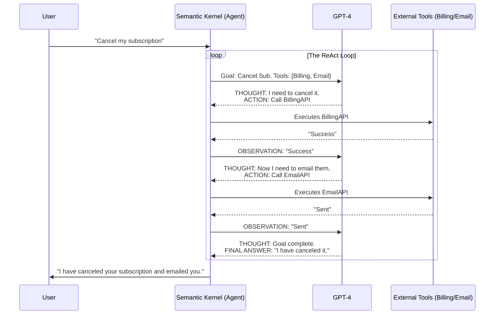

# Chapter 3 — Agent Architectures

## 🏢 Business Problem

Your company built a highly successful AI Chatbot that answers questions based on company PDFs. The CEO loves it, but now wants the chatbot to *do things*. 

"If a customer asks to cancel their subscription, the AI should log into the billing system, cancel the subscription, and email them a confirmation."

A simple chat loop cannot do this. You need to upgrade your architecture from a **Copilot** to an **Autonomous Agent**.

---

## 🧠 Theory

### Copilot vs. Agent
- **Copilot:** A conversational AI that provides information to a human. The human makes the final decision and executes the action.
- **Agent:** An AI given a goal, a set of tools (APIs), and the autonomy to loop, reason, and execute actions on behalf of the human.

### The ReAct (Reason + Act) Pattern
Agents use a loop called ReAct. Instead of just answering a question, the LLM is prompted to:
1. **Thought:** "What do I need to do to achieve the user's goal?"
2. **Action:** "I need to call the `BillingAPI.CancelSubscription` tool."
3. **Observation:** "The API returned success."
4. **Thought:** "The subscription is canceled. Now I need to email the user."
5. **Action:** "I need to call the `EmailAPI.Send` tool."

This loop continues until the Agent achieves the goal or hits a predefined failure limit.

---

## 🏗 Architecture: The Agentic Loop



---

## 💻 C# Example: Semantic Kernel Auto-Function Calling

In Semantic Kernel, the ReAct loop is handled automatically using `ToolCallBehavior.AutoInvokeKernelFunctions`. You just provide the tools (Plugins), and the Kernel does the looping.

```csharp title="BillingAgent.cs"
using System.ComponentModel;
using Microsoft.SemanticKernel;
using Microsoft.SemanticKernel.Connectors.OpenAI;

// 1. Define the Tools (Native C# Plugins)
public class BillingPlugin
{
    // The [Description] attribute is critical! This is how the LLM knows what the tool does.
    [KernelFunction, Description("Cancels a user's active subscription.")]
    public string CancelSubscription([Description("The User ID")] string userId)
    {
        Console.WriteLine($"[EXECUTING API] Canceling sub for {userId}...");
        return "SUCCESS_CANCELED";
    }

    [KernelFunction, Description("Sends an email to a user.")]
    public string SendEmail([Description("The User ID")] string userId, [Description("The message body")] string message)
    {
        Console.WriteLine($"[EXECUTING API] Emailing {userId}: {message}");
        return "SUCCESS_SENT";
    }
}

public class AgentRunner
{
    public async Task RunAgentAsync(Kernel kernel)
    {
        // 2. Load tools into the Kernel
        kernel.Plugins.AddFromType<BillingPlugin>();

        // 3. Enable the ReAct Loop!
        var settings = new OpenAIPromptExecutionSettings 
        { 
            ToolCallBehavior = ToolCallBehavior.AutoInvokeKernelFunctions 
        };

        var prompt = "Please cancel the subscription for user Jignesh_123 and let them know via email.";
        
        // 4. The Kernel will loop internally, calling the C# functions until the goal is met.
        var result = await kernel.InvokePromptAsync(prompt, new(settings));
        
        Console.WriteLine($"Final Output: {result}");
    }
}
```

---

## 🧪 Lab: The Infinite Loop Danger

### Objective
Understand the risk of autonomous agents.

### Scenario
You deploy the Agent above. The user asks to cancel their subscription. 
The LLM calls `BillingAPI`. The `BillingAPI` is down and returns an error: `"Database Timeout"`.

### The Problem
The LLM receives the error observation. It thinks: *"That didn't work. I should try again."* It calls `BillingAPI` again. It gets a timeout again. It tries again. 
Because it is an autonomous loop, it will call the API 1,000 times a second, DDoSing your own database and racking up a massive OpenAI bill.

### ✅ Success Criteria
- [ ] You understand that Agents must have a strictly enforced **Max Iterations limit** (e.g., if the loop hits 5 cycles, throw an exception and alert a human).
- [ ] You must implement idempotency on your APIs. If the agent accidentally calls `CancelSubscription` twice, it shouldn't crash the system.

---

## 🎯 Interview Questions

### Q1: What is the architectural difference between a RAG system and an Agent?
**Answer:** A RAG system is a linear pipeline (Retrieve data $\rightarrow$ Augment prompt $\rightarrow$ Generate answer). An Agent is a cyclic pipeline (Think $\rightarrow$ Act $\rightarrow$ Observe $\rightarrow$ Loop). RAG reads data; Agents take action.

### Q2: How does the LLM know which C# function to call?
**Answer:** During the initial request, the framework (like Semantic Kernel) serializes the names, parameters, and `[Description]` attributes of all registered C# functions into a JSON schema and sends it to the LLM. The LLM uses these descriptions to determine which tool matches its current goal.

### Q3: Why is "Human-in-the-loop" a critical pattern for Agent architectures?
**Answer:** Because Agents are non-deterministic, they can hallucinate a plan and execute destructive actions (like deleting the wrong database table or sending an inappropriate email). Critical actions should require the Agent to pause and request human authorization before executing the final API call.

---

**Next:** [Chapter 4 — Event-Driven AI →](/docs/architecture/event-driven-ai)
