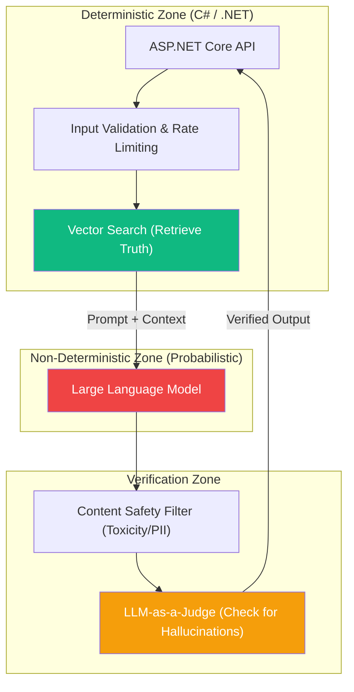

# Chapter 1 — AI Architecture Principles

## 🏢 Business Problem

Your enterprise has spent 20 years perfecting deterministic software engineering. If `A = 1`, then `System.out = 1`. 

Suddenly, your team integrates a Large Language Model. The system starts returning different answers every day. Sometimes it hallucinates, sometimes it times out, and sometimes it writes perfect code. 

The QA team doesn't know how to test it, and the DevOps team doesn't know how to monitor it. As an architect, you must establish a new set of principles for non-deterministic computing.

---

## 🧠 Theory

Building AI systems requires a paradigm shift. The core unit of computation (the LLM) is no longer a state machine; it is a probabilistic engine.

### The 4 Laws of Enterprise AI Architecture

#### 1. Assume the LLM will fail (Design for Fallback)
LLMs have strict rate limits, regional outages, and inherent timeouts. If your primary API is Azure OpenAI in `East US`, you must have an automatic fallback to `West US` or a local Ollama instance. Your architecture must never throw a hard error because the primary LLM is busy.

#### 2. Never trust the output (Design for Grounding)
An LLM does not possess truth; it possesses probability. You must implement a strict Retrieval-Augmented Generation (RAG) boundary. The AI must only answer using context retrieved from your private Vector Database.

#### 3. Isolate the Orchestrator (Design for Agnosticism)
Do not hardcode `OpenAIClient` into your business logic. Use an orchestration layer (like Semantic Kernel or `Microsoft.Extensions.AI`). You must be able to swap from GPT-4 to LLaMA 3 without changing a single line of domain code.

#### 4. Asynchronous by Default (Design for Latency)
Standard REST APIs expect a response in < 2 seconds. AI can take 30+ seconds. Never hold an HTTP thread open waiting for an LLM unless you are streaming tokens. Use WebSockets (SignalR) or Queues (RabbitMQ/Kafka) for heavy lifting.

---

## 🏗 Architecture: The Non-Deterministic Pipeline



---

## 💻 C# Example: Implementing the Fallback Principle

In .NET, we use `Microsoft.Extensions.Http.Resilience` (built on Polly) to automatically implement Principle 1: *Assume the LLM will fail*.

```csharp title="AiResiliencePipeline.cs"
using Microsoft.Extensions.Http.Resilience;
using Polly;

var builder = WebApplication.CreateBuilder(args);

// Create a resilience pipeline that handles HTTP 429 (Too Many Requests)
builder.Services.AddResiliencePipeline<string, HttpResponseMessage>("AiFallbackPipeline", pipeline =>
{
    // 1. Retry up to 3 times with exponential backoff
    pipeline.AddRetry(new HttpRetryStrategyOptions
    {
        MaxRetryAttempts = 3,
        Delay = TimeSpan.FromSeconds(2),
        BackoffType = DelayBackoffType.Exponential
    });

    // 2. If the endpoint completely fails, trip the circuit breaker
    pipeline.AddCircuitBreaker(new HttpCircuitBreakerStrategyOptions
    {
        FailureRatio = 0.5,
        SamplingDuration = TimeSpan.FromSeconds(10),
        BreakDuration = TimeSpan.FromSeconds(30)
    });
});

// Apply this pipeline to your Semantic Kernel or raw OpenAI HTTP clients
```

---

## 🧪 Lab: The Deterministic Shift

### Objective
Understand how to handle non-deterministic outputs in a deterministic system.

### Scenario
You are building an AI system that takes a natural language email and extracts the `CustomerName` and `OrderNumber`. You need to save this to a SQL database.

### The Problem
The LLM returns:
*Request 1:* `Name: John, Order: 123`
*Request 2:* `The customer is John and his order is 123.`
*Request 3:* `{"CustomerName": "John", "OrderNumber": 123}`

Your SQL database cannot parse this inconsistent text.

### ✅ Success Criteria
- [ ] You recognize that the LLM is acting non-deterministically.
- [ ] You enforce determinism by using **Structured Outputs** (JSON mode). You provide the LLM with a strict JSON schema in the System Prompt.
- [ ] You write a C# `try/catch` block that attempts to deserialize the JSON (`JsonSerializer.Deserialize<OrderInfo>`). If it fails, you automatically prompt the LLM again, passing the parse error back to it so it can fix its own mistake.

---

## 🎯 Interview Questions

### Q1: What is the fundamental difference between traditional software architecture and AI architecture?
**Answer:** Traditional architecture is deterministic and stateless (given the same input, you get the exact same output in a predictable amount of time). AI architecture is non-deterministic (probabilistic). You must design systems that expect varying latencies, varying output formats, and occasional outright failures (hallucinations).

### Q2: Why is the "Verification Zone" necessary in the architecture diagram above?
**Answer:** Because the LLM is non-deterministic, you cannot trust its raw output. The Verification Zone acts as a firewall. It uses deterministic code (Regex for PII) and secondary LLMs ("LLM-as-a-Judge") to score the output for safety and factual grounding before showing it to the user.

### Q3: A stakeholder demands that the new AI feature have 100% accuracy and never make a mistake. How do you respond?
**Answer:** You must reset their expectations. Large Language Models are statistical engines, not truth engines. You can architect pipelines (like RAG and structured JSON outputs) to achieve 99% reliability, but 100% is mathematically impossible with generative AI. Critical decisions must always include a "human-in-the-loop" UI pattern.

---

**Next:** [Chapter 2 — Enterprise AI Patterns →](/docs/architecture/enterprise-ai-patterns)
