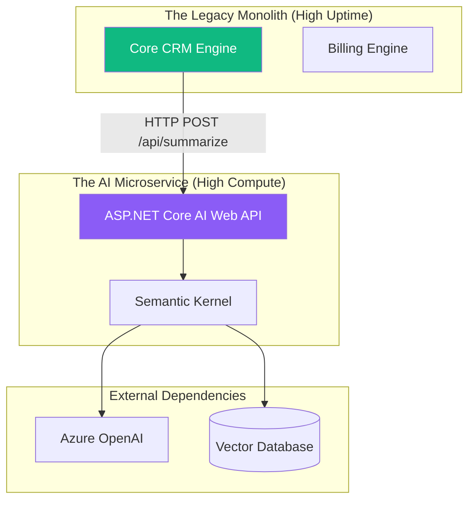

# Chapter 5 — AI Microservices

## 🏢 Business Problem

Your company has a massive, monolithic .NET application. The CEO mandates that "AI must be added to everything." 

A junior developer adds the Semantic Kernel NuGet package directly to the monolith and starts writing code. 
When the AI feature experiences a memory leak due to heavy PDF parsing, the entire monolith crashes, taking down the company's core billing and CRM systems with it. 

As an architect, you must isolate risk. AI features belong in a dedicated Microservice.

---

## 🧠 Theory

AI workloads have vastly different infrastructure requirements than standard CRUD (Create, Read, Update, Delete) applications:
- **Compute:** RAG chunking and vector math are highly CPU intensive.
- **Memory:** Loading large document contexts into memory before passing them to the LLM requires high RAM.
- **Scaling:** AI traffic is often spiky (e.g., users upload a batch of 1,000 documents at once).

If you put AI in your monolith, it will steal CPU and RAM from your primary business transactions. 

### The Microservice Boundary
You must extract the AI logic into a standalone, containerized service (e.g., an ASP.NET Core Web API running in Docker on Kubernetes). 
- The monolith calls the AI Microservice via gRPC or HTTP REST.
- If the AI Microservice crashes, the monolith continues to function (graceful degradation).
- You can scale the AI Microservice to 50 instances during a spike, without having to scale the massive monolith.

---

## 🏗 Architecture: The Isolated AI Service



---

## 💻 C# Example: Dockerizing the AI Service

To make your AI service a true microservice, it must be containerized. Here is a standard `Dockerfile` optimized for an ASP.NET Core 8 AI API.

```dockerfile title="Dockerfile"
# 1. Build Stage
FROM mcr.microsoft.com/dotnet/sdk:8.0 AS build
WORKDIR /src

# Copy csproj and restore dependencies (Optimizes Docker layer caching)
COPY ["AiMicroservice/AiMicroservice.csproj", "AiMicroservice/"]
RUN dotnet restore "AiMicroservice/AiMicroservice.csproj"

# Copy the rest of the code and build
COPY . .
WORKDIR "/src/AiMicroservice"
RUN dotnet publish -c Release -o /app/publish /p:UseAppHost=false

# 2. Runtime Stage (Minimal Alpine Linux image for security & speed)
FROM mcr.microsoft.com/dotnet/aspnet:8.0-alpine AS final
WORKDIR /app

# Copy the compiled binaries from the build stage
COPY --from=build /app/publish .

# Standardize the port
EXPOSE 8080
ENV ASPNETCORE_URLS=http://+:8080

# Run the API
ENTRYPOINT ["dotnet", "AiMicroservice.dll"]
```

---

## 🧪 Lab: Resource Limits in Kubernetes

### Objective
Understand how to protect infrastructure from runaway AI memory limits.

### Scenario
You deploy the Docker container above to Azure Kubernetes Service (AKS). 
A user uploads a massive, 5,000-page PDF for the AI to parse. The C# garbage collector fails to keep up, and the container consumes 16 GB of RAM, stealing memory from other containers on the same node. The node crashes.

### ✅ Success Criteria
- [ ] You recognize that containerizing the app is not enough; you must enforce strict hardware limits.
- [ ] You add Resource Quotas to your Kubernetes `deployment.yaml`:
  ```yaml
  resources:
    limits:
      memory: "2Gi"
      cpu: "1000m"
  ```
- [ ] If the AI service exceeds 2GB of RAM, Kubernetes instantly kills it (OOMKilled) and restarts a fresh, clean instance. The monolith and the underlying node remain perfectly safe.

---

## 🎯 Interview Questions

### Q1: Why shouldn't you add Semantic Kernel directly to a legacy monolithic application?
**Answer:** AI workloads have asymmetric hardware profiles (high CPU/RAM for parsing, vector math, and long network I/O waiting for LLMs). If placed in the monolith, they can cause thread starvation and memory leaks that take down core business processes. AI features must be isolated into Microservices to allow independent scaling and fault isolation.

### Q2: What is "Graceful Degradation" in the context of an AI Microservice?
**Answer:** If the AI Microservice goes down (e.g., OpenAI is offline), the primary monolith should catch the HTTP timeout and continue to function. For example, if the "AI Review Summarizer" microservice is down, the e-commerce monolith should catch the error, hide the "Summarize Reviews" UI button, and continue letting customers buy products without crashing the whole site.

### Q3: How do Microservices communicate with each other?
**Answer:** They usually communicate via synchronous HTTP REST APIs, high-performance gRPC (great for internal backend-to-backend calls), or asynchronously via Message Brokers like RabbitMQ/Kafka.

---

**Next:** [Chapter 6 — Multi-Agent Systems →](/docs/architecture/multi-agent-systems)
