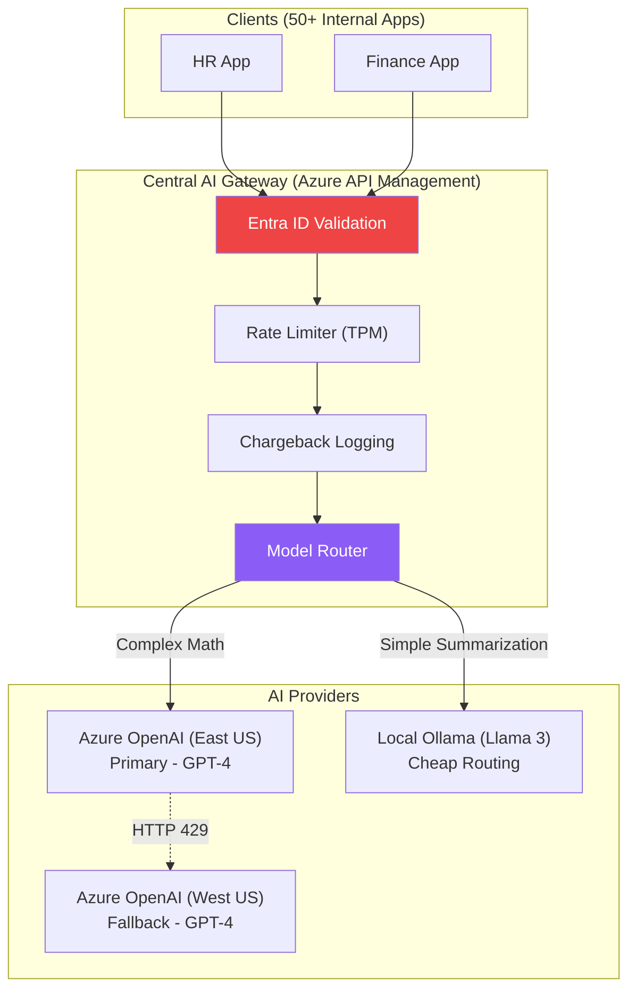

# Chapter 2 — Enterprise AI Patterns

## 🏢 Business Problem

Your company has 50 different development teams. Every team decides they need "AI". 
Team A hardcodes an OpenAI API key into their React frontend. Team B uses a local Python script. Team C uses Azure OpenAI but doesn't track their costs. 

At the end of the month, the cloud bill is $100,000, and no one knows which team spent the money. Furthermore, your CISO realizes that PII is leaking across the internet.

You need to establish strict architectural patterns to centralize and secure AI usage across the enterprise.

---

## 🧠 Theory

Enterprise AI architecture relies on three primary patterns to maintain control, security, and reliability.

### 1. The Gateway Pattern
No application should ever communicate directly with the Foundation Model (e.g., OpenAI). All traffic must route through a central AI Gateway (like Azure API Management).
- **Why?** It centralizes authentication (Entra ID), rate limiting (Tokens-Per-Minute per department), chargebacks (billing Team A vs Team B), and audit logging.

### 2. The Router Pattern (Model Multiplexing)
Not every task requires a massive, expensive model like GPT-4.
- **Why?** If a user asks a simple question ("Summarize this paragraph"), the Router intercepts the request and sends it to a cheaper, faster model (like GPT-3.5 or LLaMA 3). If the user asks for complex coding help, it routes to GPT-4. This saves massive amounts of money.

### 3. The Fallback Pattern (Active-Active)
Cloud AI providers have strict regional quotas. If `East US` hits its limit, it returns HTTP 429.
- **Why?** You configure the Gateway to automatically route the traffic to a secondary region (e.g., `West Europe`) or a secondary provider (Anthropic) seamlessly, so the end-user never experiences an outage.

---

## 🏗 Architecture: The Enterprise AI Gateway



---

## 💻 C# Example: Implementing the Router Pattern

If you aren't using a heavy infrastructure Gateway like Azure API Management, you can implement the Router Pattern directly in your C# API using `Microsoft.Extensions.AI`.

```csharp title="AiRouter.cs"
using Microsoft.Extensions.AI;

public class EnterpriseAiRouter
{
    private readonly IChatClient _expensiveClient;
    private readonly IChatClient _cheapClient;

    public EnterpriseAiRouter(
        [FromKeyedServices("gpt-4")] IChatClient expensiveClient,
        [FromKeyedServices("llama-3")] IChatClient cheapClient)
    {
        _expensiveClient = expensiveClient;
        _cheapClient = cheapClient;
    }

    public async Task<string> ProcessRequestAsync(string userMessage)
    {
        // Simple heuristic: If the prompt is short and doesn't contain code/math keywords, use the cheap model.
        if (userMessage.Length < 100 && !userMessage.Contains("calculate") && !userMessage.Contains("code"))
        {
            Console.WriteLine("Routing to Cheap Local Model...");
            var response = await _cheapClient.CompleteAsync(userMessage);
            return response.Message.Text;
        }
        else
        {
            Console.WriteLine("Routing to Expensive Cloud Model...");
            var response = await _expensiveClient.CompleteAsync(userMessage);
            return response.Message.Text;
        }
    }
}
```

---

## 🧪 Lab: Load Balancing AI

### Objective
Understand the limitations of standard load balancing for AI.

### Scenario
You put a standard Round-Robin load balancer in front of two Azure OpenAI instances (Region A and Region B). 
User 1 sends a 10-token request to Region A. 
User 2 sends a 128,000-token request to Region B.

### The Problem
Traditional load balancers count *requests* (Requests-Per-Minute). They think Region A and Region B are equally busy (1 request each). But Region B's GPUs are on fire processing 128k tokens, while Region A is completely idle!

### ✅ Success Criteria
- [ ] You realize that AI Load Balancing must be **Token-Aware**, not Request-Aware.
- [ ] You configure your AI Gateway to track Tokens-Per-Minute (TPM) consumed by each endpoint, routing new traffic to the endpoint with the most available token capacity, rather than just doing simple Round-Robin.

---

## 🎯 Interview Questions

### Q1: What is the AI Gateway Pattern and why is it mandatory for enterprises?
**Answer:** The AI Gateway pattern acts as a reverse proxy between internal applications and external LLM providers. It is mandatory because it centralizes security (preventing key leakage), enforces cross-department rate limits, provides a single point for auditing/billing (chargebacks), and abstracts the backend models from the frontend apps.

### Q2: How does the Fallback Pattern differ from standard API retries?
**Answer:** Standard retries wait and hit the exact same endpoint again. In AI, if a region is out of capacity (HTTP 429), it might be out of capacity for hours. The Fallback Pattern immediately catches the 429 error and routes the request to a completely different geographical region or an entirely different model provider to ensure high availability.

### Q3: Why is "Chargeback" a major architectural concern with LLMs?
**Answer:** LLM costs scale linearly with usage (per token). If one rogue developer creates an infinite loop that calls an LLM, they can rack up thousands of dollars in charges in an hour. Without a Gateway tagging and logging every request to a specific department's budget (Chargeback), the central IT team gets stuck with an unexplainable, massive cloud bill.

---

**Next:** [Chapter 3 — Agent Architectures →](/docs/architecture/agent-architectures)
