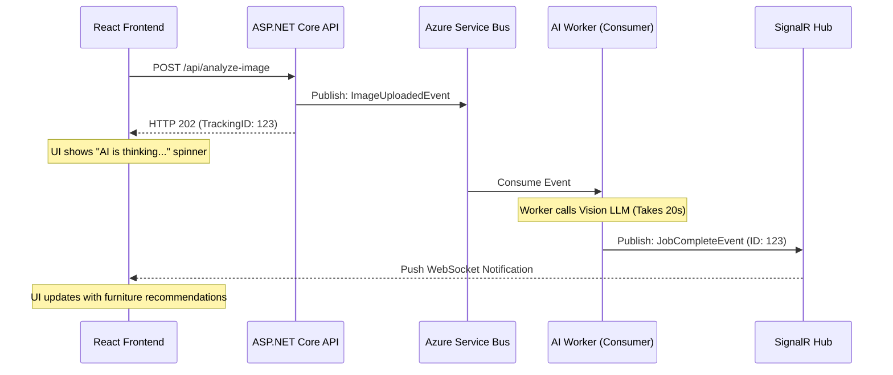

# Chapter 4 — Event-Driven AI

## 🏢 Business Problem

Your e-commerce platform allows users to upload photos of their living rooms so an AI can recommend furniture. 

During the Black Friday sale, 10,000 users upload photos simultaneously. The ASP.NET Core API tries to send 10,000 high-resolution images to the Vision LLM synchronously. The API crashes, users get 502 Bad Gateway errors, and you lose millions in sales.

As an architect, you must decouple the fast user experience from the slow AI processing.

---

## 🧠 Theory

Synchronous APIs (Request $\rightarrow$ Wait $\rightarrow$ Response) are a disaster for AI at scale. An LLM can take 15 to 45 seconds to process a complex image or document. 

You must adopt an **Event-Driven Architecture (EDA)**.

### The Decoupling Pattern
1. **The Producer (Web API):** Receives the user's file, saves it to fast blob storage, publishes an event to a Message Broker, and returns an immediate response (`202 Accepted`) to the user. Total time: 50 milliseconds.
2. **The Message Broker (Kafka/Azure Service Bus):** Holds the events safely in a queue. If the AI is busy, the events just wait in line. Nothing crashes.
3. **The Consumer (Worker Service):** Pulls events from the queue one by one, processes them with the LLM, and saves the result to a database. Total time: 30 seconds per item.

### Handling the User Experience
Because the API returned immediately, the user's browser doesn't have the final answer. The UI must either:
- Poll a status endpoint every 5 seconds.
- Wait for a real-time push notification via **SignalR / WebSockets**.

---

## 🏗 Architecture: Event-Driven Pipeline



---

## 💻 C# Example: Consuming Events for AI

Here is the backend code for the Consumer. We use the standard .NET `BackgroundService` to listen to a message queue and process AI workloads safely.

```csharp title="AiMessageConsumer.cs"
using Microsoft.SemanticKernel;
using Azure.Messaging.ServiceBus;

public class AiMessageConsumer : BackgroundService
{
    private readonly ServiceBusClient _serviceBus;
    private readonly Kernel _kernel;

    public AiMessageConsumer(ServiceBusClient serviceBus, Kernel kernel)
    {
        _serviceBus = serviceBus;
        _kernel = kernel;
    }

    protected override async Task ExecuteAsync(CancellationToken stoppingToken)
    {
        // Connect to the specific queue
        var processor = _serviceBus.CreateProcessor("ai-image-jobs");

        processor.ProcessMessageAsync += async args =>
        {
            var imageId = args.Message.Body.ToString();
            Console.WriteLine($"[WORKER] Received Job {imageId}. Sending to LLM...");

            // Simulate slow AI processing
            var response = await _kernel.InvokePromptAsync($"Analyze image {imageId}");
            
            Console.WriteLine($"[WORKER] Finished Job {imageId}. Notifying UI.");
            
            // In a real app, you would notify SignalR or save to a DB here
            
            // Tell the queue the message was successfully processed so it can be deleted
            await args.CompleteMessageAsync(args.Message);
        };

        processor.ProcessErrorAsync += args =>
        {
            Console.WriteLine($"[ERROR] {args.Exception.Message}");
            return Task.CompletedTask;
        };

        // Start listening
        await processor.StartProcessingAsync(stoppingToken);
    }
}
```

---

## 🧪 Lab: The Poison Pill

### Objective
Understand failure states in Event-Driven systems.

### Scenario
A malicious user uploads a corrupted PDF that causes your AI parsing logic to throw a `NullReferenceException`. 

The `AiMessageConsumer` catches the exception, and the message is NOT marked as completed. Because it wasn't completed, the Service Bus immediately hands the message back to the worker to try again. The worker crashes again.

This is a "Poison Pill." It will loop infinitely, blocking the queue and preventing legitimate users from getting their furniture recommendations.

### ✅ Success Criteria
- [ ] You configure the `MaxDeliveryCount` on your Service Bus (e.g., to 3).
- [ ] If a message fails 3 times, the broker automatically moves it to a **Dead-Letter Queue (DLQ)**.
- [ ] The worker moves on to the next user's job. Your engineering team can inspect the DLQ later to see why the PDF failed.

---

## 🎯 Interview Questions

### Q1: Why is an Event-Driven Architecture critical for AI at scale?
**Answer:** AI models (especially LLMs) are inherently slow and have strict throughput limits. Standard synchronous APIs will timeout or exhaust thread pools while waiting for the LLM. EDA decouples the fast ingestion of data from the slow processing of data, acting as a shock-absorber during traffic spikes.

### Q2: What is the role of SignalR in an Event-Driven AI system?
**Answer:** Because the HTTP request returns an immediate `202 Accepted` before the AI finishes its work, the frontend client doesn't have the result. SignalR provides a persistent WebSocket connection so the backend Worker can "push" the final result to the user's browser the moment the AI finishes, providing a seamless UX.

### Q3: How do you handle database transactions in an Event-Driven AI pipeline?
**Answer:** You must use the **Outbox Pattern**. If the API saves a record to the SQL database AND publishes a message to Kafka, you run the risk of the DB write succeeding but the Kafka publish failing (a distributed transaction failure). The Outbox pattern ensures the event is saved in the same SQL transaction as the data, guaranteeing consistency.

---

**Next:** [Chapter 5 — AI Microservices →](/docs/architecture/ai-microservices)
