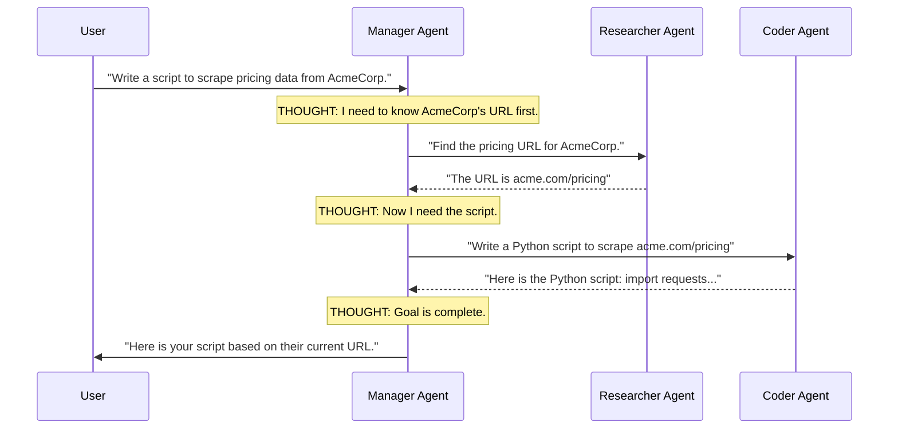

# Chapter 6 — Multi-Agent Systems

## 🏢 Business Problem

You built an Autonomous Agent (using the ReAct loop) and gave it 50 different tools: `SearchWeb`, `QueryDatabase`, `WriteCode`, `SendEmail`, `ApproveLoan`, etc. 

When a user asks, "What is the weather?", the Agent gets confused by the massive list of tools, hallucinates, and accidentally calls `ApproveLoan`. 

A single Agent cannot do everything. Just like humans, AI needs a corporate hierarchy. You need a **Multi-Agent System**.

---

## 🧠 Theory

The fundamental rule of Multi-Agent Systems (MAS): **Narrow the Scope.**

Instead of one "God Agent" with 50 tools and a massive system prompt, you create a team of specialized Micro-Agents. Each Micro-Agent has exactly 1 job, 1 specific system prompt, and 2 or 3 tools.

### The Team Structure
1. **The Manager (Router) Agent:** Talks to the human. Understands the goal. Breaks the goal down into tasks and delegates them to worker agents.
2. **The Researcher Agent:** Only has tools for searching the web and reading PDFs.
3. **The Coder Agent:** Only has tools for writing and executing Python code.
4. **The Reviewer Agent:** Has no tools. Its only job is to critique the Coder Agent's work and send it back if it finds bugs.

### Frameworks
Building this by hand is difficult because agents must pass conversational history back and forth. Frameworks like **Microsoft AutoGen** or the new **Semantic Kernel Agent Framework** handle the routing and message passing for you.

---

## 🏗 Architecture: The Multi-Agent Hierarchy



---

## 💻 C# Example: Defining Specialized Agents

Here is how you define scoped agents using Semantic Kernel. Notice how each agent has a strict, narrow personality and only a single tool.

```csharp title="MultiAgentSetup.cs"
using Microsoft.SemanticKernel;
using Microsoft.SemanticKernel.Agents;
using Microsoft.SemanticKernel.Agents.OpenAI;

public class MultiAgentFactory
{
    public static async Task RunTeamAsync(Kernel kernel)
    {
        // 1. The Researcher Agent
        var researcher = new OpenAIAssistantAgent(kernel)
        {
            Name = "Researcher",
            Instructions = "You are an expert researcher. Your only job is to search the database for facts.",
            // Give it ONLY the search tool
            Plugins = [KernelPluginFactory.CreateFromType<SearchPlugin>()]
        };

        // 2. The Copywriter Agent
        var copywriter = new OpenAIAssistantAgent(kernel)
        {
            Name = "Copywriter",
            Instructions = "You write beautiful, engaging marketing copy based ONLY on the facts provided to you by the Researcher.",
            // Give it NO tools. It only writes text.
            Plugins = []
        };

        // 3. The Group Chat (Manager)
        var chat = new AgentGroupChat(researcher, copywriter)
        {
            ExecutionSettings = new AgentGroupChatSettings
            {
                // Define the logic for who speaks next
                SelectionStrategy = new SequentialSelectionStrategy()
            }
        };

        // The user starts the conversation
        chat.AddChatMessage(new ChatMessageContent(AuthorRole.User, "Write an ad for our new XYZ product."));

        // Let the agents talk to each other!
        await foreach (var response in chat.InvokeAsync())
        {
            Console.WriteLine($"{response.AuthorName}: {response.Content}");
        }
    }
}
```

---

## 🧪 Lab: The Infinite Debate

### Objective
Understand the failure modes of Multi-Agent Systems.

### Scenario
You create a `CoderAgent` and a `ReviewerAgent`. 
The Coder writes a script. 
The Reviewer says: "This script is inefficient. Use a `while` loop." 
The Coder rewrites it. 
The Reviewer says: "This script is unreadable. Use a `for` loop."
The Coder rewrites it...

They debate forever, burning through your OpenAI budget.

### ✅ Success Criteria
- [ ] You recognize that Multi-Agent Systems can fall into infinite loops of critique.
- [ ] You implement a **Termination Strategy**. In the `AgentGroupChatSettings`, you must configure a maximum number of turns (e.g., `MaxIterations = 5`) or provide a strict termination instruction to the Manager Agent ("If the team cannot agree after 3 turns, output FINAL ANSWER").

---

## 🎯 Interview Questions

### Q1: Why not just use one Agent with a massive System Prompt?
**Answer:** LLMs suffer from the "Lost in the Middle" problem and instruction dilution. If you give an LLM a 5,000-word system prompt with 50 rules and 20 tools, it will forget half the rules and hallucinate tool calls. By splitting the logic into Multi-Agent micro-prompts, each LLM call is highly focused, resulting in vastly higher accuracy and reliability.

### Q2: What is Microsoft AutoGen?
**Answer:** AutoGen is a popular open-source framework developed by Microsoft Research specifically designed for building Multi-Agent Systems. It excels at allowing LLMs to converse with each other, write code, execute that code in a Docker sandbox, and pass the results back to the conversation. 

### Q3: How do you prevent Agents from taking destructive actions (like deleting databases)?
**Answer:** First, adhere to the Principle of Least Privilege: do not give the Agent a tool that has `DELETE` permissions unless absolutely necessary. Second, require a "Human-in-the-loop" step. The framework must pause the Agent loop, present the planned tool call to the human UI, and wait for an `Authorize` button click before executing the API.

---

**Next:** [Chapter 7 — Security & Governance →](/docs/architecture/security-and-governance)
