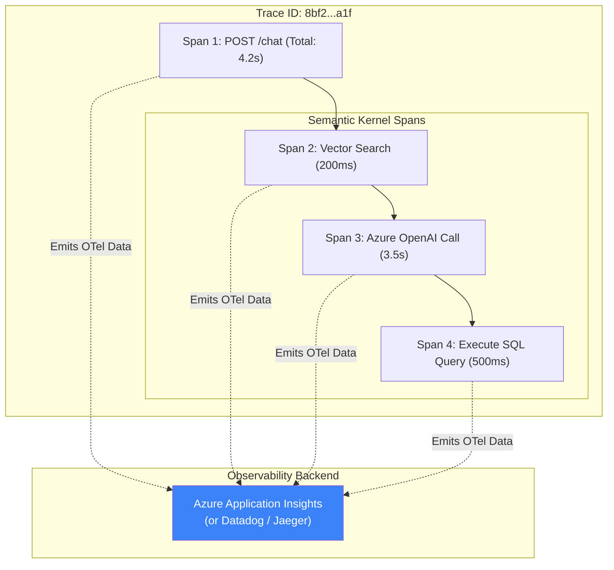

# Chapter 8 — Observability

## 🏢 Business Problem

Your multi-agent RAG system is in production. A VIP customer reports: *"I asked a question, it took 45 seconds, and then it returned a generic error message."*

You look at the logs. You see an `HTTP 500` error on the API layer. But which part failed? Was it the Vector DB? Did the LLM rate-limit you? Did the Python Coder Agent crash? Did a tool timeout? 

Without proper observability, debugging a non-deterministic, multi-step AI pipeline is completely impossible.

---

## 🧠 Theory

Standard logging (`ILogger.LogInformation`) is insufficient for AI. 

If an Agent calls an LLM 4 times, queries a DB twice, and uses 3 APIs, a flat text log is useless. You need **Distributed Tracing**.

### OpenTelemetry (OTel)
OpenTelemetry is the industry standard for observability. It allows you to track a single user request (a **Trace**) across multiple microservices and database calls, breaking it down into individual segments (**Spans**).

In modern .NET (8+), OpenTelemetry is built natively into the framework. Furthermore, `Microsoft.Extensions.AI` and `Semantic Kernel` automatically emit OTel spans!

### What must be observed in AI?
1. **Latency:** How many milliseconds did the exact LLM HTTP call take versus the Vector DB query?
2. **Tokens:** How many prompt tokens and completion tokens were used in *this specific span*? (Crucial for per-user billing).
3. **Prompts:** What exact system prompt and user history was sent over the wire? (Crucial for debugging hallucinations).

---

## 🏗 Architecture: Distributed Tracing



---

## 💻 C# Example: Enabling OpenTelemetry for AI

In .NET 8, wiring up Semantic Kernel to export beautiful Gantt-chart style traces to Azure Application Insights (or any OTel backend) takes just a few lines of code.

```csharp title="Program.cs"
using OpenTelemetry.Metrics;
using OpenTelemetry.Trace;

var builder = WebApplication.CreateBuilder(args);

// 1. Configure OpenTelemetry
builder.Services.AddOpenTelemetry()
    .WithTracing(tracing =>
    {
        tracing.AddAspNetCoreInstrumentation() // Traces incoming HTTP requests
               .AddHttpClientInstrumentation() // Traces outgoing HTTP calls
               
               // 2. CRITICAL: Tell OTel to listen to Semantic Kernel's built-in activity source!
               .AddSource("Microsoft.SemanticKernel*"); 
               
               // 3. Export the traces to your backend
        tracing.AddAzureMonitorTraceExporter(options => 
        {
            options.ConnectionString = "InstrumentationKey=your-key-here";
        });
    });

// Setup SK
builder.Services.AddKernel();
builder.Services.AddAzureOpenAIChatCompletion("gpt-4", "endpoint", "key");

var app = builder.Build();
app.Run();
```

---

## 🧪 Lab: The Prompt Logging Dilemma

### Objective
Understand the security implications of AI Observability.

### Scenario
You enable OpenTelemetry. You look at Application Insights and see that Semantic Kernel is logging the latency and token count, but it is **not** logging the actual text of the Prompt or the Response.

You need the text to debug a hallucination, so you enable it via configuration.

### The Security Breach
The next day, the CISO calls you. A customer entered their Social Security Number into the chat. Because you enabled Prompt Logging, that SSN was captured by OpenTelemetry and stored in plain text inside Azure Application Insights, violating GDPR and HIPAA.

### ✅ Success Criteria
- [ ] You understand why Semantic Kernel hides prompt text by default.
- [ ] You establish an architectural rule: **Never log raw prompt text in production environments without redacting PII.**
- [ ] If you must log prompts for evaluation/RAGAS, you route them through a PII-scrubber (like Azure AI Language's PII detection) before pushing them to your OTel backend.

---

## 🎯 Interview Questions

### Q1: Why is Distributed Tracing better than traditional logging for Agent architectures?
**Answer:** Agents loop non-deterministically. Traditional logs produce thousands of disconnected lines of text, making it impossible to reconstruct the exact sequence of "Thought -> Action -> Observation" for a specific user request. Distributed Tracing groups all these events under a single Trace ID, allowing you to visually see the exact waterfall of events, delays, and errors.

### Q2: How do you track the cost of an individual user's chat session?
**Answer:** Because `Microsoft.Extensions.AI` and Semantic Kernel emit OpenTelemetry metrics, you can attach the `UserId` as a Custom Tag to the current Activity (Span). When the LLM returns the `TotalTokenCount`, it is logged alongside that tag. You can then query your observability backend to aggregate total tokens by `UserId` and multiply by the current OpenAI pricing sheet.

### Q3: What is the difference between a Metric and a Trace in OpenTelemetry?
**Answer:** A Trace tracks a single, specific request through the system (e.g., User Jignesh asked a question at 10:00 AM, and it took 2 seconds). A Metric is an aggregation over time (e.g., The system processed 50,000 requests in the last hour, with an average latency of 1.5 seconds, consuming 2 million tokens). Both are required for a healthy system.

---

**Congratulations!** You have completed Volume 4 — Architecture Patterns. 🎉
