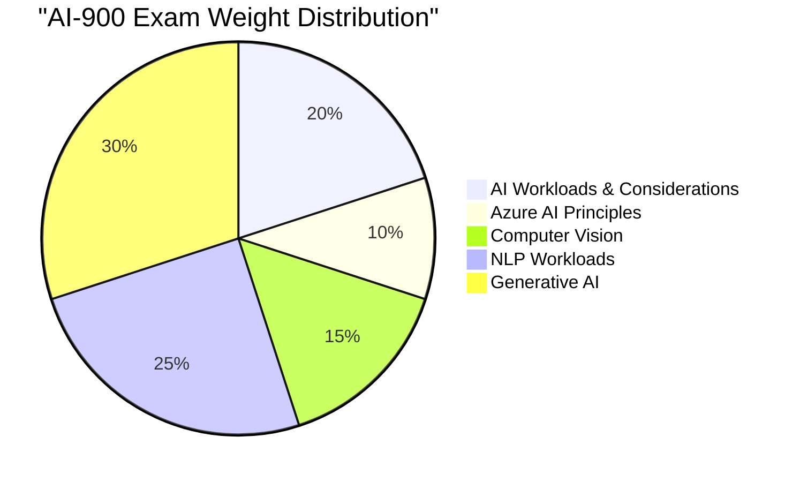

# 🎓 AI-900 — Azure AI Fundamentals

## Overview

| Detail | Value |
|--------|-------|
| **Full Name** | Microsoft Azure AI Fundamentals |
| **Code** | AI-900 |
| **Cost** | $165 USD |
| **Duration** | 45 minutes |
| **Questions** | 40–60 questions |
| **Passing Score** | 700 / 1000 |
| **Format** | Multiple choice, drag-and-drop, case studies |
| **Prerequisites** | None (beginner-friendly) |
| **Renewal** | Annual (free online assessment) |

---

## Why Take AI-900 First?

As a .NET developer transitioning to AI Solution Architecture, AI-900 is the perfect starting point:

1. **Foundation** — Validates you understand AI terminology and concepts
2. **Credential** — Shows your employer/clients you're investing in AI
3. **Gateway** — Prepares you for AI-102 (Azure AI Engineer)
4. **Fast** — Can be completed in 1–2 weeks of study

---

## Exam Domains

### Domain 1: Describe AI Workloads (15–20%)

| Topic | Key Concepts |
|-------|-------------|
| AI types | Prediction, anomaly detection, NLP, computer vision, generative |
| ML fundamentals | Training, inference, features, labels, datasets |
| Responsible AI | Fairness, reliability, privacy, inclusiveness, transparency, accountability |

**Handbook chapters:** [AI Landscape](/docs/fundamentals/ai-landscape)

### Domain 2: Describe Principles of ML (20–25%)

| Topic | Key Concepts |
|-------|-------------|
| ML types | Supervised, unsupervised, reinforcement learning |
| Regression | Predicting continuous values |
| Classification | Predicting categories |
| Clustering | Finding groups in data |
| Deep learning | Neural networks, training, layers |

### Domain 3: Describe Computer Vision Workloads (15–20%)

| Topic | Key Concepts |
|-------|-------------|
| Image classification | Categorizing images |
| Object detection | Locating objects in images |
| OCR | Extracting text from images |
| Azure services | Azure AI Vision, Custom Vision, Face API |

### Domain 4: Describe NLP Workloads (15–20%)

| Topic | Key Concepts |
|-------|-------------|
| Key concepts | Tokenization, entities, sentiment, language detection |
| Azure services | Azure AI Language, Translator, Speech |
| Conversational AI | Bots, QnA Maker, CLU |

**Handbook chapters:** [Tokens & Context](/docs/fundamentals/tokens-and-context)

### Domain 5: Describe Generative AI Workloads (15–20%)

| Topic | Key Concepts |
|-------|-------------|
| Generative AI | LLMs, GPT, prompts, completions |
| Azure OpenAI | Models, deployment, playground |
| Responsible GenAI | Grounding, content filters, prompt engineering |

**Handbook chapters:** [LLM Basics](/docs/fundamentals/llm-basics), [Prompt Engineering](/docs/fundamentals/prompt-engineering)

---

## Study Plan (2 Weeks)

### Week 1: Learn

| Day | Topic | Resource |
|-----|-------|----------|
| Mon | AI fundamentals + Responsible AI | [MS Learn Path 1](https://learn.microsoft.com/en-us/training/paths/get-started-with-artificial-intelligence-on-azure/) |
| Tue | Machine Learning concepts | [MS Learn Path 2](https://learn.microsoft.com/en-us/training/paths/create-no-code-predictive-models-azure-machine-learning/) |
| Wed | Computer Vision | [MS Learn Path 3](https://learn.microsoft.com/en-us/training/paths/explore-computer-vision-microsoft-azure/) |
| Thu | NLP & Language | [MS Learn Path 4](https://learn.microsoft.com/en-us/training/paths/explore-natural-language-processing/) |
| Fri | Generative AI & Azure OpenAI | [MS Learn Path 5](https://learn.microsoft.com/en-us/training/paths/introduction-generative-ai/) |

### Week 2: Practice & Review

| Day | Activity |
|-----|----------|
| Mon | Review all handbook chapters in Volume 1 |
| Tue | Practice questions (MS Learn assessments) |
| Wed | Review weak areas |
| Thu | Practice exam |
| Fri | **Take the exam** 🎯 |

---

## Key Services to Know

| Service | What It Does | Category |
|---------|-------------|----------|
| **Azure OpenAI** | GPT models as a service | Generative AI |
| **Azure AI Search** | Intelligent document search | Search + AI |
| **Azure AI Vision** | Image analysis, OCR | Computer Vision |
| **Azure AI Language** | NLP tasks (sentiment, entities) | NLP |
| **Azure AI Speech** | Speech-to-text, text-to-speech | Speech |
| **Azure AI Document Intelligence** | Form/document extraction | Document AI |
| **Azure Machine Learning** | Build/train/deploy ML models | ML Platform |
| **Azure AI Content Safety** | Content moderation | Responsible AI |

---

## Sample Questions

### Question 1
**Which Azure service would you use to deploy a GPT-4 model for your enterprise application?**

- A) Azure Machine Learning
- B) Azure AI Vision
- C) Azure OpenAI Service ✅
- D) Azure AI Language

### Question 2
**A company wants to ensure their AI system treats all demographic groups fairly. Which Responsible AI principle does this address?**

- A) Transparency
- B) Fairness ✅
- C) Reliability
- D) Privacy

### Question 3
**What is the process of converting input text into numerical representations called?**

- A) Classification
- B) Embedding ✅
- C) Regression
- D) Clustering

---

## Registration

1. Go to [Microsoft Certifications](https://learn.microsoft.com/en-us/credentials/certifications/azure-ai-fundamentals/)
2. Click "Schedule Exam"
3. Choose Pearson VUE (online or test center)
4. Complete the exam

---

## Mapping to Handbook

| AI-900 Domain | Handbook Chapter |
|--------------|-----------------|
| AI Workloads | [Chapter 1 — AI Landscape](/docs/fundamentals/ai-landscape) |
| Machine Learning | Volume 1 — Foundations |
| Computer Vision | Volume 2 — LLM Engineering (coming) |
| NLP | [Chapter 3 — Tokens](/docs/fundamentals/tokens-and-context) |
| Generative AI | [Chapter 2 — LLMs](/docs/fundamentals/llm-basics), [Chapter 4 — Prompts](/docs/fundamentals/prompt-engineering) |

---

## After AI-900

Once you pass AI-900, your next steps:

1. ✅ Continue with Volume 2 of this handbook
2. ✅ Build your first AI application (see Labs)
3. ✅ Start preparing for **AI-102** (Azure AI Engineer)
4. ✅ Begin the FactoryMind capstone project
