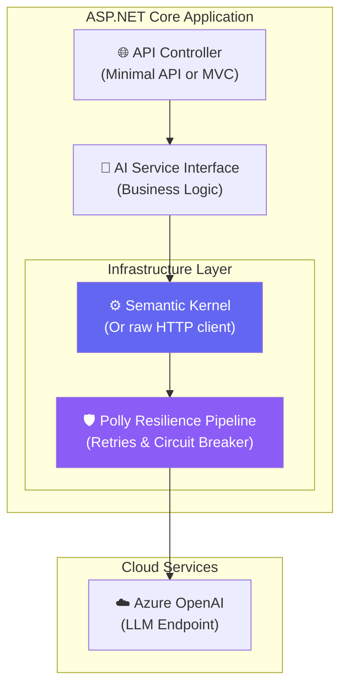

# Chapter 1 — ASP.NET Core AI Integration Patterns

## 🏢 Business Problem

Your development team is tasked with adding an LLM chatbot to the enterprise application. A junior developer writes a controller that uses a raw `HttpClient` to call the OpenAI API. 

In production, the LLM takes 15 seconds to answer. The thread pool starves, connections are exhausted, API rate limits are hit, and the entire ASP.NET Core application crashes.

As a Solution Architect, you must define the correct patterns for integrating AI into a robust .NET architecture.

---

## 🧠 Theory

AI integrations introduce three architectural challenges that standard microservices usually don't have:
1. **High Latency:** LLM calls take seconds, not milliseconds.
2. **Non-Determinism:** The response is never exactly the same.
3. **Strict Rate Limiting:** Cloud AI providers strictly enforce Tokens-Per-Minute (TPM) and Requests-Per-Minute (RPM).

To solve this in ASP.NET Core, we rely on three core principles:
- **Dependency Injection (DI):** Abstracting the AI service.
- **IHttpClientFactory:** Managing connection pooling.
- **Resilience (Polly):** Handling rate limits (HTTP 429) gracefully.

---

## 🏗 Architecture: AI Service Layering



---

## 💻 C# Example: Building the Resilient AI Client

Instead of raw HTTP calls, always use `IHttpClientFactory` paired with `Microsoft.Extensions.Http.Resilience` (the modern Polly wrapper in .NET 8+).

```csharp title="Program.cs — Registering Resilient AI Clients"
using Microsoft.Extensions.Http.Resilience;
using Polly;

var builder = WebApplication.CreateBuilder(args);

// 1. Register a resilient HttpClient specifically for OpenAI
builder.Services.AddHttpClient("OpenAI_Client")
    .AddStandardResilienceHandler(options =>
    {
        // Customize the retry policy for AI APIs (often hit 429 Too Many Requests)
        options.Retry.MaxRetryAttempts = 3;
        
        // Use exponential backoff: 2s, 4s, 8s
        options.Retry.Delay = TimeSpan.FromSeconds(2);
        options.Retry.BackoffType = DelayBackoffType.Exponential;
        
        // Circuit breaker: Stop hitting the API if it fails 5 times in a row
        options.CircuitBreaker.FailureRatio = 0.5;
        options.CircuitBreaker.SamplingDuration = TimeSpan.FromSeconds(10);
    });

// 2. Register Semantic Kernel using the resilient client
builder.Services.AddKernel()
    .AddAzureOpenAIChatCompletion(
        deploymentName: "gpt-4",
        endpoint: builder.Configuration["AzureOpenAI:Endpoint"]!,
        apiKey: builder.Configuration["AzureOpenAI:ApiKey"]!,
        httpClient: builder.Services.BuildServiceProvider().GetRequiredService<IHttpClientFactory>().CreateClient("OpenAI_Client")
    );

var app = builder.Build();
app.Run();
```

---

## 🧪 Lab: Thread Starvation

### Objective
Understand why synchronous code kills AI applications.

### Scenario
A junior developer writes this code in an ASP.NET Core controller:

```csharp
[HttpGet("/ask")]
public string AskQuestion(string prompt)
{
    var client = new HttpClient();
    // BAD: Blocking the thread while waiting for a 10-second LLM response
    var response = client.GetStringAsync($"https://api.openai.com/v1/...?prompt={prompt}").Result; 
    return response;
}
```

### ❌ The Problem
ASP.NET Core has a limited number of worker threads. If 100 users call this endpoint, 100 threads are blocked for 10 seconds waiting for the LLM. The server will stop responding to all other requests (Thread Starvation).

### ✅ The Fix
Always use `async/await` so the thread is released back to the pool while waiting for the network I/O.

```csharp
[HttpGet("/ask")]
public async Task<string> AskQuestionAsync(string prompt, IHttpClientFactory factory)
{
    var client = factory.CreateClient("OpenAI_Client");
    // GOOD: Thread is freed to serve other users while waiting!
    var response = await client.GetStringAsync($"https://api.openai.com/v1/...?prompt={prompt}"); 
    return response;
}
```

---

## 🎯 Interview Questions

### Q1: Why should you use `IHttpClientFactory` instead of instantiating `new HttpClient()` for your AI calls?
**Answer:** Instantiating `new HttpClient()` per request exhausts the server's available sockets (Socket Exhaustion). `IHttpClientFactory` manages an internal pool of HTTP message handlers to reuse connections efficiently while respecting DNS changes.

### Q2: An AI API returns an HTTP 429 error. What does this mean, and how does Polly handle it?
**Answer:** HTTP 429 means "Too Many Requests" (Rate Limit Exceeded). AI APIs enforce strict token/request limits. Using a Polly retry policy with exponential backoff ensures the application waits a few seconds and tries again automatically, rather than crashing or throwing an exception to the user.

### Q3: Why is the Circuit Breaker pattern important for AI integrations?
**Answer:** If the Azure OpenAI region goes down completely, we don't want 1,000 users all waiting 15 seconds for timeouts, locking up our server resources. The Circuit Breaker trips after a set number of failures and immediately fails fast, protecting our system and allowing us to route traffic to a fallback region.

---

**Next:** [Chapter 2 — Semantic Kernel Basics →](/docs/dotnet-ai/semantic-kernel-basics)
