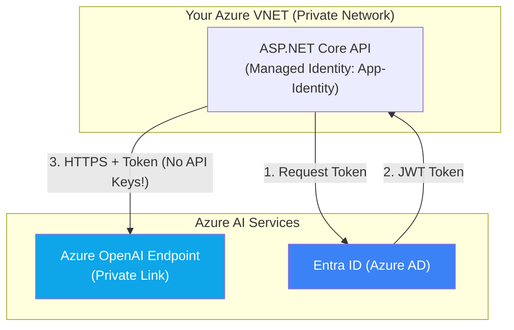

# Chapter — Azure OpenAI

## 🏢 Business Problem

Your developers built an internal HR tool using the public OpenAI API. The CISO shuts down the project immediately. 

"You are sending employee PII and proprietary company secrets to a public SaaS endpoint! How do we know OpenAI isn't using our data to train GPT-5? How are you securing the API keys? This fails compliance."

As an architect, you must solve this by migrating to **Azure OpenAI**.

---

## 🧠 Theory

**Azure OpenAI** is a service provided by Microsoft that hosts the exact same OpenAI models (GPT-4, o1, Ada) but within the secure boundary of your Azure Tenant.

### Why Enterprises Choose Azure OpenAI
1. **Data Privacy:** Microsoft contractually guarantees that your prompts and generated data are **never** used to train OpenAI's models.
2. **Network Security:** You can place Azure OpenAI inside an Azure Virtual Network (VNET) or use Private Endpoints. The traffic never travels over the public internet.
3. **Identity & RBAC:** Instead of sharing a single `OPENAI_API_KEY` across the company (which is a massive security risk), you use **Entra ID** (formerly Azure AD). Applications authenticate via Managed Identities.
4. **Content Filtering:** Azure provides built-in, customizable safety filters to prevent generating hate speech, violence, or self-harm content.

### The SDK Difference
Historically, there were two SDKs: `OpenAI` and `Azure.AI.OpenAI`. 
With the release of the v2 SDKs, Microsoft unified them. The `Azure.AI.OpenAI` package now depends directly on the official `OpenAI` package. They share the same schema!

---

## 🏗 Architecture: Secure Azure Deployment



---

## 💻 C# Example: Passwordless Authentication

This is the gold standard for enterprise AI integration. Notice there are **no API keys** in this code or configuration.

```csharp title="AzureOpenAiService.cs"
using Azure.AI.OpenAI;
using Azure.Identity;
using OpenAI.Chat;

public class SecureAiService
{
    public async Task<string> AskQuestionAsync(string question)
    {
        // 1. URL to your private Azure resource
        Uri endpoint = new Uri("https://my-enterprise-openai.openai.azure.com/");

        // 2. DefaultAzureCredential automatically handles identity:
        // - In Visual Studio: Uses your logged-in developer account
        // - In Azure App Service: Uses the System Assigned Managed Identity
        AzureOpenAIClient azureClient = new AzureOpenAIClient(endpoint, new DefaultAzureCredential());

        // 3. The rest of the code is identical to the standard OpenAI SDK!
        // Note: In Azure, "gpt-4o" refers to your Deployment Name, not just the model name.
        ChatClient chatClient = azureClient.GetChatClient("gpt-4o");

        var response = await chatClient.CompleteChatAsync(question);
        
        return response.Value.Content[0].Text;
    }
}
```

---

## 🧪 Lab: The Deployment Name Trap

### Objective
Understand the operational difference between public OpenAI and Azure OpenAI.

### Scenario
You run `azureClient.GetChatClient("gpt-4o")`. The API returns an `HTTP 404: Resource Not Found`. 

You check your code; "gpt-4o" is spelled correctly! What happened?

### ✅ Success Criteria
- [ ] You understand that in public OpenAI, you access the model directly by its global name.
- [ ] You understand that in Azure OpenAI, you must first create a **Deployment** of a model within your resource.
- [ ] If you deploy the `gpt-4o` model but name the deployment `my-custom-gpt-deployment`, your code must call `azureClient.GetChatClient("my-custom-gpt-deployment")`. The 404 error occurs because the SDK is looking for the *deployment name*, not the model name.

---

## 🎯 Interview Questions

### Q1: What is a Managed Identity and why is it preferred over API Keys?
**Answer:** A Managed Identity is an Azure AD feature that automatically manages the identity of a cloud resource (like an App Service). Instead of storing an API Key in configuration (where it can be leaked in source control or read by unauthorized admins), the app requests a short-lived token directly from Azure AD. If the code is moved out of Azure, it immediately loses access.

### Q2: What is the contractual difference regarding data usage between public OpenAI and Azure OpenAI?
**Answer:** Public OpenAI (like ChatGPT free tier) may use user prompts and responses to train future models. Azure OpenAI operates under Microsoft's enterprise agreements, guaranteeing that customer data is logically isolated, encrypted at rest, and never used to fine-tune Microsoft or OpenAI foundation models.

### Q3: How do you secure network access to an Azure OpenAI resource?
**Answer:** You disable public internet access on the Azure OpenAI resource and configure a Private Endpoint. This assigns a private IP address from your Virtual Network (VNET) to the OpenAI service, ensuring that traffic between your application and the AI service never traverses the public internet.

---

**Next:** [Chapter — Microsoft.Extensions.AI →](/docs/dotnet-ai/microsoft-extensions-ai)
