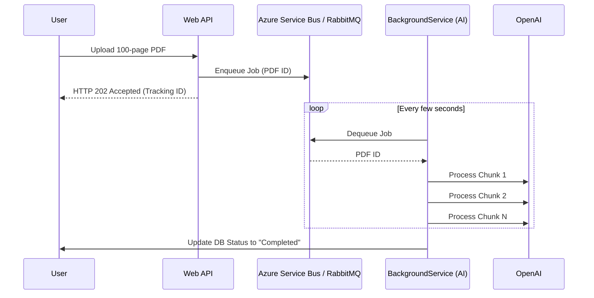

# Chapter — Background AI Processing

## 🏢 Business Problem

Your company receives 5,000 customer support emails per day. You write an ASP.NET Core API endpoint to process them with an LLM. 

At 9:00 AM, a batch of 500 emails hits the API simultaneously. The API threads lock up waiting for OpenAI to respond. The load balancer drops the connections (HTTP 504 Timeout). The emails are lost, and the API crashes.

As an architect, you must know that AI is inherently slow. Heavy AI workloads must be processed in the background.

---

## 🧠 Theory

ASP.NET Core is designed for fast Request-Response cycles (milliseconds). AI workloads (Summarization, RAG Ingestion, Bulk Translation) take seconds or minutes. 

If you mix the two, you will exhaust your server's thread pool and memory.

### The Queue-Worker Architecture
The standard enterprise pattern for heavy AI is Event-Driven Architecture.
1. **The API** receives the data (e.g., an email or PDF), saves it to blob storage, pushes a message to a Queue, and immediately returns `HTTP 202 Accepted` to the user.
2. **The Worker Service** (a background process) pulls the message off the Queue, calls the LLM, and saves the result to a database.

### Hosted Services in .NET
In .NET, you do not need to build a separate application for background work. You can use an `IHostedService` (usually the `BackgroundService` base class) which runs in the background of your existing ASP.NET Core process, or as a standalone Windows Service / Linux Daemon.

---

## 🏗 Architecture: Queue-Worker Pattern



---

## 💻 C# Example: .NET Worker Service for AI

Here is a C# `BackgroundService` that reads from a simulated queue and uses Semantic Kernel to process data safely outside the HTTP request pipeline.

```csharp title="AiWorkerService.cs"
using Microsoft.SemanticKernel;

// BackgroundService implements IHostedService
public class AiWorkerService : BackgroundService
{
    private readonly IServiceProvider _serviceProvider;
    private readonly ILogger<AiWorkerService> _logger;

    // Inject IServiceProvider because Background Services run as Singletons.
    // We need to create Scopes manually to resolve Scoped dependencies safely!
    public AiWorkerService(IServiceProvider serviceProvider, ILogger<AiWorkerService> logger)
    {
        _serviceProvider = serviceProvider;
        _logger = logger;
    }

    protected override async Task ExecuteAsync(CancellationToken stoppingToken)
    {
        _logger.LogInformation("AI Worker starting...");

        // Keep running until the application shuts down
        while (!stoppingToken.IsCancellationRequested)
        {
            // Simulate pulling a message from RabbitMQ or Azure Service Bus
            var jobId = await GetNextJobFromQueueAsync();

            if (jobId != null)
            {
                // ALWAYS create a scope for background work!
                using var scope = _serviceProvider.CreateScope();
                
                // Resolve Semantic Kernel within this isolated scope
                var kernel = scope.ServiceProvider.GetRequiredService<Kernel>();
                
                try
                {
                    _logger.LogInformation($"Processing Job {jobId}");
                    var result = await kernel.InvokePromptAsync($"Summarize document {jobId}");
                    _logger.LogInformation($"Job {jobId} complete.");
                }
                catch (Exception ex)
                {
                    _logger.LogError(ex, $"AI Processing failed for {jobId}");
                    // Push back to queue or dead-letter queue
                }
            }

            // Wait before checking queue again to prevent CPU spiking
            await Task.Delay(1000, stoppingToken);
        }
    }

    private Task<string> GetNextJobFromQueueAsync() => Task.FromResult("DOC-123");
}
```

### Registration in Program.cs
```csharp
// Register the worker to run in the background
builder.Services.AddHostedService<AiWorkerService>();
```

---

## 🧪 Lab: The Singleton Scope Trap

### Objective
Understand Dependency Injection within Background Services.

### Scenario
A developer injects Entity Framework `DbContext` (which is Scoped by default) directly into the constructor of the `AiWorkerService`. 

When the app starts, it crashes with: *"Cannot consume scoped service 'AppDbContext' from singleton 'AiWorkerService'."*

### ✅ Success Criteria
- [ ] You understand that `IHostedService` (BackgroundService) is always instantiated as a **Singleton** by the host.
- [ ] You realize that injecting a Scoped service into a Singleton forces the Scoped service to live forever, causing memory leaks or DB connection exhaustion.
- [ ] **The Fix:** As shown in the code above, you inject `IServiceProvider`, manually call `CreateScope()` inside your loop, resolve your Scoped services, and let them be disposed when the loop iteration finishes.

---

## 🎯 Interview Questions

### Q1: Why should you return HTTP 202 Accepted instead of waiting for the LLM?
**Answer:** HTTP 202 tells the client "I have received your request, but I have not finished processing it." This prevents the Load Balancer (which usually has a 30-60 second timeout) from terminating the connection while the LLM is working. The client can then poll a status endpoint or wait for a WebSocket/SignalR push notification.

### Q2: What is a Dead-Letter Queue (DLQ) and why is it important for AI workloads?
**Answer:** AI APIs fail frequently due to rate limiting (429) or transient cloud errors. If your background worker fails to process a message 5 times in a row, the message broker moves the message to a DLQ. This prevents the "poison pill" from endlessly crashing your worker and blocking other messages from being processed.

### Q3: Can you run an `IHostedService` inside a standard ASP.NET Core Web API?
**Answer:** Yes. The ASP.NET Core generic host can run both the Kestrel web server (for API endpoints) and multiple `IHostedService` background workers in the exact same process. However, for massive enterprise workloads, it is best practice to deploy the API and the Worker as two physically separate applications (microservices) so they can scale independently.

---

**Next:** [Chapter — Local Models (Ollama) →](/docs/dotnet-ai/local-models-ollama)
