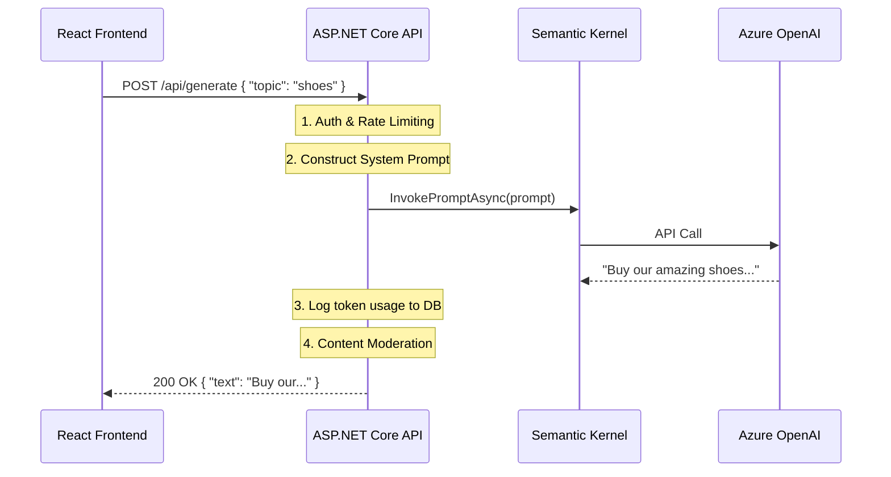

# Chapter 3 — Building AI APIs in .NET

## 🏢 Business Problem

Your frontend team has built a React application for generating marketing copy. They need a backend API. 

If you just expose the LLM directly to the frontend, you risk exposing your API keys, you cannot enforce business rules (like filtering out bad words), and you have no way to log usage per user. You need a dedicated AI Gateway/API layer.

---

## 🧠 Theory

When building an AI API, the backend acts as a **Middleware / Gateway**. 

The frontend never talks to OpenAI or Azure directly. It talks to your ASP.NET Core API. Your API is responsible for:
1. **Authentication & Authorization:** Verifying the user.
2. **Prompt Engineering:** The frontend sends a short request ("shoes"), the backend wraps it in the massive system prompt ("You are a marketing expert...").
3. **Safety & Moderation:** Intercepting the request and response to filter PII or toxic content.
4. **Billing & Logging:** Tracking token usage to bill the correct tenant.
5. **Orchestration:** Calling the LLM via Semantic Kernel.

### The Timeout Problem
Standard HTTP APIs are designed to respond in under 2 seconds. LLM calls can take 10 to 60 seconds. If deployed behind a standard load balancer (like Azure App Gateway or AWS ALB), the load balancer will often close the connection (Timeout HTTP 504) before the LLM finishes!

To solve this, you must either:
1. Increase load balancer timeout thresholds (easy, but risky for server health).
2. Use WebSockets/SignalR (best for chat).
3. Implement the **Asynchronous Request-Reply Pattern** (HTTP 202 Accepted).

---

## 🏗 Architecture: The AI Gateway Pattern



---

## 💻 C# Example: Minimal API Gateway

Here is a production-ready template for a Minimal API endpoint that acts as an AI Gateway.

```csharp title="Program.cs — Minimal API AI Gateway"
using Microsoft.AspNetCore.Mvc;
using Microsoft.SemanticKernel;

var builder = WebApplication.CreateBuilder(args);

// Register Semantic Kernel (Assuming Azure OpenAI is configured)
builder.Services.AddKernel().AddAzureOpenAIChatCompletion("gpt-4", "endpoint", "key");

var app = builder.Build();

app.MapPost("/api/marketing/generate", async (
    [FromBody] MarketingRequest request, 
    [FromServices] Kernel kernel, 
    ILogger<Program> logger) =>
{
    // 1. Validation
    if (string.IsNullOrWhiteSpace(request.Topic)) 
        return Results.BadRequest("Topic is required.");

    // 2. Construct Prompt (Frontend doesn't see this)
    var prompt = $"""
        You are an expert marketing copywriter. 
        Write a 2-sentence ad about {request.Topic}.
        Do not use the word 'cheap'.
        """;

    try
    {
        // 3. Orchestration
        var result = await kernel.InvokePromptAsync(prompt);
        
        // 4. Logging & Billing (Simulated)
        var metadata = result.Metadata;
        logger.LogInformation("Tokens used: {Tokens}", metadata?["Usage"]);

        // 5. Response
        return Results.Ok(new { copy = result.ToString() });
    }
    catch (Exception ex)
    {
        logger.LogError(ex, "LLM Failure");
        return Results.Problem("The AI service is currently unavailable.");
    }
});

app.Run();

public class MarketingRequest { public string Topic { get; set; } }
```

---

## 🧪 Lab: The Asynchronous Request-Reply Pattern

### Objective
Understand how to bypass Load Balancer timeouts for very long-running AI tasks (like processing a 100-page PDF).

### The Pattern
Instead of holding the HTTP connection open for 2 minutes:
1. Client sends `POST /api/process-pdf`.
2. API immediately returns `HTTP 202 Accepted` and a `Location: /api/status/12345` header. It starts processing on a background thread (or queue).
3. Client polls `GET /api/status/12345` every 5 seconds.
4. When finished, the status endpoint returns `HTTP 303 See Other` pointing to the result.

### ✅ Success Criteria
- [ ] You understand that `await kernel.InvokePromptAsync` blocks the HTTP request pipeline.
- [ ] You realize that for 60+ second tasks, standard HTTP POSTs are unreliable on cloud infrastructure.
- [ ] You know that Webhooks, SignalR, or 202 Polling are required for heavy AI tasks.

---

## 🎯 Interview Questions

### Q1: Why shouldn't the frontend call the OpenAI API directly?
**Answer:** Calling OpenAI directly from a browser exposes the API keys, meaning anyone can steal them and incur charges on your account. Furthermore, the frontend would have to hold the "System Prompt" (your business logic/secret sauce), making it visible to users and impossible to update without a client deployment.

### Q2: What is the difference between a synchronous API and an asynchronous API in the context of AI?
**Answer:** A synchronous API keeps the HTTP connection open while the LLM generates text. This is fine for quick calls (2-5 seconds). An asynchronous API returns an immediate acknowledgment (HTTP 202) and processes the AI request in the background, requiring the client to poll for the result. This prevents load balancer timeouts on heavy workloads.

### Q3: How do you track cost per user in an AI application?
**Answer:** The LLM API returns "Token Usage" metadata in every response (Prompt Tokens + Completion Tokens). The backend API must intercept this response, read the usage metadata, and log it to a database against the authenticated user's ID before returning the final text to the frontend.

---

**Next:** [Chapter 4 — Streaming AI Responses with SignalR →](/docs/dotnet-ai/streaming-with-signalr)
