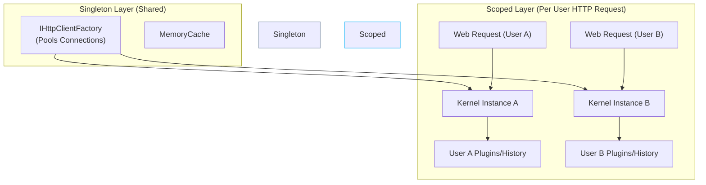

# Chapter — Dependency Injection Patterns for AI

## 🏢 Business Problem

Your developers registered the Semantic Kernel object as a Singleton in ASP.NET Core. 

In a multi-tenant application, User A asks the AI a question. Concurrently, User B asks a question. Because the Kernel is a Singleton, User A's context and chat history are accidentally injected into User B's prompt! User B receives an answer containing User A's private data.

As an architect, you must dictate the correct Dependency Injection (DI) lifetimes for AI objects.

---

## 🧠 Theory

In .NET, Dependency Injection lifetimes are critical.
1. **Transient:** A new instance every time.
2. **Scoped:** A single instance per HTTP Request.
3. **Singleton:** One instance for the entire lifetime of the application.

### The Semantic Kernel Concurrency Problem
The `Kernel` object in Semantic Kernel contains state (like Plugins and prompt settings). If you register the Kernel as a Singleton and mutate it during a web request (e.g., adding a user-specific plugin), that mutation affects all other concurrent web requests.

### The Solution
1. **Scoped Kernels:** Register the Kernel as Scoped/Transient so each HTTP request gets its own isolated instance.
2. **Kernel Clones:** If you have a heavy, pre-configured Kernel (registered as a Singleton for performance), you must call `kernel.Clone()` before modifying it for a specific user.

---

## 🏗 Architecture: Multi-Tenant DI



---

## 💻 C# Example: Scoped AI Services

Here is how you safely configure Semantic Kernel in an ASP.NET Core Web API.

```csharp title="Program.cs — Safe DI Configuration"
var builder = WebApplication.CreateBuilder(args);

// 1. Add Kernel to DI (Semantic Kernel v1.x registers it as Transient by default)
builder.Services.AddKernel();
builder.Services.AddAzureOpenAIChatCompletion("gpt-4", "endpoint", "key");

// 2. Register your business service as Scoped (one per HTTP request)
builder.Services.AddScoped<ChatAgentService>();

var app = builder.Build();

app.MapPost("/api/chat", async (ChatRequest request, ChatAgentService agent) =>
{
    // The DI container injects a fresh, isolated ChatAgentService (and Kernel) for this user.
    return await agent.ReplyAsync(request);
});

app.Run();

// Business Logic
public class ChatAgentService
{
    private readonly Kernel _kernel;

    public ChatAgentService(Kernel kernel)
    {
        _kernel = kernel; // This is a fresh instance
    }

    public async Task<string> ReplyAsync(ChatRequest request)
    {
        // Safe to mutate! This plugin only exists for THIS user's request.
        _kernel.Plugins.AddFromObject(new UserSpecificDatabasePlugin(request.TenantId));

        var response = await _kernel.InvokePromptAsync(request.Message);
        return response.ToString();
    }
}
```

---

## 🧪 Lab: The Clone Pattern

### Objective
Understand high-performance instantiation.

### Scenario
Constructing a `Kernel` with 50 complex plugins takes 200 milliseconds. If you register it as Transient, every web request adds a 200ms penalty before it even hits the LLM. 

### The Fix
You register a `Kernel` as a Singleton on startup and load the 50 plugins. 
When a web request comes in, you inject the Singleton Kernel, but **you do not use it directly**. You call `.Clone()`.

```csharp
public class FastChatService
{
    private readonly Kernel _singletonKernel;

    public FastChatService([FromKeyedServices("GlobalKernel")] Kernel globalKernel)
    {
        _singletonKernel = globalKernel;
    }

    public async Task<string> FastReplyAsync(string message)
    {
        // Clone is incredibly fast (microseconds) and creates an isolated copy!
        Kernel userKernel = _singletonKernel.Clone();
        
        // Mutate the clone safely
        userKernel.Plugins.AddFromObject(new SecretPlugin());
        
        return (await userKernel.InvokePromptAsync(message)).ToString();
    }
}
```

### ✅ Success Criteria
- [ ] You understand that `Kernel.Clone()` provides the safety of Scoped/Transient lifetimes with the performance of a Singleton.

---

## 🎯 Interview Questions

### Q1: Why is registering Semantic Kernel as a Singleton dangerous in a Web API?
**Answer:** The `Kernel` object holds state (Plugins, execution settings). If it is a Singleton, concurrent web requests will mutate the same object, leading to race conditions and cross-tenant data leakage where User A accidentally uses User B's plugins.

### Q2: What is the lifecycle of `IHttpClientFactory` and why does Semantic Kernel use it under the hood?
**Answer:** `IHttpClientFactory` is registered as a Singleton. It manages a pool of underlying HTTP message handlers. Semantic Kernel uses it to prevent Socket Exhaustion (running out of outbound ports) while still respecting DNS changes.

### Q3: When using `Microsoft.Extensions.AI`, what is the default lifetime of `IChatClient`?
**Answer:** By default, extension methods like `AddChatClient()` register the `IChatClient` as a **Singleton**. Because `IChatClient` is stateless (it just sends HTTP requests and does not hold user-specific plugins like SK), it is perfectly safe to share across concurrent requests.

---

**Next:** [Chapter — Background AI Processing →](/docs/dotnet-ai/background-ai-processing)
