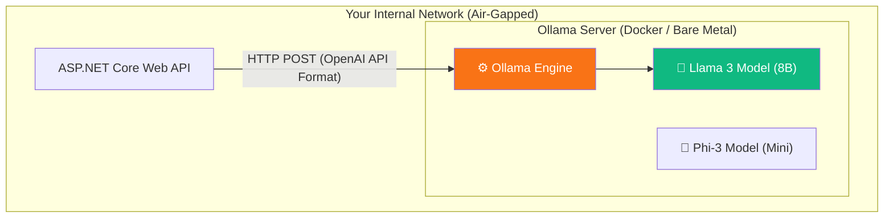

# Chapter — Local Models with Ollama

## 🏢 Business Problem

Your startup is building an AI feature to analyze user financial data. If you send this data to OpenAI, you face extreme regulatory compliance hurdles and massive per-token costs.

You need an AI model that runs entirely on your own servers, with zero data leaving your network.

---

## 🧠 Theory

Until recently, running a Large Language Model required writing complex Python code and compiling C++ frameworks. 

**Ollama** changed everything. It is a lightweight framework (like Docker, but for AI) that allows you to download and run open-source models (like Meta's LLaMA 3, Mistral, or Phi-3) locally with a single terminal command.

### Why Run Local?
1. **Zero Token Costs:** You pay for the hardware once; inferencing is free.
2. **Absolute Privacy:** Data never leaves your machine. Perfect for healthcare (HIPAA) or finance.
3. **Air-Gapped Systems:** Can run on internal networks with no internet connection.

### The Catch: Hardware
To run a model at acceptable speeds, the entire model must fit into the VRAM (Video RAM) of a GPU. 
- An 8-Billion parameter model (like LLaMA 3 8B) requires about 8GB of VRAM.
- A 70-Billion parameter model requires about 40GB of VRAM (requiring expensive enterprise GPUs like Nvidia A100s).

---

## 🏗 Architecture: The Local AI Stack



---

## 💻 C# Example: Semantic Kernel + Ollama

Ollama is brilliant because it exposes a REST API that perfectly mimics the OpenAI API schema. This means you can use the standard OpenAI connectors in .NET to talk to your local model!

```csharp title="Program.cs — Connecting to Ollama"
using Microsoft.SemanticKernel;
using Microsoft.SemanticKernel.ChatCompletion;

var builder = WebApplication.CreateBuilder(args);

// 1. Tell Semantic Kernel to talk to localhost instead of OpenAI servers!
#pragma warning disable SKEXP0070 // Suppress experimental warning for Ollama connector
builder.Services.AddOllamaChatCompletion(
    modelId: "llama3.1",                     // The model you pulled via Ollama
    endpoint: new Uri("http://localhost:11434") // The default Ollama port
);
#pragma warning restore SKEXP0070

var app = builder.Build();

app.MapPost("/api/local-chat", async (string prompt, IChatCompletionService chat) =>
{
    // 2. This execution never leaves your internal network
    var response = await chat.GetChatMessageContentAsync(prompt);
    
    return Results.Ok(new { answer = response.Content });
});

app.Run();
```

---

## 🧪 Lab: Running Ollama

### Objective
Experience how easy it is to spin up a local model.

### Prerequisites
You need a machine with a decent GPU (Mac M-series chips work wonderfully, or an Nvidia RTX card).

### Steps
1. Install Ollama from `ollama.com`.
2. Open your terminal and run:
   ```bash
   ollama run llama3.1
   ```
3. Wait 2 minutes for the 4.7GB model to download.
4. The terminal will turn into a chat prompt. Type "Hello".
5. You are now chatting with an LLM running entirely on your local hardware!

### ✅ Success Criteria
- [ ] You verify that turning off your Wi-Fi does not stop the AI from answering.

---

## 🎯 Interview Questions

### Q1: Does a local model like LLaMA 3 8B perform as well as GPT-4?
**Answer:** No. GPT-4 is a massive "frontier" model with over a trillion parameters. LLaMA 3 8B is excellent for narrow tasks (summarization, simple RAG, classification) but will struggle with deep logical reasoning, complex math, or writing massive blocks of coherent code compared to GPT-4.

### Q2: What happens if you run an 8GB model on a machine with only 4GB of GPU VRAM?
**Answer:** Ollama will load whatever it can into the fast GPU VRAM, and "spill over" the remaining 4GB into the standard system RAM (CPU). Because system RAM is vastly slower than GPU VRAM, the text generation speed will drop from ~40 tokens/second to roughly ~3 tokens/second.

### Q3: Why is Ollama popular for enterprise development?
**Answer:** Because it provides an OpenAI-compatible REST API. Developers can write their entire C# application using `Microsoft.Extensions.AI` or Semantic Kernel pointing to a free, local Ollama instance. When they deploy to production, they simply change the connection string to point to a paid Azure OpenAI endpoint without changing a single line of business logic.

---

**Congratulations!** You have completed Volume 3 — .NET AI Integration. 🎉
