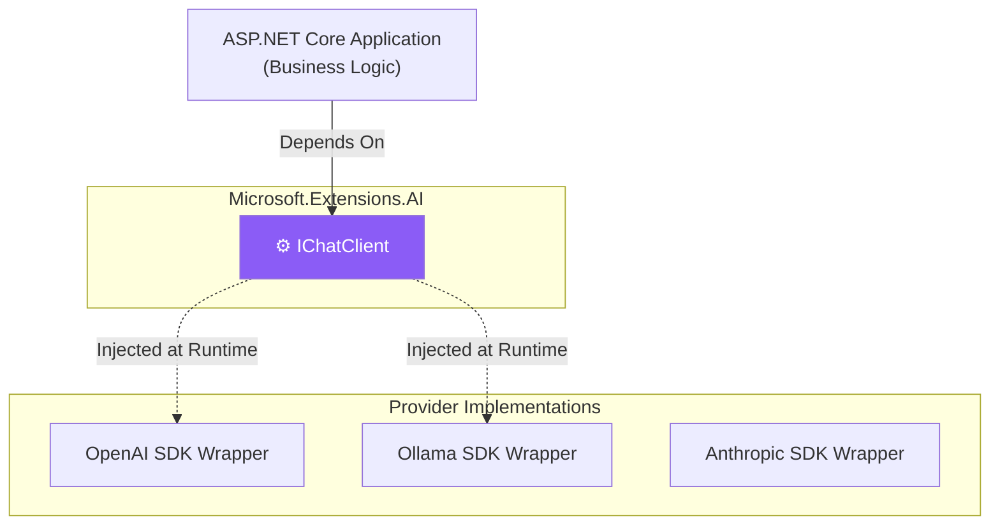

# Chapter — Microsoft.Extensions.AI

## 🏢 Business Problem

Your company built its entire AI infrastructure using the official OpenAI SDK. A year later, OpenAI raises its prices. The CIO mandates a switch to Anthropic's Claude 3.5 Sonnet. 

Because your codebase is tightly coupled to `OpenAIClient`, `ChatCompletion`, and `ChatMessage`, you must rewrite the entire data access layer, risking massive regressions.

As an architect, you must prevent vendor lock-in. 

---

## 🧠 Theory

In late 2024, Microsoft released **`Microsoft.Extensions.AI`**. 

This library does *not* provide an AI model. Instead, it provides standard **Interfaces** (abstractions) that all .NET developers should use, regardless of which underlying model they choose.

### The Core Interfaces
- **`IChatClient`:** Abstraction for sending text/history to a model and getting a response.
- **`IEmbeddingGenerator`:** Abstraction for converting text to vectors.

If you write your business logic against `IChatClient`, you can swap out OpenAI for LLaMA, Anthropic, or Mistral by changing a single line of Dependency Injection setup in `Program.cs`.

### How does this differ from Semantic Kernel?
Semantic Kernel is a heavy orchestrator (Planners, Memory, Plugins). `Microsoft.Extensions.AI` is a lightweight primitive. In fact, Semantic Kernel is being refactored to use `Microsoft.Extensions.AI` internally!

---

## 🏗 Architecture: The Abstraction Layer



---

## 💻 C# Example: Vendor Agnostic DI

Notice how the `ChatService` has no idea what AI company is powering the response.

```csharp title="ChatService.cs"
using Microsoft.Extensions.AI;

public class ChatService
{
    // Depend on the abstraction, not the concrete client!
    private readonly IChatClient _chatClient;

    public ChatService(IChatClient chatClient)
    {
        _chatClient = chatClient;
    }

    public async Task<string> SummarizeAsync(string text)
    {
        var response = await _chatClient.CompleteAsync($"Summarize this: {text}");
        return response.Message.Text;
    }
}
```

### Swapping Providers in Program.cs

```csharp title="Program.cs"
using Microsoft.Extensions.AI;
using OpenAI;

var builder = WebApplication.CreateBuilder(args);

bool useLocalAI = builder.Configuration.GetValue<bool>("UseLocalAI");

if (useLocalAI)
{
    // Use a free, local LLaMA model via Ollama
    builder.Services.AddChatClient(new OllamaChatClient(new Uri("http://localhost:11434"), "llama3.1"));
}
else
{
    // Use cloud-hosted OpenAI
    var openAiClient = new OpenAIClient("sk-...");
    // The AsChatClient() extension method wraps the OpenAI SDK into the IChatClient interface!
    builder.Services.AddChatClient(openAiClient.AsChatClient("gpt-4o"));
}

builder.Services.AddTransient<ChatService>();
var app = builder.Build();
```

---

## 🧪 Lab: The Middleware Pipeline

### Objective
Understand the power of interface decorators.

### Scenario
You want to implement caching. If a user asks the same question twice, you don't want to pay the LLM again.

### The Fix
Because `IChatClient` is a standard interface, the community has built middleware (decorators) for it.

```csharp
// Program.cs
builder.Services.AddChatClient(openAiClient.AsChatClient("gpt-4o"))
    .UseDistributedCache() // Automatically caches responses in Redis/Memory!
    .UseLogging()          // Automatically logs all tokens and latency
    .UseFunctionInvocation(); // Enables automatic tool calling
```

### ✅ Success Criteria
- [ ] You understand that `Microsoft.Extensions.AI` operates just like standard ASP.NET Core Middleware or `HttpClient` delegating handlers.
- [ ] You realize this drastically reduces boilerplate code for cross-cutting concerns (logging, caching, resilience).

---

## 🎯 Interview Questions

### Q1: Why did Microsoft create `Microsoft.Extensions.AI` when Semantic Kernel already existed?
**Answer:** Semantic Kernel is highly opinionated and complex. Many developers just wanted a simple interface to swap models without buying into the entire Semantic Kernel ecosystem (Planners, Prompts, etc.). `Microsoft.Extensions.AI` provides those foundational, lightweight primitives.

### Q2: How does `IChatClient` solve vendor lock-in?
**Answer:** By conforming to the Dependency Inversion Principle. The application's business logic depends on `IChatClient`. The specific vendor SDKs (OpenAI, Ollama) provide wrapper classes that implement `IChatClient`. Therefore, changing the vendor requires zero changes to the business logic, only a change to the DI registration.

### Q3: What is the `IEmbeddingGenerator` interface?
**Answer:** It is the sibling to `IChatClient`. It abstracts the process of converting text into vectors. This allows an application to swap from OpenAI's embedding model to a local Hugging Face embedding model seamlessly.

---

**Next:** [Chapter — Dependency Injection Patterns →](/docs/dotnet-ai/dependency-injection-patterns)
