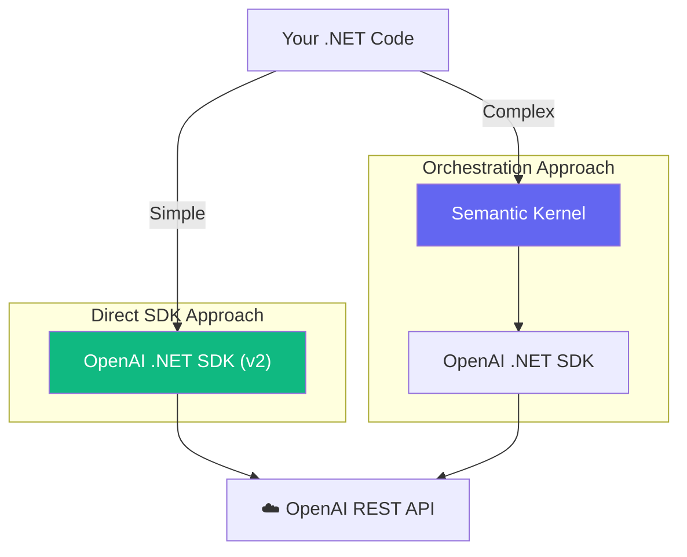

# Chapter — The Official OpenAI SDK for .NET

## 🏢 Business Problem

Your team is building a simple internal console application to summarize text files. A developer spends 3 days trying to learn Semantic Kernel, setting up Dependency Injection, Planners, and Memory abstractions just to make a single API call.

As a Solution Architect, you must know when to use heavy orchestration frameworks, and when to use the lightweight, raw SDK.

---

## 🧠 Theory

In late 2024, OpenAI completely rewrote their official .NET SDK (`OpenAI` v2). 

Unlike Semantic Kernel (which is an orchestration framework built *on top* of the SDK), the raw OpenAI SDK is a thin, direct wrapper over the REST API.

### When to use the raw OpenAI SDK:
- **Simple Scripts:** Console apps, Azure Functions, or quick utility scripts.
- **Bleeding-Edge Features:** When OpenAI releases a brand new feature (like Realtime Audio API), it is available in the raw SDK on day one. Semantic Kernel might take weeks to implement the abstraction.
- **Maximum Performance:** Avoiding the overhead of Dependency Injection and Planners.

### When to AVOID the raw OpenAI SDK:
- **Model Portability:** If you hardcode `OpenAIClient`, you cannot easily swap to LLaMA or Anthropic later.
- **Enterprise Applications:** You lose Semantic Kernel's built-in telemetry, logging, and auto-function calling pipelines.

---

## 🏗 Architecture: SDK vs Orchestrator



---

## 💻 C# Example: Using the v2 SDK

Here is how you make a chat request using the modern, raw OpenAI SDK without any extra fluff.

```csharp title="Program.cs — Raw SDK Call"
using System.ClientModel; // Replaces Azure.Core in v2
using OpenAI;
using OpenAI.Chat;

// 1. Initialize the client (Reads OPENAI_API_KEY from env variables by default)
OpenAIClient client = new OpenAIClient(Environment.GetEnvironmentVariable("OPENAI_API_KEY"));

// 2. Get a client specific to the Chat Completion API
ChatClient chatClient = client.GetChatClient("gpt-4o");

// 3. Construct the raw message array
List<ChatMessage> messages = new()
{
    new SystemChatMessage("You are a helpful IT assistant."),
    new UserChatMessage("How do I reset my password?")
};

// 4. Execute the raw API call
ClientResult<ChatCompletion> result = await chatClient.CompleteChatAsync(messages);

// 5. Read the response
Console.WriteLine(result.Value.Content[0].Text);

// Bonus: The SDK gives direct access to raw metadata
Console.WriteLine($"Total Tokens: {result.Value.Usage.TotalTokenCount}");
```

---

## 🧪 Lab: The Token Counting Trap

### Objective
Understand the risk of raw SDKs.

### Scenario
You write the code above and loop it over 10,000 database rows to summarize them. Halfway through, the application crashes with an `HTTP 400: Context Window Exceeded` error.

### ✅ Success Criteria
- [ ] You recognize that the raw `OpenAIClient` does **not** count tokens automatically before sending the request.
- [ ] You recognize that Semantic Kernel *can* be configured to automatically chunk and manage context windows.
- [ ] You learn the rule: When using the raw SDK, **you are responsible** for integrating a tokenizer (`Microsoft.ML.Tokenizers`) to protect the API boundary.

---

## 🎯 Interview Questions

### Q1: What is the primary difference between Semantic Kernel and the OpenAI SDK?
**Answer:** The OpenAI SDK is a low-level HTTP wrapper specifically tied to OpenAI's proprietary REST API schema. Semantic Kernel is a high-level, model-agnostic orchestration framework that uses the OpenAI SDK internally, but abstracts it so you can swap models and chain AI tasks together with C# code.

### Q2: OpenAI released the v2 SDK in 2024. What was the major architectural change?
**Answer:** The v1 SDK was heavily dependent on `Azure.Core` (as it was maintained by Microsoft). The v2 SDK is a complete rewrite using `System.ClientModel`, standardizing it as an independent library while still sharing underlying HTTP pipelines with the Azure SDKs.

### Q3: When should an enterprise explicitly forbid the use of the raw OpenAI SDK?
**Answer:** When building the core "AI Gateway" or primary Web APIs. Hardcoding the raw SDK locks the enterprise into OpenAI's ecosystem, making it incredibly difficult to switch to cheaper open-source models (like LLaMA) or competitors (like Anthropic) in the future without a complete codebase rewrite.

---

**Next:** [Chapter — Azure OpenAI →](/docs/dotnet-ai/azure-openai)
