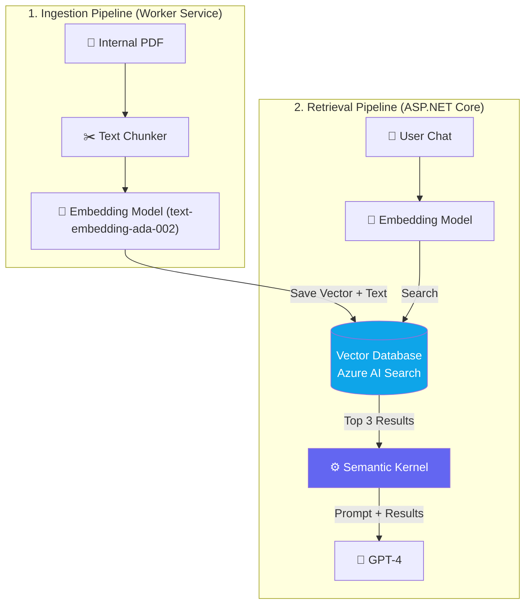

# Chapter 5 — RAG Architecture in .NET

## 🏢 Business Problem

Your enterprise has adopted Microsoft 365, SharePoint, and hundreds of internal PDFs. The executive team wants an internal "ChatGPT" that securely searches these documents. 

In Volume 2, we learned the theory behind Retrieval-Augmented Generation (RAG). Now, as a .NET Architect, you need to implement a scalable, enterprise-grade RAG pipeline using official Microsoft libraries.

---

## 🧠 Theory

A production .NET RAG pipeline relies on two official Microsoft abstraction layers:

1. **Semantic Kernel (`Microsoft.SemanticKernel`):** Used for Orchestration (calling the LLM, managing the prompt).
2. **Microsoft Extensions Vector Data (`Microsoft.Extensions.VectorData`):** A unified abstraction over vector databases (Qdrant, Redis, Azure AI Search). It acts like Entity Framework (EF Core) but for Vector databases!

### The Two Pipelines
A complete RAG system is actually **two distinct applications**:
1. **The Ingestion Pipeline:** Runs in the background (e.g., Azure Functions or a Worker Service). It crawls SharePoint, chunks the text, creates embeddings, and saves them to the Vector DB.
2. **The Retrieval Pipeline:** Runs in the API (ASP.NET Core). It takes the user's chat, embeds the query, searches the DB, and passes the results to Semantic Kernel.

---

## 🏗 Architecture: The .NET RAG Data Flow



---

## 💻 C# Example: Microsoft.Extensions.VectorData

Here is how you perform the Retrieval phase using the new standardized .NET Vector Data abstractions.

```csharp title="RagService.cs — Standard .NET RAG Implementation"
using Microsoft.Extensions.VectorData;
using Microsoft.SemanticKernel;
using Microsoft.SemanticKernel.Embeddings;

public class CorporateRagService
{
    private readonly Kernel _kernel;
    private readonly ITextEmbeddingGenerationService _embeddingService;
    
    // Abstracted Vector Store (could be Qdrant, Redis, or Azure AI Search!)
    private readonly IVectorStoreRecordCollection<string, DocumentRecord> _vectorCollection;

    public CorporateRagService(
        Kernel kernel, 
        ITextEmbeddingGenerationService embeddingService,
        IVectorStore vectorStore)
    {
        _kernel = kernel;
        _embeddingService = embeddingService;
        _vectorCollection = vectorStore.GetCollection<string, DocumentRecord>("corporate_docs");
    }

    public async Task<string> AskQuestionAsync(string userQuestion)
    {
        // 1. Convert user question into a vector
        var queryEmbedding = await _embeddingService.GenerateEmbeddingAsync(userQuestion);

        // 2. Perform Vector Search against the DB
        var searchOptions = new VectorSearchOptions { Top = 3 };
        var searchResults = await _vectorCollection.VectorizedSearchAsync(queryEmbedding, searchOptions);

        // 3. Build the Context String from the DB results
        var contextBuilder = new System.Text.StringBuilder();
        await foreach (var result in searchResults.Results)
        {
            contextBuilder.AppendLine($"Source: {result.Record.FileName}");
            contextBuilder.AppendLine($"Content: {result.Record.Text}");
        }

        // 4. Augment and Generate via Semantic Kernel
        var prompt = $$"""
            You are a helpful corporate assistant. Answer the user's question using ONLY the provided context.
            
            [CONTEXT]
            {{contextBuilder}}
            
            [QUESTION]
            {{userQuestion}}
            """;

        var answer = await _kernel.InvokePromptAsync(prompt);
        return answer.ToString();
    }
}

// Data Model defining the Vector DB schema
public class DocumentRecord
{
    [VectorStoreRecordKey]
    public string Id { get; set; }
    
    [VectorStoreRecordData]
    public string FileName { get; set; }
    
    [VectorStoreRecordData]
    public string Text { get; set; }
    
    [VectorStoreRecordVector(1536)] // 1536 is standard for OpenAI embeddings
    public ReadOnlyMemory<float> Vector { get; set; }
}
```

---

## 🧪 Lab: The Dependency Injection Advantage

### Objective
Understand why Microsoft created `Microsoft.Extensions.VectorData`.

### Scenario
You built the `CorporateRagService` above using Qdrant (a free, open-source vector DB running in Docker) for local development.

Your CISO tells you that production must use Azure AI Search for compliance.

### The Fix
Because you used `IVectorStore`, you do not need to rewrite your `CorporateRagService`. You only change `Program.cs`:

**Dev (Program.cs):**
```csharp
builder.Services.AddQdrantVectorStore(...);
```

**Prod (Program.cs):**
```csharp
builder.Services.AddAzureAISearchVectorStore(...);
```

### ✅ Success Criteria
- [ ] You understand that `Microsoft.Extensions.VectorData` does for Vector Databases what `Entity Framework Core` did for SQL databases. It abstracts the underlying engine!

---

## 🎯 Interview Questions

### Q1: Why do we need an Ingestion Pipeline separate from the ASP.NET Core API?
**Answer:** Ingesting 1,000 PDFs, chunking them, and calling the Embedding API millions of times is a heavy, long-running batch process. If you run this in an ASP.NET Core web request, the request will time out and crash. Ingestion belongs in a background Worker Service or Azure Function.

### Q2: What is `Microsoft.Extensions.VectorData`?
**Answer:** It is a standardized .NET library that provides a common interface (`IVectorStore`) for interacting with various vector databases (Redis, Qdrant, Azure AI Search). It allows developers to swap database providers via Dependency Injection without changing business logic.

### Q3: In RAG, why must the Embedding Model used in Ingestion match the one used in Retrieval?
**Answer:** An embedding model maps text to a specific mathematical space (e.g., `text-embedding-ada-002` uses a 1,536-dimension space). If you ingest documents using OpenAI, but try to search them using a HuggingFace embedding model (which might use 384 dimensions), the math is completely incompatible and the vector search will fail or return garbage.

---

**Next:** [Chapter 6 — Vector Databases in .NET →](/docs/dotnet-ai/vector-databases-dotnet)
