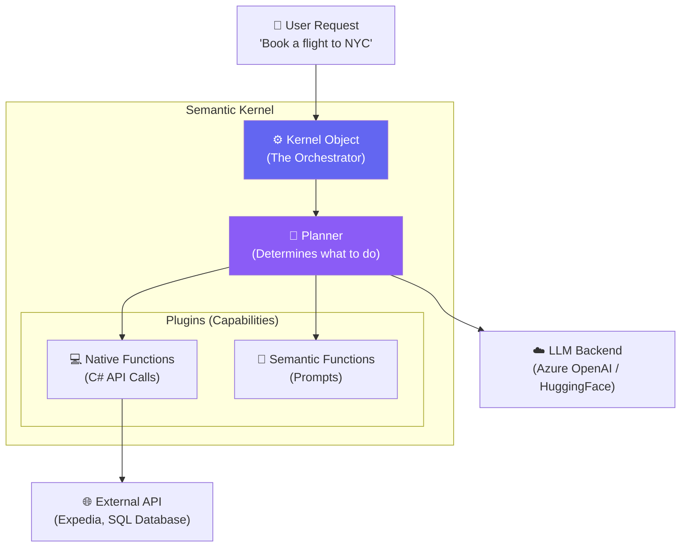

# Chapter 2 — Semantic Kernel Basics

## 🏢 Business Problem

Your enterprise needs to switch from OpenAI to LLaMA 3 hosted on Azure, but the legacy codebase has hardcoded API calls to OpenAI's specific REST format. Changing the models requires rewriting the entire data access layer.

As an architect, you need an abstraction layer. You need the **Semantic Kernel**.

---

## 🧠 Theory

**Microsoft Semantic Kernel (SK)** is an open-source SDK that lets you easily combine AI services like OpenAI, Azure OpenAI, and Hugging Face with conventional programming languages like C# and Python.

It is Microsoft's enterprise answer to *LangChain*. 

### Why not just use `HttpClient`?
1. **Model Agnosticism:** SK abstracts the API. You write code once, and you can swap from GPT-4 to LLaMA 3 by changing one line of configuration.
2. **Native Functions:** SK can execute local C# code (like checking a database or getting the time) to answer user questions.
3. **Planners:** SK can take a user's goal, look at the functions available, and create a multi-step plan to achieve the goal automatically.

### The Kernel Execution Pipeline

The `Kernel` is the central object. You register **Models** (LLMs) and **Plugins** (C# code or Prompts) into the Kernel. When a user asks a question, the Kernel orchestrates the interaction.

---

## 🏗 Architecture: Semantic Kernel Components



---

## 💻 C# Example: Hello Semantic Kernel

Here is how you build a Kernel, register a C# function, and let the LLM use it to answer a question it otherwise wouldn't know the answer to (the current time).

```csharp title="Program.cs — Native Functions with Semantic Kernel"
using Microsoft.SemanticKernel;
using System.ComponentModel;

// 1. Create a Native Plugin (Standard C# Code)
public class TimePlugin
{
    [KernelFunction, Description("Gets the current exact time.")]
    public string GetCurrentTime()
    {
        return DateTime.Now.ToString("F");
    }
}

// 2. Build the Kernel
var builder = Kernel.CreateBuilder();

// Add the LLM
builder.AddAzureOpenAIChatCompletion(
    deploymentName: "gpt-4",
    endpoint: "https://your-endpoint.openai.azure.com/",
    apiKey: "your-api-key"
);

// Add the Plugin to the Kernel
builder.Plugins.AddFromType<TimePlugin>("Time");

var kernel = builder.Build();

// 3. Ask the Kernel (Enable Auto-Function Calling)
var settings = new OpenAIPromptExecutionSettings { ToolCallBehavior = ToolCallBehavior.AutoInvokeKernelFunctions };

var result = await kernel.InvokePromptAsync(
    "What is the exact time right now?", 
    new(settings)
);

Console.WriteLine(result); 
// Output: "The exact time right now is Tuesday, October 24, 2026 10:45 AM."
```

---

## 🧪 Lab: Abstracting Models

### Objective
Understand the power of the Kernel abstraction.

### Scenario
Look at the Kernel builder code above. 
Your company decides to stop using Azure OpenAI and switch to a local Ollama server running LLaMA 3. 

### The Task
Identify exactly what code needs to change.

### ✅ Success Criteria
- [ ] You realize the *only* thing that changes is the dependency injection setup.
- [ ] You replace `AddAzureOpenAIChatCompletion` with something like `AddOllamaChatCompletion` (provided by the SK community/SDKs).
- [ ] **Crucial Concept:** The prompt execution code (`kernel.InvokePromptAsync`) does **not** change. This is the architectural benefit of SK.

---

## 🎯 Interview Questions

### Q1: What is the difference between Semantic Kernel and LangChain?
**Answer:** Both are orchestration frameworks. LangChain is Python/TypeScript native and moves very fast, heavily geared toward experimental AI engineering. Semantic Kernel is Microsoft-backed, C# native (with Python support), heavily integrated with Dependency Injection, and built with enterprise stability and .NET patterns in mind.

### Q2: What is a "Plugin" in Semantic Kernel?
**Answer:** A Plugin is a collection of functions that give the LLM capabilities. A function can be "Native" (written in C#, like querying a SQL database) or "Semantic" (a pre-written text prompt, like summarizing text). 

### Q3: How does the LLM know when to call a Native C# Function?
**Answer:** We pass the descriptions of our C# functions (via attributes like `[Description]`) to the LLM in the system prompt. When the user asks a question, the LLM determines if it needs the function. If yes, the LLM responds with a "Tool Call" request. The Kernel pauses, executes the C# code, feeds the result back to the LLM, and the LLM finishes the sentence.

---

**Next:** [Chapter 3 — Building AI APIs in .NET →](/docs/dotnet-ai/building-ai-apis)
