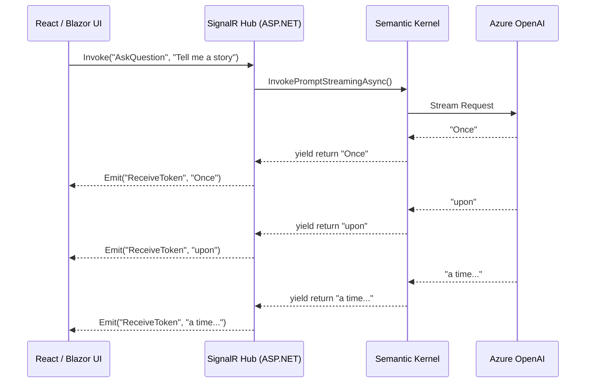

# Chapter 4 — Streaming AI Responses with SignalR

## 🏢 Business Problem

Your company built an AI chatbot using a standard HTTP REST API. A user asks a complex question. They stare at a loading spinner for 18 seconds, assume the app is broken, refresh the page, and try again. 

You just paid for two expensive LLM API calls, and the user is frustrated. 

To create a modern ChatGPT-like experience, you must stream tokens to the UI as they are generated. In .NET, the best tool for this is **SignalR**.

---

## 🧠 Theory

LLMs do not generate their entire response at once. They predict and generate text one token (roughly one syllable) at a time. 

If you use standard `await kernel.InvokePromptAsync()`, the Semantic Kernel waits until the *entire* response is generated before returning the string to you. 

Instead, we need to use **Streaming** (`InvokePromptStreamingAsync`), which returns an `IAsyncEnumerable<string>`. 

### The Protocol Problem
Standard HTTP/1.1 Request-Response is terrible at pushing partial data over a long period. We need a persistent connection. 
- **Server-Sent Events (SSE):** One-way streaming from server to client. (Often used by OpenAI).
- **WebSockets:** Two-way persistent connection.
- **SignalR:** Microsoft's framework that abstracts WebSockets, SSE, and Long Polling, automatically falling back to the best available protocol.

---

## 🏗 Architecture: SignalR Streaming



---

## 💻 C# Example: Building an AI SignalR Hub

Here is how you connect Semantic Kernel's `IAsyncEnumerable` to a SignalR Hub.

```csharp title="AiChatHub.cs — Real-time AI Streaming"
using Microsoft.AspNetCore.SignalR;
using Microsoft.SemanticKernel;
using System.Runtime.CompilerServices;

public class AiChatHub : Hub
{
    private readonly Kernel _kernel;

    public AiChatHub(Kernel kernel)
    {
        _kernel = kernel;
    }

    // Instead of returning a string, we return an IAsyncEnumerable
    // SignalR natively understands this and streams the data to the client!
    public async IAsyncEnumerable<string> StreamAnswer(
        string question, 
        [EnumeratorCancellation] CancellationToken cancellationToken)
    {
        var prompt = $"Answer this question helpfully: {question}";

        // 1. Call the Streaming API
        var responseStream = _kernel.InvokePromptStreamingAsync<string>(
            prompt, 
            cancellationToken: cancellationToken
        );

        // 2. Yield each token back to the client as it arrives
        await foreach (var chunk in responseStream)
        {
            if (!string.IsNullOrEmpty(chunk))
            {
                // SignalR pushes this piece down the WebSocket instantly
                yield return chunk; 
            }
        }
    }
}
```

### Setup in Program.cs
```csharp
var builder = WebApplication.CreateBuilder(args);

// Add SignalR and Semantic Kernel
builder.Services.AddSignalR();
builder.Services.AddKernel().AddAzureOpenAIChatCompletion(...);

var app = builder.Build();

// Map the Hub
app.MapHub<AiChatHub>("/aichub");

app.Run();
```

---

## 🧪 Lab: Handling Disconnects

### Objective
Understand the cost implications of client disconnects.

### The Scenario
A user asks the AI to "Write a 50-page summary of World War II". The LLM starts generating. Two seconds later, the user closes their browser window.

### The Problem
If your backend doesn't handle the disconnect, the LLM will continue generating the entire 50-page summary in the cloud. You will pay for all those tokens, even though no one is reading them.

### ✅ Success Criteria
- [ ] You understand the importance of the `CancellationToken`.
- [ ] In SignalR, if the client disconnects, the `[EnumeratorCancellation] CancellationToken` is automatically triggered. 
- [ ] Passing this token to `InvokePromptStreamingAsync` ensures Semantic Kernel instantly terminates the HTTP request to OpenAI, saving you money!

---

## 🎯 Interview Questions

### Q1: What is the UX (User Experience) benefit of streaming LLM responses?
**Answer:** It significantly reduces perceived latency. Instead of waiting 10 seconds for a full answer, the user sees the first word in 500 milliseconds and reads along as the AI types. This builds trust and prevents users from abandoning the page.

### Q2: How does SignalR handle `IAsyncEnumerable`?
**Answer:** SignalR 3.0+ natively supports streaming from the server to the client. When a Hub method returns an `IAsyncEnumerable`, SignalR does not wait for the enumeration to finish. It immediately pushes each yielded item over the WebSocket/SSE connection as a distinct message.

### Q3: Why is tracking token usage harder when streaming?
**Answer:** In a standard REST call, the LLM returns the exact Token Usage in the final JSON wrapper. When streaming via SSE, the usage statistics are usually only sent in the very *last* chunk of the stream (or sometimes not at all, depending on the provider). You must explicitly configure the SDK to request usage data and capture it after the `await foreach` loop completes.

---

**Next:** [Chapter 5 — RAG Architecture in .NET →](/docs/dotnet-ai/rag-architecture-dotnet)
