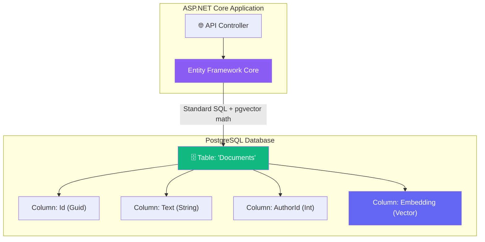

# Chapter 6 — Vector Databases in .NET

## 🏢 Business Problem

Your company already runs a massive PostgreSQL database using Entity Framework Core (EF Core) for all business data. 

You need to add AI Semantic Search. The infrastructure team refuses to approve a new, dedicated Vector Database (like Pinecone or Qdrant) because of the operational overhead, security reviews, and costs.

As a Solution Architect, how do you add Vector Search without adding a new database?

---

## 🧠 Theory

You do not always need a dedicated vector database. Many traditional databases now support vector math via extensions.

For .NET shops, the two most common architectures are:

1. **Dedicated Vector DBs:** Azure AI Search, Qdrant, Milvus. (Best for massive scale, 10M+ documents).
2. **Integrated Vector DBs:** PostgreSQL (via `pgvector`), SQL Server, Cosmos DB. (Best for keeping relational data and vector data together).

### Entity Framework Core + `pgvector`
If you are already using PostgreSQL and EF Core, you can install the `pgvector` extension. This allows you to store a `Vector` type directly in your standard SQL tables alongside your relational data!

**The Advantage:**
If you need to find "AI matching documents authored by Employee 123", doing this across *two* databases (Vector DB for meaning, SQL DB for the author) is an architectural nightmare called the "Dual-Write problem." 

Using EF Core + `pgvector`, you can do standard SQL `WHERE AuthorId = 123` combined with an `ORDER BY VectorDistance` in a single query!

---

## 🏗 Architecture: Integrated Vector Search



---

## 💻 C# Example: EF Core with pgvector

Here is how you configure EF Core to store and query vectors natively in PostgreSQL.

### 1. Setup DbContext
```csharp title="AppDbContext.cs"
using Microsoft.EntityFrameworkCore;
using Pgvector;
using Pgvector.EntityFrameworkCore; // Requires Npgsql.EntityFrameworkCore.PostgreSQL package

public class AppDbContext : DbContext
{
    public DbSet<DocumentEntity> Documents { get; set; }

    protected override void OnModelCreating(ModelBuilder modelBuilder)
    {
        // Must tell PostgreSQL we are using the pgvector extension
        modelBuilder.HasPostgresExtension("vector");
    }
}

public class DocumentEntity
{
    public int Id { get; set; }
    public string Content { get; set; }
    public int AuthorId { get; set; }
    
    // The Pgvector type!
    public Vector Embedding { get; set; }
}
```

### 2. Hybrid SQL + Vector Query
```csharp title="DocumentRepository.cs"
using Microsoft.EntityFrameworkCore;
using Pgvector;

public class DocumentRepository
{
    private readonly AppDbContext _db;

    public DocumentRepository(AppDbContext db)
    {
        _db = db;
    }

    public async Task<List<string>> SearchAuthoredDocsAsync(int authorId, float[] queryVector)
    {
        var vector = new Vector(queryVector);

        // This compiles down to a single SQL query!
        // It filters by AuthorId (Relational) AND sorts by Vector Distance (Cosine Similarity)
        var results = await _db.Documents
            .Where(d => d.AuthorId == authorId)
            .OrderBy(d => d.Embedding.CosineDistance(vector))
            .Take(5)
            .Select(d => d.Content)
            .ToListAsync();

        return results;
    }
}
```

---

## 🧪 Lab: The Dual-Write Problem

### Objective
Understand the architectural risk of separating data.

### Scenario
You store standard document metadata (Title, Author, Permissions) in SQL Server. You store the Document Text and Vectors in Qdrant (a dedicated vector DB).

A user deletes a document. 
Your code executes:
1. `SQL.Delete(docId)` (Success!)
2. `Qdrant.Delete(docId)` (Network drops... Failure!)

### The Problem
Your SQL database says the document is gone. Your Vector database still has it. When a user runs an AI search, the Vector DB returns the deleted document! This is a severe data leak.

### ✅ Success Criteria
- [ ] You understand that distributed transactions across two different databases are incredibly difficult.
- [ ] You realize that using an Integrated Vector DB (like PostgreSQL + pgvector) solves this because you can delete the row in a single atomic SQL transaction.

---

## 🎯 Interview Questions

### Q1: When should you use a dedicated Vector Database vs an Integrated relational database (like pgvector)?
**Answer:** Use an integrated database (pgvector) when you have heavy relational filtering (e.g., Row-Level Security, tenant IDs, foreign keys) or you want to avoid operational complexity and dual-write issues. Use a dedicated Vector DB (Azure AI Search, Pinecone) when you have massive scale (10s of millions of vectors) and need advanced indexing algorithms or out-of-the-box Hybrid Search (BM25 + Vector).

### Q2: How does `pgvector` calculate similarity in EF Core?
**Answer:** EF Core translates the `.CosineDistance()` LINQ method directly into the `<=>` pgvector SQL operator. The similarity math happens entirely inside the PostgreSQL database engine, not in the .NET application memory.

### Q3: What is the "Dual-Write Problem"?
**Answer:** It is a distributed systems issue where an application must write data to two separate databases (e.g., SQL and a Vector DB). If one write succeeds and the other fails, the system is in an inconsistent state, leading to data leaks or ghost records.

---

**Congratulations!** You've completed Volume 3 — .NET AI Integration. 🎉

You now understand:
- ✅ ASP.NET Core AI Patterns (Polly, IHttpClientFactory)
- ✅ Semantic Kernel Abstractions
- ✅ AI Gateway & Timeout handling
- ✅ SignalR Streaming for AI
- ✅ RAG Data flows in .NET
- ✅ EF Core + pgvector integration

**Next:** Volume 4 — Architecture Patterns (coming soon)
