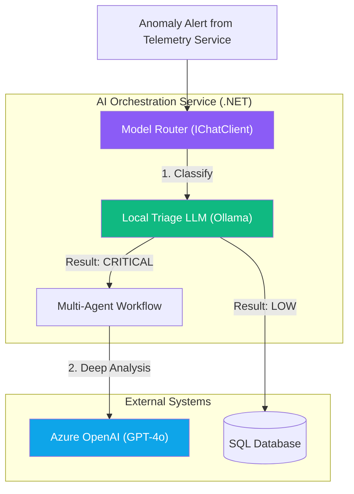

# Chapter 3 — AI Orchestration Layer

## 🏢 Business Problem

When the Telemetry Service detects a machine anomaly (e.g., Temperature > 100°C), it sends an alert to the AI system. 

Sometimes the anomaly is simple: *"Sensor calibration error. No action required."* 
Sometimes it is catastrophic: *"Main bearing failure imminent. Requires mechanic dispatch."*

If you send every single alert to GPT-4o, you waste money on trivial anomalies. If you send everything to a cheap local model, it fails to understand complex catastrophic failures.

You need an **Orchestration Layer** to route tasks dynamically.

---

## 🧠 Theory

The Orchestration Layer acts as the brain of FactoryMind. It does not contain domain logic (like saving Work Orders); it only contains *routing* and *decision-making* logic.

### The Two-Tier Strategy
1. **Tier 1 (Triage):** Every anomaly alert hits a small, fast, local LLM (e.g., LLaMA 3.1 via Ollama). This model is tasked *only* with classifying the severity of the alert (Low, Medium, Critical). Cost: $0.00.
2. **Tier 2 (Deep Analysis):** If Tier 1 classifies the alert as "Critical", the Orchestration Layer forwards the full telemetry history to Azure OpenAI (GPT-4o) for deep analysis and agentic workflow execution.

This pattern (Model Routing) saves up to 90% on AI API costs in a production enterprise.

---

## 🏗 Architecture: The AI Router



---

## 💻 C# Example: Implementing the Triage Router

We use `Microsoft.Extensions.AI` to build the Triage logic. We use Structured Outputs (JSON schema) to force the local model to return a clean `Severity` enum.

```csharp title="AnomalyRouter.cs"
using Microsoft.Extensions.AI;
using System.Text.Json;

public class AnomalyRouter
{
    private readonly IChatClient _triageClient; // Injected Ollama (Llama 3)
    private readonly AgentHub _agentHub;        // The Semantic Kernel GPT-4 system

    public AnomalyRouter(
        [FromKeyedServices("TriageModel")] IChatClient triageClient, 
        AgentHub agentHub)
    {
        _triageClient = triageClient;
        _agentHub = agentHub;
    }

    public async Task RouteAnomalyAsync(string machineId, string telemetryData)
    {
        var prompt = $$"""
            Analyze the following machine telemetry. 
            Is this a severe failure requiring a mechanic, or a minor warning?
            Respond ONLY in JSON matching this format: {"Severity": "Low" | "Medium" | "Critical"}
            
            [DATA]
            {{telemetryData}}
            """;

        // 1. Ask the cheap/local model first
        var response = await _triageClient.CompleteAsync(prompt);
        var result = JsonSerializer.Deserialize<TriageResult>(response.Message.Text);

        if (result?.Severity == "Critical")
        {
            Console.WriteLine($"[CRITICAL] Machine {machineId} failing. Waking up GPT-4 Agents...");
            
            // 2. Escalate to the expensive, smart system
            await _agentHub.RunDiagnosticWorkflowAsync(machineId, telemetryData);
        }
        else
        {
            Console.WriteLine($"[LOW/MED] Machine {machineId} anomalous but stable. Logging and ignoring.");
            // Just save to DB, don't wake up the expensive AI
        }
    }
}

public class TriageResult { public string Severity { get; set; } }
```

---

## 🧪 Lab: The Latency Penalty

### Objective
Understand the user-experience tradeoff of multi-tiered orchestration.

### Scenario
A mechanic is standing in front of a smoking machine. They hit the "Diagnose Now" button on their tablet. 
The request hits the `AnomalyRouter`.
1. The local Triage LLM takes 3 seconds to classify it.
2. It escalates to GPT-4o, which takes 8 seconds to run the diagnostic.
3. Total waiting time: 11 seconds.

### ✅ Success Criteria
- [ ] You recognize that routing adds sequential latency.
- [ ] You implement **Streaming** to the mechanic's UI. 
- [ ] As soon as the Triage model decides it is critical (at second 3), you push a SignalR message to the tablet: *"Critical failure detected. Escalating to deep analysis..."*
- [ ] The mechanic knows the system is working, rather than staring at a frozen spinner for 11 seconds.

---

## 🎯 Interview Questions

### Q1: Why not just use `if (temperature > 150) Severity = Critical` instead of an LLM for triage?
**Answer:** If the rules are that simple, you absolutely should use a standard C# `if` statement! AI should only be used when the rules are fuzzy. For example, if the telemetry includes a vibration frequency matrix and acoustic sensor text like *"high-pitched whining sound detected"*, a standard `if` statement cannot parse that. A small LLM can.

### Q2: How does `[FromKeyedServices]` work in the constructor?
**Answer:** In .NET 8, Keyed Dependency Injection allows you to register multiple implementations of the exact same interface (`IChatClient`) but tag them with a string key. We register Ollama as `"TriageModel"` and Azure OpenAI as `"SmartModel"`. This allows the Router class to ask the DI container for the specific model it needs.

### Q3: What happens if the Local Triage LLM hallucinates and classifies a catastrophic failure as "Low"?
**Answer:** This is a False Negative, and it is the biggest risk of the Router Pattern. Because smaller models are less intelligent, they make more mistakes. You must continuously monitor the accuracy of the Triage model against human evaluations (using RAGAS or a larger LLM-as-a-Judge) and potentially fine-tune the small model on historical factory data to improve its domain-specific accuracy.

---

**Next:** [Chapter 4 — Event-Driven Architecture →](/docs/factorymind/event-driven-architecture)
