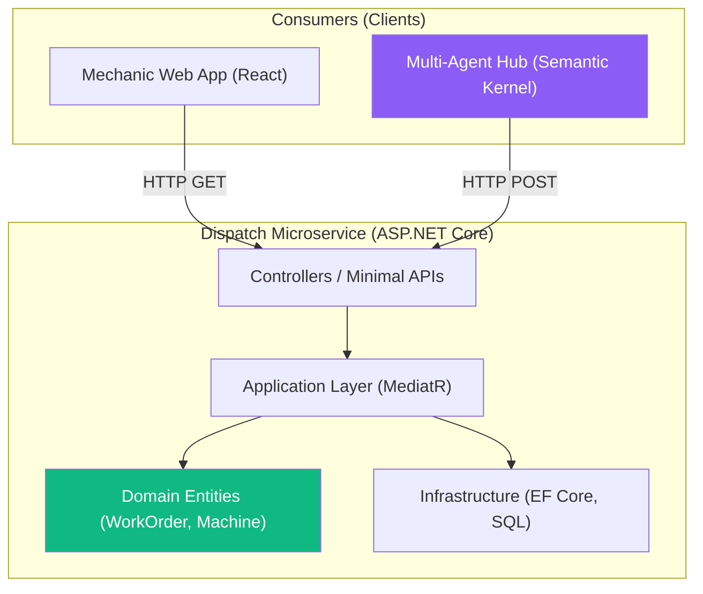

# Chapter 2 — Backend Services (.NET 8)

## 🏢 Business Problem

Your factory floor generates gigabytes of data. Your developers want to feed all of this raw telemetry directly into Semantic Kernel and GPT-4 to "find anomalies." 

When they deploy, Azure OpenAI throttles them within 3 minutes because they exceeded the Tokens-Per-Minute quota. The monthly projected bill is $2.4 million. 

As an architect, you must explain that AI is the *last* step in the pipeline, not the first. You need robust, deterministic backend services to filter the noise.

---

## 🧠 Theory

The core of FactoryMind is not AI. It is high-performance, deterministic C# code. 

### The Telemetry Service
This service pulls data from Kafka/Event Hubs. It uses standard math (moving averages, standard deviations) to detect anomalies. **It only wakes up the AI when a mathematical anomaly is detected.**
- E.g., If Machine A's temperature goes from 80°C to 110°C, the Telemetry Service triggers an event. 99% of normal data is never sent to the LLM.

### The Dispatch Service
This is a standard CRUD API using Entity Framework Core and SQL Server. It maintains the state of the factory (Machines, Mechanics, Work Orders). 
- It exposes a secure REST API that the Semantic Kernel Agents will eventually call as "Tools". 

### Clean Architecture
We separate the domains. The Dispatch Service knows nothing about Kafka or LLMs. The Telemetry Service knows nothing about Work Orders. They communicate entirely through messages (events).

---

## 🏗 Architecture: The Dispatch API



---

## 💻 C# Example: The Dispatch API (Tool Target)

When we build the AI Agent in a later chapter, it will need a way to dispatch mechanics. We must provide a clean, documented REST endpoint for the Agent to call.

```csharp title="Program.cs (Dispatch API)"
using Microsoft.EntityFrameworkCore;
using System.ComponentModel.DataAnnotations;

var builder = WebApplication.CreateBuilder(args);
builder.Services.AddDbContext<FactoryContext>(opt => opt.UseSqlServer("..."));
var app = builder.Build();

// This is the endpoint the AI Agent will call!
app.MapPost("/api/workorders", async (CreateWorkOrderDto dto, FactoryContext db) =>
{
    // Deterministic business logic
    var mechanic = await db.Mechanics
        .Where(m => m.Status == "Available" && m.Specialty == dto.RequiredSpecialty)
        .FirstOrDefaultAsync();

    if (mechanic == null)
        return Results.BadRequest("No mechanics available for this specialty.");

    var workOrder = new WorkOrder
    {
        MachineId = dto.MachineId,
        MechanicId = mechanic.Id,
        Description = dto.Description,
        Status = "Assigned",
        CreatedAt = DateTime.UtcNow
    };

    db.WorkOrders.Add(workOrder);
    await db.SaveChangesAsync();

    // The AI receives this JSON to know it succeeded
    return Results.Ok(new { WorkOrderId = workOrder.Id, AssignedMechanic = mechanic.Name });
});

app.Run();

// DTO expected by the API (and eventually the AI)
public record CreateWorkOrderDto(
    [Required] string MachineId, 
    [Required] string RequiredSpecialty, 
    [Required] string Description);
```

---

## 🧪 Lab: The Cost of Noise

### Objective
Understand the financial impact of omitting a deterministic filtering layer.

### Scenario
Machine A sends 1 telemetry ping per second (86,400 per day). 
The JSON payload is 50 tokens. 
If you send every ping to GPT-4o directly to ask "Is this anomalous?":
- 86,400 * 50 tokens = 4,320,000 tokens/day.
- Cost of GPT-4o input: ~$5.00 / 1M tokens.
- Cost = $21.60 per day, *per machine*.
- For 5,000 machines = **$108,000 per day**.

### ✅ Success Criteria
- [ ] You calculate the cost of sending raw data to an LLM.
- [ ] You implement a standard C# `if (temp > MaxTemp)` threshold check in the Telemetry Service.
- [ ] You only trigger the LLM API call if the threshold is breached (maybe 5 times a day per machine).
- [ ] Your new AI cost is **$0.06 per day**, and you are promoted to VP of Engineering.

---

## 🎯 Interview Questions

### Q1: Why should the AI Agent call a REST API to create a Work Order instead of talking to the SQL database directly?
**Answer:** The REST API encapsulates the business logic (e.g., finding an *available* mechanic with the right *specialty*). If you give the AI Agent raw SQL access, it might hallucinate a query that assigns a work order to a mechanic who is on vacation, bypassing all your C# validation logic.

### Q2: What is the MediatR pattern and why is it popular in .NET microservices?
**Answer:** MediatR implements the CQRS (Command Query Responsibility Segregation) pattern. It decouples the API controller from the business logic. The controller just sends a `Command` object into the mediator, and a dedicated `Handler` processes it. This keeps the codebase highly organized and easy to unit test.

### Q3: How do you secure the Dispatch API so that only the AI Agent can call it?
**Answer:** You implement OAuth2 (Entra ID) with Application Roles. The AI Agent microservice is given a Managed Identity. You assign that identity the `WorkOrder.Create` role. The Dispatch API checks the incoming JWT token for this specific role. This prevents a human user (or another compromised microservice) from maliciously calling the endpoint.

---

**Next:** [Chapter 3 — AI Orchestration Layer →](/docs/factorymind/ai-orchestration-layer)
