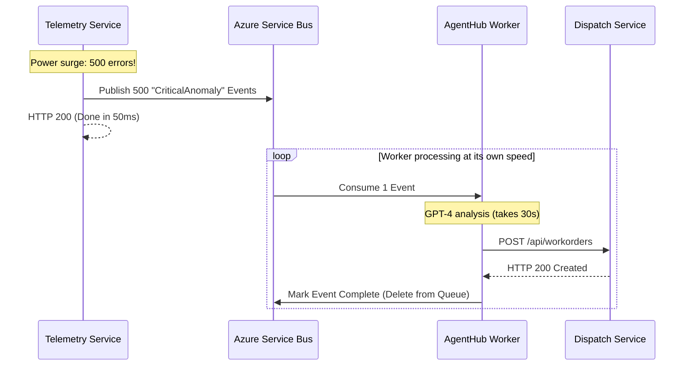

# Chapter 4 — Event-Driven Architecture (FactoryMind)

## 🏢 Business Problem

Your `AgentHub` is working perfectly. When a machine reports a critical error, the AI analyzes it, finds the repair manual, and dispatches a mechanic. 

One day, the factory experiences a power surge. 500 machines report a critical error simultaneously. The `TelemetryService` makes 500 synchronous HTTP calls to the `AgentHub`. 

The `AgentHub` can only process 10 requests at a time due to Azure OpenAI rate limits. 490 requests time out (HTTP 504). No mechanics are dispatched, and the factory floor burns down.

You must decouple the system.

---

## 🧠 Theory

In a deterministic system, if a database is slow, you can just wait. In an AI system, if the LLM is busy or rate-limited, you cannot wait.

### The Decoupled Hub
The `TelemetryService` must **never** call the `AgentHub` via HTTP GET/POST. 
Instead, it must publish an event to a Message Broker (e.g., `CriticalAnomalyDetectedEvent`).

The `AgentHub` runs as a Background Worker Service. It pulls events off the queue at its own pace. If it can only process 10 per minute, it processes 10 per minute. The other 490 events sit safely in the queue.

### The Saga Pattern
Because the process is now asynchronous, the `AgentHub` must manage state. 
1. It starts analyzing the anomaly.
2. It queries the Vector DB for the manual.
3. It calls the `DispatchService` to create a work order.

If Step 3 fails, the Agent must know how to "rollback" or retry without starting all over from Step 1.

---

## 🏗 Architecture: Decoupled AI Processing



---

## 💻 C# Example: Consuming the Anomaly Event

Here is how the `AgentHub` consumes the event safely using a .NET `BackgroundService`.

```csharp title="AgentHubWorker.cs"
using Azure.Messaging.ServiceBus;

public class AgentHubWorker : BackgroundService
{
    private readonly ServiceBusClient _busClient;
    private readonly IServiceProvider _services;

    public AgentHubWorker(ServiceBusClient busClient, IServiceProvider services)
    {
        _busClient = busClient;
        _services = services;
    }

    protected override async Task ExecuteAsync(CancellationToken stoppingToken)
    {
        var processor = _busClient.CreateProcessor("critical-anomalies-queue");

        processor.ProcessMessageAsync += async args =>
        {
            var jsonPayload = args.Message.Body.ToString();
            Console.WriteLine($"[AGENT HUB] Pulled anomaly from queue: {jsonPayload}");

            // 1. Create a Scope! BackgroundServices are Singletons.
            // We need a fresh, scoped Semantic Kernel for this specific event.
            using var scope = _services.CreateScope();
            var orchestrator = scope.ServiceProvider.GetRequiredService<AiOrchestrator>();

            try 
            {
                // 2. Run the heavy AI workflow
                await orchestrator.RunDiagnosticWorkflowAsync(jsonPayload);
                
                // 3. Success! Delete the message from the queue.
                await args.CompleteMessageAsync(args.Message);
            }
            catch (Exception ex)
            {
                // 4. If the AI hallucinates or fails, we don't complete the message.
                // The Service Bus will automatically retry it later!
                Console.WriteLine($"[ERROR] AI Workflow Failed: {ex.Message}");
            }
        };

        processor.ProcessErrorAsync += args => Task.CompletedTask;

        await processor.StartProcessingAsync(stoppingToken);
    }
}
```

---

## 🧪 Lab: The Idempotency Key

### Objective
Prevent duplicate AI actions in a retrying queue system.

### Scenario
The `AgentHub` analyzes the anomaly (Step 1), and successfully calls the `DispatchService` to create Work Order #99 (Step 2). 

Right before it can tell the Service Bus to delete the message (Step 3), the server crashes.

When the server restarts, the Service Bus thinks the message was never processed, so it hands it to the `AgentHub` again. The AI analyzes it again and creates Work Order #100. The mechanic receives two work orders for the exact same broken machine.

### ✅ Success Criteria
- [ ] You recognize this as the classic "At-Least-Once Delivery" problem in distributed systems.
- [ ] You must implement **Idempotency**.
- [ ] You modify the `DispatchService` API to require a unique `Idempotency-Key` header (usually the original Event ID from the Service Bus).
- [ ] If the AI accidentally calls the Dispatch API twice with the same Event ID, the Dispatch API checks SQL Server, sees it already created a work order for that Event ID, and safely returns `HTTP 200 OK` without creating a duplicate.

---

## 🎯 Interview Questions

### Q1: If the TelemetryService publishes the event and doesn't wait for the AI to finish, how does the mechanic know to go fix the machine?
**Answer:** The `AgentHub` is a background worker. When it finishes its AI analysis, it makes a REST call to the `DispatchService`. The `DispatchService` saves the Work Order to SQL Server and then immediately broadcasts a SignalR WebSocket message to the specific mechanic's tablet, forcing the UI to update with the new instructions.

### Q2: What happens if the `AgentHub` encounters a hard limit (HTTP 429 Too Many Requests) from OpenAI?
**Answer:** Because we are using an Event-Driven Architecture, this is not a crisis. We implement a Polly Retry policy on the OpenAI HTTP Client. If all retries fail, an exception is thrown in the C# code. The `ProcessMessageAsync` catch block is hit. The Service Bus waits a few minutes and tries handing the message to the worker again later when the OpenAI quota resets.

### Q3: Why did we call `_services.CreateScope()` inside the message handler loop?
**Answer:** Semantic Kernel (and Entity Framework) relies heavily on Scoped dependencies. A `BackgroundService` is a Singleton that lives forever. If you resolve a Scoped service directly from a Singleton, it essentially becomes a Singleton itself, leading to massive memory leaks, stale database connections, and cross-contamination of AI conversational histories between different events.

---

**Next:** [Chapter 5 — Messaging (Kafka vs RabbitMQ) →](/docs/factorymind/messaging-kafka-rabbitmq)
