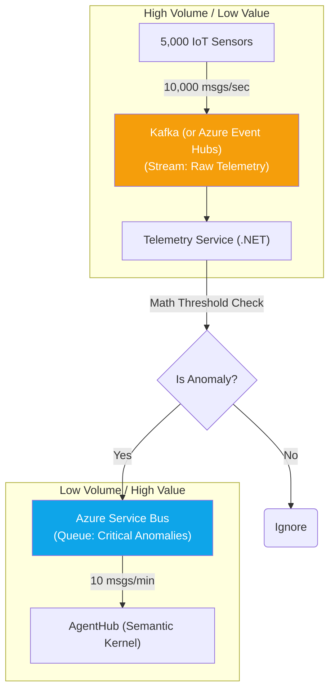

# Chapter 5 — Messaging (Kafka vs RabbitMQ)

## 🏢 Business Problem

Your `AgentHub` is now beautifully decoupled using an Event-Driven Architecture. 

However, your infrastructure team is arguing about which Message Broker to use. Team A wants RabbitMQ because they are familiar with it. Team B wants Apache Kafka because it scales better. Team C wants Azure Service Bus because it's fully managed.

If you choose the wrong broker for FactoryMind, the system will either collapse under the load of 5,000 IoT sensors or bankrupt the company with unnecessary compute costs.

---

## 🧠 Theory

There are two fundamental types of message brokers. You must choose the right tool for the right job in your AI architecture.

### 1. Smart Broker / Dumb Consumer (RabbitMQ / Azure Service Bus)
- **How it works:** The broker tracks the state of every single message. When the `AgentHub` reads a message, the broker "locks" it. When the Agent finishes, it tells the broker "Delete it." If the Agent crashes, the broker unlocks the message for another worker.
- **Best For:** High-value, low-volume transactional events. (e.g., "Critical Anomaly Detected", "Dispatch Mechanic", "Process Payment").
- **Throughput:** ~50,000 messages per second.

### 2. Dumb Broker / Smart Consumer (Apache Kafka / Azure Event Hubs)
- **How it works:** The broker is just a giant, append-only log file on a hard drive. It does not track message state. It just stores bytes. The Consumer (your C# code) is responsible for remembering where it stopped reading (its "offset").
- **Best For:** Low-value, massive-volume streaming data. (e.g., IoT Sensor Telemetry, Log aggregation).
- **Throughput:** ~Millions of messages per second.

---

## 🏗 Architecture: The Dual-Broker Strategy

In a massive enterprise system like FactoryMind, you do not choose one. You use both.



### The Data Flow
1. 5,000 sensors blast 10,000 telemetry points per second into **Kafka**. Kafka easily absorbs this massive firehose.
2. The `TelemetryService` reads from Kafka, runs basic C# math thresholds, and filters out 99.9% of the noise.
3. When it finds a critical error, it drops a *single, high-value event* onto **Azure Service Bus**.
4. The `AgentHub` reads from Azure Service Bus, relying on its advanced features (Dead-Letter Queues, message locking) to safely process the complex AI task.

---

## 💻 C# Example: Consuming from Kafka (Event Hubs)

Reading from a stream (Kafka/Event Hubs) is fundamentally different than reading from a queue (RabbitMQ/Service Bus). 

With a Queue, you process one message and delete it. With a Stream, you process batches of data and update your "checkpoint" (offset).

```csharp title="TelemetryStreamProcessor.cs"
using Azure.Messaging.EventHubs;
using Azure.Messaging.EventHubs.Processor;
using Azure.Storage.Blobs;

public class TelemetryStreamProcessor
{
    private readonly EventProcessorClient _processor;

    public TelemetryStreamProcessor(string connectionString, string storageConnectionString)
    {
        // Kafka/Event Hubs require a Blob Storage account to save your "checkpoint"
        // This is how the "Smart Consumer" remembers where it left off if the server crashes!
        var storageClient = new BlobContainerClient(storageConnectionString, "checkpoints");
        
        _processor = new EventProcessorClient(storageClient, "$Default", connectionString, "iot-telemetry");
        
        _processor.ProcessEventAsync += ProcessEventHandler;
        _processor.ProcessErrorAsync += ProcessErrorHandler;
    }

    public async Task StartAsync() => await _processor.StartProcessingAsync();

    private async Task ProcessEventHandler(ProcessEventArgs args)
    {
        // 1. Read the raw bytes
        string data = System.Text.Encoding.UTF8.GetString(args.Data.Body.ToArray());
        
        // 2. Do the fast C# math triage (Is it an anomaly?)
        if (IsAnomalous(data)) 
        {
            // 3. Send to Azure Service Bus!
            await SendToServiceBusAsync(data);
        }

        // 4. Update the checkpoint every 50 messages to save Blob Storage I/O
        if (args.CancellationToken.IsCancellationRequested) return;
        
        // This tells the stream: "I have successfully read up to this point in the log."
        await args.UpdateCheckpointAsync(args.CancellationToken);
    }
}
```

---

## 🧪 Lab: The Poison Pill in Kafka

### Objective
Understand why you never put heavy AI processing directly on a Kafka stream.

### Scenario
An architect ignores the dual-broker strategy. They connect the `AgentHub` directly to Kafka.

The Agent processes Message 1, 2, and 3 instantly. 
Message 4 contains a complex error. The LLM takes 45 seconds to analyze it. 
While the Agent is blocked for 45 seconds, Messages 5 through 50,000 pile up behind it in the stream. 
Because Kafka enforces strict sequential processing (within a partition), the entire stream halts. The system collapses.

### ✅ Success Criteria
- [ ] You realize that streams require **uniform, fast processing times** (like simple C# math).
- [ ] You realize that queues (RabbitMQ/Service Bus) allow **competing consumers**. If one Agent is blocked for 45 seconds on Message A, another Agent instance can immediately pull Message B from the queue and process it in parallel.
- [ ] You enforce the rule: **Never put a non-deterministic LLM call on a real-time data stream.**

---

## 🎯 Interview Questions

### Q1: What is a Dead-Letter Queue (DLQ) and which broker type supports it?
**Answer:** A DLQ is a sub-queue where messages are automatically sent if they fail to process after $X$ attempts. This prevents a bad message (poison pill) from blocking the system forever. "Smart Brokers" like Azure Service Bus and RabbitMQ have native DLQs. "Dumb Brokers" like Kafka do not have native DLQs; if a message fails, you must write custom C# code to skip the offset and manually publish the bad message to a separate error topic.

### Q2: Why does Azure Event Hubs (Kafka) require a Blob Storage connection?
**Answer:** Because Kafka-style brokers do not track which messages you have read. They just store a massive log. The Consumer (your .NET app) is responsible for tracking its own progress. The Event Processor Client uses Blob Storage to write a "Checkpoint" file. If your .NET app crashes and restarts, it reads the Blob Storage file, finds its last checkpoint, and resumes reading the stream from exactly that point.

### Q3: If Kafka is harder to use and lacks DLQs, why use it at all?
**Answer:** Throughput. Because Kafka doesn't waste compute power tracking the state and locking status of every single message, it can ingest millions of events per second with sub-millisecond latency. A traditional queue like RabbitMQ would melt if you tried to feed it 10,000 IoT sensor pings a second.

---

**Next:** [Chapter 6 — Multi-Agent Workflow →](/docs/factorymind/multi-agent-workflow)
