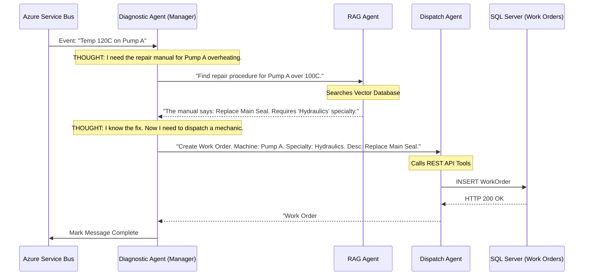

# Chapter 6 — Multi-Agent Workflow (The Capstone)

## 🏢 Business Problem

Your `AgentHub` successfully pulls critical anomaly events from the Service Bus. 

Now, the AI must actually *solve* the problem. It needs to:
1. Analyze the machine's numerical telemetry.
2. Search a 10,000-page PDF manual for the error code.
3. Call an API to find an available mechanic with the right specialty.
4. Call an API to dispatch the mechanic.

If you give one "God Agent" all these tools, it will hallucinate and dispatch a mechanic without reading the manual. You must build a **Multi-Agent Workflow**.

---

## 🧠 Theory

We will use the **Semantic Kernel Agent Framework** to build a Manager/Worker hierarchy.

1. **The Diagnostic Agent (Manager):** Reads the telemetry. Identifies the broken component.
2. **The RAG Agent (Worker):** Has access to the Vector Database. Finds the repair procedure.
3. **The Dispatch Agent (Worker):** Has access to the REST APIs. Creates the Work Order.

This ensures strict isolation of concerns. The RAG agent cannot accidentally dispatch a mechanic, because it physically does not have that tool.

---

## 🏗 Architecture: The Multi-Agent Capstone



---

## 💻 C# Example: Semantic Kernel Agent Group

Here is the final capstone code. This is what modern Enterprise AI looks like in .NET 8.

```csharp title="FactoryAgentHub.cs"
using Microsoft.SemanticKernel;
using Microsoft.SemanticKernel.Agents;
using Microsoft.SemanticKernel.Agents.OpenAI;

public class FactoryAgentHub
{
    public async Task ProcessAnomalyAsync(Kernel kernel, string anomalyJson)
    {
        // 1. Define the RAG Agent (No APIs, just Vector Search)
        var ragAgent = new OpenAIAssistantAgent(kernel)
        {
            Name = "ManualReader",
            Instructions = "You search repair manuals. Answer ONLY using the facts from the manual.",
            Plugins = [KernelPluginFactory.CreateFromType<VectorSearchPlugin>()]
        };

        // 2. Define the Dispatch Agent (No Vector Search, just APIs)
        var dispatchAgent = new OpenAIAssistantAgent(kernel)
        {
            Name = "Dispatcher",
            Instructions = "You create work orders. You MUST require a MachineId, Specialty, and Description.",
            Plugins = [KernelPluginFactory.CreateFromType<WorkOrderApiPlugin>()]
        };

        // 3. Define the Manager (No tools, just orchestrates)
        var managerAgent = new OpenAIAssistantAgent(kernel)
        {
            Name = "DiagnosticManager",
            Instructions = """
                You manage factory repairs. 
                1. First, ask the ManualReader how to fix the broken component.
                2. Second, ask the Dispatcher to create a work order using that fix.
                3. Once the work order is confirmed, say "WORKFLOW_COMPLETE".
                """
        };

        // 4. Create the Chat Group
        var chat = new AgentGroupChat(managerAgent, ragAgent, dispatchAgent)
        {
            ExecutionSettings = new AgentGroupChatSettings
            {
                // Terminate the loop when the manager says it's done
                TerminationStrategy = new RegexTerminationStrategy("WORKFLOW_COMPLETE")
                {
                    Agents = [managerAgent],
                    MaximumIterations = 8
                }
            }
        };

        // 5. Kick off the workflow!
        chat.AddChatMessage(new ChatMessageContent(AuthorRole.User, anomalyJson));

        await foreach (var response in chat.InvokeAsync())
        {
            Console.WriteLine($"[{response.AuthorName}]: {response.Content}\n");
        }
    }
}
```

---

## 🧪 Lab: The Hallucination Firewall

### Objective
Ensure the AgentHub fails gracefully.

### Scenario
The `DiagnosticManager` asks the `ManualReader` how to fix a "Flux Capacitor". 
The Vector Database returns nothing (because the factory does not build time machines).
The `ManualReader` agent hallucinates and replies: *"Use a wrench to tighten the flux core."*
The `DiagnosticManager` blindly trusts this and creates a Work Order.

### ✅ Success Criteria
- [ ] You implement **Principle 2: Never Trust the Output (Design for Grounding)** from Volume 4.
- [ ] You modify the `ManualReader` System Prompt: *"If the Vector Database does not contain the answer, you MUST reply exactly: 'MANUAL_NOT_FOUND'."*
- [ ] You modify the `DiagnosticManager` System Prompt: *"If the ManualReader replies 'MANUAL_NOT_FOUND', you MUST stop the workflow and dispatch a 'General Inspection' work order instead of a specific repair."*
- [ ] Your Multi-Agent System is now highly deterministic, grounded, and safe for production.

---

## 🎯 Final Review Questions

### Q1: In the FactoryMind architecture, what is the journey of a single byte of telemetry from the sensor to the mechanic?
**Answer:** The sensor publishes to Kafka. The `TelemetryService` reads it, detects an anomaly, and publishes to Azure Service Bus. The `AgentHub` worker consumes it, triggers the Multi-Agent workflow to find the manual and create a Work Order. The `DispatchService` saves the Work Order to SQL Server and uses SignalR to push it to the mechanic's tablet.

### Q2: Why is Semantic Kernel better suited for this than the raw OpenAI SDK?
**Answer:** The raw OpenAI SDK can only make single HTTP calls. Building a Multi-Agent Group Chat that routes messages, maintains conversation history across 3 distinct personas, automatically invokes C# functions, and respects termination strategies would require thousands of lines of complex, error-prone boilerplate code. Semantic Kernel's Agent Framework provides these abstractions natively.

### Q3: How do we prevent this system from bankrupting the company?
**Answer:** 
1. **The Gateway Pattern:** Route all AI calls through a central gateway to enforce Token Rate Limits.
2. **The Router Pattern:** Use a cheap local LLM (Ollama) to triage anomalies before waking up GPT-4.
3. **The Messaging Pattern:** Use Kafka and basic C# math to filter out 99.9% of the noise before it ever touches an AI model.

---

**🏆 CONGRATULATIONS!** 

You have successfully completed the **AI Solution Architect Handbook**. 
You are now equipped to design, build, and secure enterprise-grade Artificial Intelligence systems on the .NET technology stack. 

*The future is non-deterministic. Go build it.*
