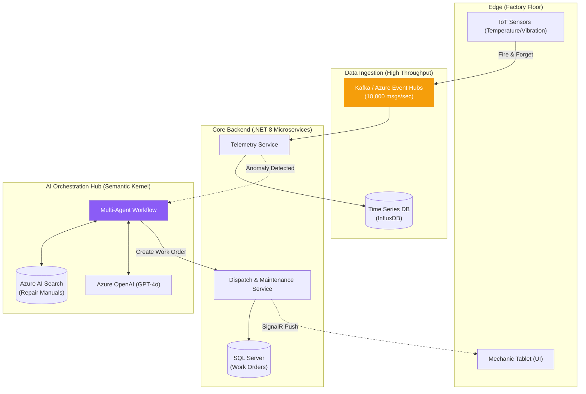

# Case Study — FactoryMind Architecture

## 🏢 Business Problem

You have been hired as the Lead AI Architect for "FactoryMind," a next-generation manufacturing company. 

They have 5,000 IoT sensors on the factory floor reporting vibration, temperature, and pressure every second. When a machine breaks, a mechanic spends 4 hours digging through a 10,000-page PDF manual to find the repair procedure. 

The CEO wants an AI system that predicts failures *before* they happen, automatically searches the repair manual, and dispatches a mechanic with the correct tools.

---

## 🧠 Theory

Building FactoryMind requires synthesizing everything we've learned in Volumes 1-5:
1. **IoT Telemetry:** Requires extreme throughput (Event-Driven Architecture).
2. **Failure Prediction:** Requires analyzing numerical trends.
3. **Repair Manuals:** Requires a Vector Database and RAG.
4. **Dispatching Mechanics:** Requires an Autonomous Agent with tool-calling capabilities.

### The Macro Blueprint
We will split the system into decoupled domains. The IoT edge devices will not talk to the AI directly. They will dump data into a Message Broker. The AI will live in a specialized Microservice that acts as a "Multi-Agent Hub."

---

## 🏗 Architecture: The FactoryMind Blueprint



---

## 💻 C# Example: The Edge IoT Client

At the edge, we use an extremely lightweight C# client that just dumps data onto the queue and moves on. It does not wait for AI processing.

```csharp title="IotSensorClient.cs"
using Azure.Messaging.EventHubs;
using Azure.Messaging.EventHubs.Producer;
using System.Text.Json;

public class IotSensorClient
{
    private readonly EventHubProducerClient _producer;

    public IotSensorClient(string connectionString, string eventHubName)
    {
        _producer = new EventHubProducerClient(connectionString, eventHubName);
    }

    public async Task SendTelemetryAsync(string machineId, double temp, double vibration)
    {
        // 1. Create the payload
        var payload = new
        {
            MachineId = machineId,
            Temperature = temp,
            Vibration = vibration,
            Timestamp = DateTime.UtcNow
        };

        var eventData = new EventData(JsonSerializer.SerializeToUtf8Bytes(payload));

        // 2. Fire and Forget to the Event Hub
        // The sensor does not care if the AI is busy or offline!
        using EventDataBatch eventBatch = await _producer.CreateBatchAsync();
        eventBatch.TryAdd(eventData);

        await _producer.SendAsync(eventBatch);
        Console.WriteLine($"[SENSOR] Telemetry sent for {machineId}.");
    }
}
```

---

## 🧪 Lab: The Single Point of Failure

### Objective
Identify architectural bottlenecks before writing code.

### Scenario
A junior architect reviews the blueprint above. They suggest removing Kafka (Event Hubs) and having the IoT sensors make direct HTTP POST requests to the `Telemetry Service`, which will then directly call the `AgentHub`.

### ✅ Success Criteria
- [ ] You identify that this introduces synchronous coupling. 
- [ ] If Azure OpenAI goes down for 5 minutes, the `AgentHub` hangs. 
- [ ] The `Telemetry Service` HTTP threads get exhausted waiting for the Agent Hub. 
- [ ] The `Telemetry Service` crashes. 
- [ ] The IoT sensors get HTTP 500 errors and start dropping critical temperature data on the floor. 
- [ ] You understand that **Kafka/Event Hubs acts as a shock absorber**. If the AI goes down, the queue just fills up with data. When the AI comes back online, it processes the backlog without a single byte of telemetry being lost.

---

## 🎯 Interview Questions

### Q1: Why use a Time Series Database (like InfluxDB) alongside SQL Server?
**Answer:** SQL Server (relational) is excellent for tracking state, like "Work Order #123 is Assigned." However, storing 10,000 sensor readings per second will instantly lock up SQL Server tables. Time Series DBs are highly optimized for appending sequential numerical data and querying aggregates (e.g., "Give me the average temperature over the last 5 minutes").

### Q2: Why is the Semantic Kernel `AgentHub` isolated into its own domain?
**Answer:** The Agent Hub requires massive memory for vector operations and long network I/O for LLM calls. If we put the Semantic Kernel logic inside the `Dispatch Service`, a sudden spike in AI analysis could consume all the server's RAM, causing the API to crash and preventing mechanics from logging in or closing their existing work orders.

### Q3: What is the role of SignalR in the FactoryMind architecture?
**Answer:** When the Multi-Agent Hub finally decides that a machine needs repair, it tells the Dispatch Service to create a Work Order. Because this happened asynchronously in the background, the mechanic's tablet doesn't know about it. The Dispatch Service uses SignalR (WebSockets) to "push" the new Work Order notification instantly to the mechanic's screen without requiring the tablet to constantly poll the server.

---

**Next:** [Chapter 2 — Backend Services →](/docs/factorymind/backend-services)
