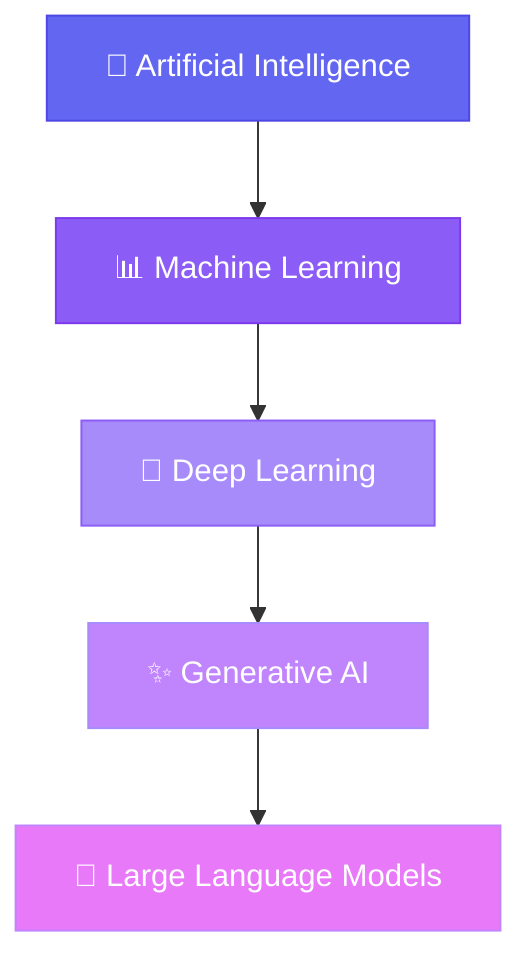
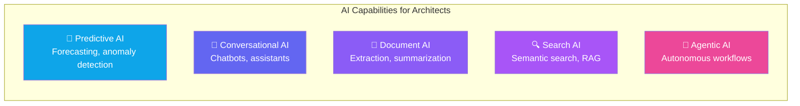
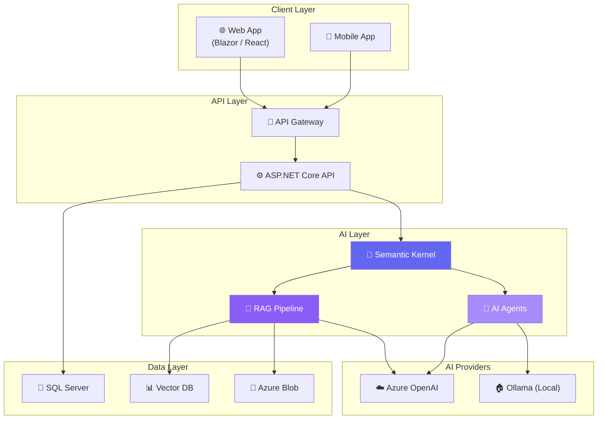

# Chapter 1 — The AI Landscape

## 🏢 Business Problem

Every enterprise is being asked the same question: *"How do we use AI?"*

As a Solution Architect, you need to answer that question with clarity — not hype. You need to understand what AI actually is, what it can and cannot do, where LLMs fit into the broader AI landscape, and how to make informed technology decisions.

This chapter gives you that foundation.

---

## 🧠 Theory

### What is Artificial Intelligence?

**Artificial Intelligence (AI)** is the broad field of computer science focused on creating systems that can perform tasks that typically require human intelligence. These tasks include:

- Understanding natural language
- Recognizing images and speech
- Making decisions and predictions
- Generating text, code, and images

### The AI Hierarchy

It's critical to understand how the major terms relate to each other:



| Term | What It Means | Example |
|------|---------------|---------|
| **AI** | Machines that simulate human intelligence | Chess engines, self-driving cars |
| **Machine Learning** | Systems that learn from data without explicit programming | Spam filters, recommendation engines |
| **Deep Learning** | ML using neural networks with many layers | Image recognition, speech-to-text |
| **Generative AI** | AI that creates new content (text, images, code) | ChatGPT, DALL-E, GitHub Copilot |
| **LLM** | Large neural networks trained on text to understand and generate language | GPT-4, Claude, Llama, Gemini |

### Why This Matters for .NET Architects

As a .NET architect, you're not building AI models from scratch — you're **integrating AI capabilities into enterprise systems**. Your job is to:

1. **Evaluate** which AI approach fits the business problem
2. **Design** the system architecture around AI services
3. **Integrate** AI APIs into existing .NET applications
4. **Manage** costs, latency, and reliability
5. **Ensure** security, compliance, and responsible AI use

### Types of AI You'll Encounter



| Capability | .NET Technology | Use Case |
|-----------|----------------|----------|
| **Predictive** | ML.NET, Azure ML | Demand forecasting, fraud detection |
| **Conversational** | Semantic Kernel, Azure OpenAI | Customer support, internal assistants |
| **Document** | Azure AI Document Intelligence | Invoice processing, contract analysis |
| **Search** | Azure AI Search, vector databases | Knowledge bases, documentation search |
| **Agentic** | Semantic Kernel Agents, AutoGen | Automated workflows, multi-step reasoning |

---

## 🏗 Architecture Diagram

Here's how AI fits into a typical enterprise .NET architecture:



---

## 💻 C# Example

Here's a simple example using ML.NET to show that AI in .NET isn't magic — it's just code:

```csharp title="Program.cs — Sentiment Analysis with ML.NET"
using Microsoft.ML;
using Microsoft.ML.Data;

// Define the data model
public class SentimentInput
{
    public string Text { get; set; } = string.Empty;
}

public class SentimentPrediction
{
    [ColumnName("PredictedLabel")]
    public bool IsPositive { get; set; }

    public float Probability { get; set; }
    public float Score { get; set; }
}

// Create the ML pipeline
var mlContext = new MLContext();

// In production, you'd load a trained model
// For now, this shows the pattern:
Console.WriteLine("=== AI in .NET — It's Just Code ===");
Console.WriteLine();
Console.WriteLine("Key insight for architects:");
Console.WriteLine("AI is not magic. It's a pipeline:");
Console.WriteLine("  1. Data comes in");
Console.WriteLine("  2. A model processes it");
Console.WriteLine("  3. A prediction comes out");
Console.WriteLine();
Console.WriteLine("Your job as an architect is to design");
Console.WriteLine("the system AROUND the AI component.");
```

### What This Teaches

As an architect, notice the pattern:
- **Input** → structured data goes in
- **Model** → a trained model processes it
- **Output** → a prediction (or generation) comes out

Every AI integration in your .NET systems follows this same fundamental pattern. The complexity is in the **system design around it** — not in the AI itself.

---

## 🧪 Lab: Set Up Your AI Development Environment

### Objective
Set up a complete AI development environment on your machine.

### Steps

**1. Install the .NET SDK**
```bash
# Verify your .NET version (need .NET 8+)
dotnet --version
```

**2. Install Ollama (for local LLMs)**
```bash
# Download from https://ollama.com
# Then pull a small model:
ollama pull llama3.2:1b
```

**3. Install VS Code Extensions**
- C# Dev Kit
- Semantic Kernel Tools
- Mermaid Markdown Syntax Highlighting

**4. Create your first AI project**
```bash
mkdir ai-architect-labs
cd ai-architect-labs
dotnet new console -n Lab01-HelloAI
cd Lab01-HelloAI
dotnet add package Microsoft.SemanticKernel
```

**5. Verify everything works**
```csharp title="Program.cs"
using Microsoft.SemanticKernel;

Console.WriteLine("✅ Semantic Kernel is installed!");
Console.WriteLine($"✅ .NET {Environment.Version}");
Console.WriteLine("✅ Ready to build AI systems.");
```

```bash
dotnet run
```

### ✅ Success Criteria
- [ ] .NET 8+ installed
- [ ] Ollama running with a model
- [ ] VS Code with extensions
- [ ] First Semantic Kernel project compiles

---

## 🎯 Interview Questions

These are architect-level questions you should be able to answer:

### Q1: What is the difference between AI, ML, Deep Learning, and Generative AI?
**Answer:** AI is the broadest category — any system that simulates intelligence. ML is a subset where systems learn from data. Deep Learning uses multi-layered neural networks. Generative AI is a category of deep learning that creates new content. LLMs are a specific type of generative AI focused on language.

### Q2: When would you use ML.NET vs Azure OpenAI in an enterprise system?
**Answer:** Use **ML.NET** for structured data predictions (classification, regression, anomaly detection) where you need low latency, offline capability, and full data control. Use **Azure OpenAI** for unstructured text tasks (summarization, conversation, code generation) where you need language understanding. In many architectures, you'll use both.

### Q3: What are the key architecture concerns when integrating AI into an enterprise .NET system?
**Answer:**
1. **Latency** — LLM calls take 1-30 seconds; design for async
2. **Cost** — Token-based pricing; implement caching and prompt optimization
3. **Reliability** — AI outputs are non-deterministic; implement fallbacks
4. **Security** — Prompt injection, data leakage; implement guardrails
5. **Scalability** — Rate limits on AI services; design for queuing

### Q4: What is the difference between a model and a service in AI architecture?
**Answer:** A **model** is the trained neural network (e.g., GPT-4, Llama 3). A **service** wraps that model with an API, authentication, rate limiting, and infrastructure (e.g., Azure OpenAI Service). As an architect, you typically interact with services, not raw models — unless you're self-hosting with Ollama.

### Q5: How would you explain AI capabilities to a non-technical stakeholder?
**Answer:** "AI today is very good at specific tasks — summarizing documents, answering questions from your data, classifying items, and generating content. It's not general intelligence. Think of it as a very capable assistant that needs clear instructions and good data. Our architecture will integrate these specific capabilities where they add the most business value."

---

## 📚 References

- [Microsoft — What is Artificial Intelligence?](https://learn.microsoft.com/en-us/dotnet/ai/conceptual/what-is-ai)
- [ML.NET Documentation](https://learn.microsoft.com/en-us/dotnet/machine-learning/)
- [Azure AI Services Overview](https://learn.microsoft.com/en-us/azure/ai-services/what-are-ai-services)
- [Semantic Kernel Documentation](https://learn.microsoft.com/en-us/semantic-kernel/)
- [Responsible AI Principles](https://www.microsoft.com/en-us/ai/responsible-ai)

---

**Next:** [Chapter 2 — LLM Basics →](/docs/fundamentals/llm-basics)
