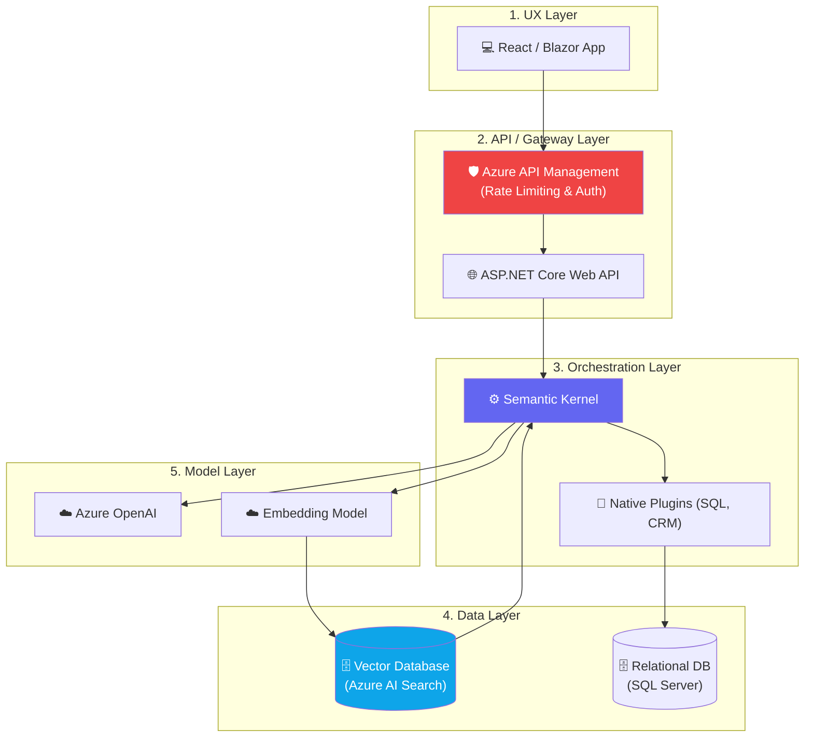

# Chapter 8 — AI System Design Overview

## 🏢 Business Problem

Your enterprise wants to launch an internal "Copilot" for the finance department. The development team presents a design: a React frontend talking directly to the Azure OpenAI REST API.

As an architect, you must reject this design. It lacks security, auditing, data grounding, and resilience. You must design a complete AI System.

---

## 🧠 Theory

An AI System is much more than just a large language model. The LLM is just the "CPU" of your system. To build a production-grade application, you need to surround the LLM with supporting infrastructure.

### The 5 Layers of Enterprise AI

1. **User Experience (UX) Layer:** 
   - Web apps, Teams bots, or mobile apps. Handles streaming UI.
2. **AI Gateway / API Layer:** 
   - The security boundary. Handles rate limiting, authentication, and token usage billing.
3. **Orchestration Layer:** 
   - Frameworks like Semantic Kernel or LangChain. Executes prompts and manages multi-step agent plans.
4. **Data & Retrieval Layer:** 
   - Vector Databases and search indexes. Grounds the AI in your company's private data (RAG).
5. **Foundation Model Layer:** 
   - The LLMs themselves (GPT-4, LLaMA, Claude) hosted in the cloud or on-premises.

---

## 🏗 Architecture: The Enterprise AI Blueprint



---

## 💻 C# Example: Defining the Interfaces

In system design, we define boundaries via interfaces before we write implementations.

```csharp title="ISystemDesign.cs"
// Layer 3: Orchestration Interface
public interface IAiOrchestrator
{
    Task<string> ExecuteUserIntentAsync(string userMessage, string userId);
}

// Layer 4: Data & Retrieval Interface
public interface IContextRetriever
{
    Task<IEnumerable<string>> SearchCompanyDataAsync(string query, string tenantId);
}

// Layer 5: Foundation Model Interface (Usually handled by Semantic Kernel, but abstracted here)
public interface ILLMClient
{
    IAsyncEnumerable<string> StreamCompletionAsync(string prompt);
}
```

---

## 🧪 Lab: Finding the Missing Link

### Objective
Identify architectural gaps in a proposed design.

### Scenario
A vendor pitches you a new AI HR platform. The architecture diagram shows a Web API directly querying a Vector Database, taking the results, and sending them to OpenAI. 

### Task
Based on the 5 Layers of Enterprise AI, what critical enterprise feature is missing from this design?

### ✅ Success Criteria
- [ ] You identified that the **Gateway Layer** is missing (or poorly defined). Without a dedicated gateway or middleware, there is no place to log token costs per department, enforce rate limits, or apply Content Safety filters (checking if the user asked an inappropriate question) before hitting the expensive LLM.

---

## 🎯 Interview Questions

### Q1: Why is an API Gateway critical for AI applications?
**Answer:** LLMs are expensive and easily abused (DDoS or prompt injection). An API Gateway enforces rate limiting (Tokens-Per-Minute), handles authentication, performs load balancing across multiple LLM regions, and acts as a central logging point for chargebacks.

### Q2: What is the purpose of the Orchestration Layer?
**Answer:** The Orchestration Layer (like Semantic Kernel) acts as the bridge between the AI model and the application's code. It decides when to search the database, when to call a REST API, and how to format the final prompt sent to the LLM.

### Q3: A developer wants to put the business logic inside the React frontend and call OpenAI directly. Why do you reject this?
**Answer:** Calling OpenAI from the frontend exposes the API keys, leading to theft and massive billing charges. It also exposes the System Prompt (the company's IP and rules) to the public internet, and it bypasses all backend security, auditing, and vector database retrieval steps.

---

**Congratulations!** You have completed Volume 1 — Foundations. 🎉

You are now ready to tackle real engineering in **Volume 2 — LLM Engineering**.
