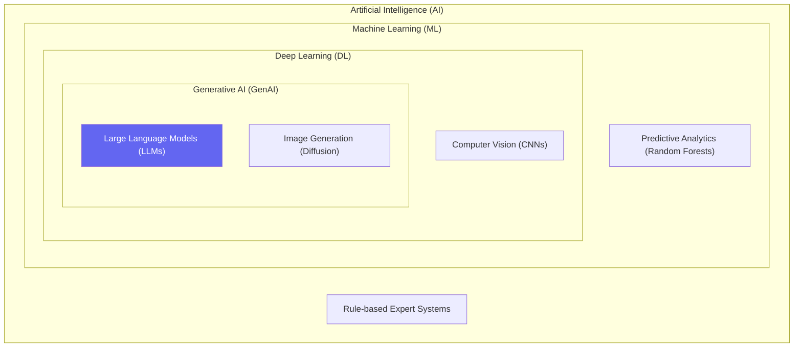

# Chapter 2 — AI Terminology for Engineers

## 🏢 Business Problem

Your company is forming an "AI Task Force". The VP of Marketing wants "AGI to write our blogs," the Data Scientist wants to "train a Deep Learning model on customer churn," and the CEO wants to "buy GenAI."

Everyone is using the word "AI," but they all mean completely different things. As an architect, you must establish a common vocabulary to align business requirements with technical reality.

---

## 🧠 Theory

Artificial Intelligence is a nested set of disciplines. Understanding the hierarchy prevents architectural mismatch.

### The AI Hierarchy

1. **Artificial Intelligence (AI)** 
   - The broadest concept. Any system that mimics human intelligence.
   - *Example:* A chess bot using an if/else decision tree.

2. **Machine Learning (ML)** 
   - A subset of AI. Systems that learn from data without being explicitly programmed.
   - *Example:* Predicting house prices using linear regression.

3. **Deep Learning (DL)** 
   - A subset of ML using multi-layered neural networks inspired by the human brain.
   - *Example:* Image recognition, speech-to-text.

4. **Generative AI (GenAI)** 
   - A subset of Deep Learning focused on *creating new content* rather than classifying existing data.
   - *Example:* ChatGPT generating text, Midjourney generating images.

### Key Terms You Must Know

- **AGI (Artificial General Intelligence):** Theoretical AI that matches or exceeds human intelligence across all domains. We do **not** have this yet.
- **Narrow AI:** AI trained to do one specific task exceptionally well. (All current AI, including GPT-4, is Narrow AI).
- **Foundation Model:** A massive AI model trained on a vast quantity of unlabeled data, which can be adapted (e.g., fine-tuned) to a wide range of downstream tasks.
- **Zero-Shot Prompting:** Asking the AI to do a task without giving it any examples.
- **Few-Shot Prompting:** Giving the AI 2-3 examples of the desired output format before asking it to do the task.

---

## 🏗 Architecture: The AI Venn Diagram



---

## 💻 C# Example: Differentiating the Stack

In .NET, you use completely different libraries depending on which part of the "AI" stack you are targeting.

```csharp title="AiRoutingExample.cs"
using Microsoft.ML;
using Microsoft.SemanticKernel;

public class AiOrchestrator
{
    // 1. Machine Learning (ML.NET) - Good for predictions on structured data
    public float PredictCustomerChurn(CustomerData data)
    {
        var mlContext = new MLContext();
        // Load a pre-trained ML model (e.g., Random Forest)
        var predictionPipeline = mlContext.Model.Load("ChurnModel.zip", out _);
        var engine = mlContext.Model.CreatePredictionEngine<CustomerData, ChurnPrediction>(predictionPipeline);
        
        return engine.Predict(data).ChurnProbability;
    }

    // 2. Generative AI (Semantic Kernel) - Good for reasoning and text generation
    public async Task<string> DraftRetentionEmailAsync(CustomerData data, Kernel kernel)
    {
        var prompt = $"Write a polite email offering a 20% discount to {data.Name}.";
        var result = await kernel.InvokePromptAsync(prompt);
        return result.ToString();
    }
}

public class CustomerData { public string Name { get; set; } }
public class ChurnPrediction { public float ChurnProbability { get; set; } }
```

---

## 🧪 Lab: Classify the Request

### Objective
Map a business request to the correct AI technology layer.

### Scenarios
1. **Request A:** "We want a system that automatically flags fraudulent credit card transactions."
2. **Request B:** "We want a system that writes a summary of our weekly all-hands meeting."
3. **Request C:** "We want a system that operates our warehouse robots autonomously in real-time."

### ✅ Success Criteria
- [ ] **Request A:** Machine Learning (Predictive/Classification). You do not need an LLM for this; you need ML.NET or XGBoost.
- [ ] **Request B:** Generative AI (LLMs). Perfect use case for Semantic Kernel and GPT-4.
- [ ] **Request C:** Deep Learning (Reinforcement Learning / Computer Vision). Not an LLM problem.

---

## 🎯 Interview Questions

### Q1: Your CEO asks you to "Add AI to our app." What is your first question?
**Answer:** "What specific business problem are we trying to solve?" The term 'AI' is too broad. If they want to predict sales, we use traditional Machine Learning. If they want to chat with PDFs, we use Generative AI.

### Q2: What is the difference between Zero-Shot and Few-Shot prompting?
**Answer:** Zero-shot provides no examples (e.g., "Translate 'Hello' to French."). Few-shot provides a few examples in the prompt to teach the model the desired output format (e.g., "English: Apple -> French: Pomme. English: Hello -> French: "). Few-shot drastically improves reliability in formatting.

### Q3: Why is GPT-4 considered "Narrow AI" and not "AGI"?
**Answer:** Because it relies on pattern matching against its training data and has no genuine understanding, self-awareness, or ability to reason outside of language generation. It cannot learn a physical skill or solve problems that it wasn't mathematically modeled to solve.

---

**Next:** [Chapter 3 — LLM Basics →](/docs/fundamentals/llm-basics)
