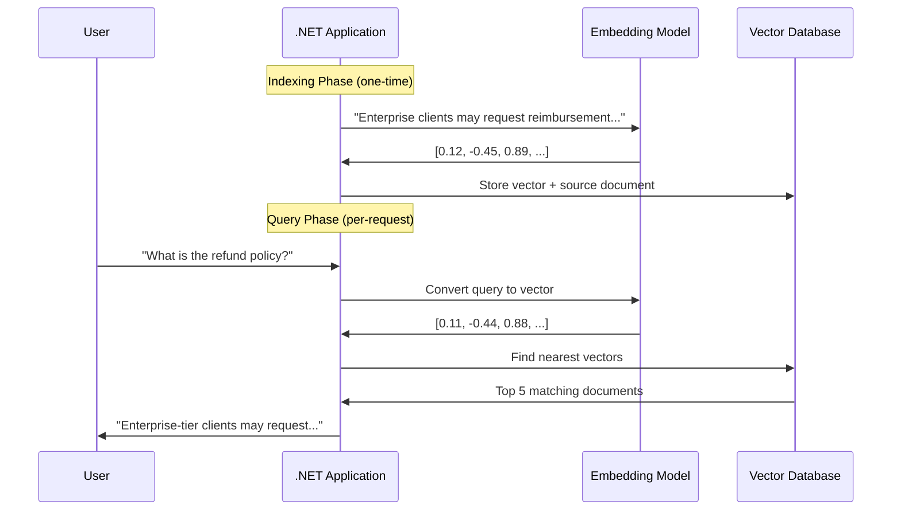
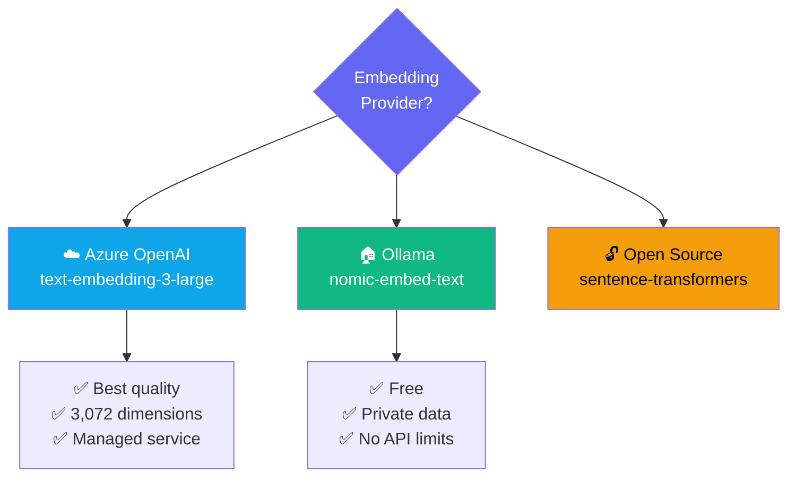
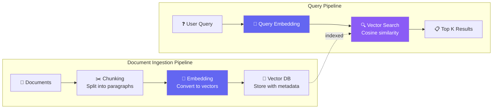

# Chapter 5 — Introduction to Embeddings

## 🏢 Business Problem

Your company has 50,000 internal documents. Users ask questions like *"What is our refund policy for enterprise customers?"* — but keyword search fails because the answer is written as *"Enterprise-tier clients may request a full reimbursement within 30 days."*

The words don't match, but the **meaning** does. This is the problem that **embeddings** solve.

---

## 🧠 Theory

### What are Embeddings?

An **embedding** is a numerical representation of text as a vector (array of numbers). Texts with similar meaning have vectors that are close together in "vector space."

```
"What is your refund policy?"     → [0.12, -0.45, 0.89, 0.33, ...]
"How can I get my money back?"    → [0.11, -0.44, 0.88, 0.35, ...]  ← Similar!
"The weather is sunny today"      → [-0.67, 0.23, -0.12, 0.78, ...] ← Different!
```

Each vector typically has **1,536 dimensions** (for OpenAI's `text-embedding-ada-002`) or **3,072 dimensions** (for `text-embedding-3-large`).

### How Embeddings Enable Semantic Search



### Similarity Measurement

**Cosine similarity** is the standard way to measure how similar two vectors are:
- **1.0** = identical meaning
- **0.0** = completely unrelated
- **-1.0** = opposite meaning

| Query | Document | Cosine Similarity |
|-------|----------|:-:|
| "refund policy" | "reimbursement guidelines" | 0.92 |
| "refund policy" | "return and exchange rules" | 0.85 |
| "refund policy" | "ASP.NET Core middleware" | 0.12 |

### Why Architects Must Understand Embeddings

Embeddings are the foundation of:

| System | How Embeddings Are Used |
|--------|------------------------|
| **RAG** | Retrieve relevant documents to send to LLM |
| **Semantic Search** | Find results by meaning, not keywords |
| **Recommendation** | Find similar items, products, or content |
| **Classification** | Group content by topic |
| **Anomaly Detection** | Find outliers in text data |

### Embedding Architecture Decisions



### Vector Databases for .NET Architects

| Database | Type | .NET Support | Best For |
|----------|------|-------------|----------|
| **Azure AI Search** | Cloud managed | Excellent | Enterprise, Azure-native |
| **pgvector** | PostgreSQL extension | Good | Existing Postgres infrastructure |
| **SQL Server** | Vector column type | Native | Existing SQL Server teams |
| **Qdrant** | Dedicated vector DB | Good | High-performance search |
| **Chroma** | Lightweight | Basic | Prototyping, local dev |
| **Pinecone** | Cloud managed | Good | Serverless, global scale |

---

## 🏗 Architecture: Embedding Pipeline



### Chunking Strategies

How you split documents affects search quality:

| Strategy | Method | Best For |
|----------|--------|----------|
| **Fixed size** | 500 tokens per chunk | Simple, predictable |
| **Paragraph** | Split on double newlines | Well-structured documents |
| **Semantic** | Split on topic changes | Long, complex documents |
| **Sliding window** | Overlapping chunks | When context spans boundaries |

**Architect's rule:** Chunk size should match your expected query granularity. If users ask broad questions, use larger chunks. If they ask specific questions, use smaller chunks.

---

## 💻 C# Example

```csharp title="EmbeddingService.cs — Generate and Compare Embeddings"
using Microsoft.SemanticKernel;
using Microsoft.SemanticKernel.Embeddings;

#pragma warning disable SKEXP0001

/// <summary>
/// Service for generating and comparing text embeddings.
/// This is the foundation of semantic search and RAG systems.
/// </summary>
public class EmbeddingService
{
    private readonly ITextEmbeddingGenerationService _embeddingService;

    public EmbeddingService(ITextEmbeddingGenerationService embeddingService)
    {
        _embeddingService = embeddingService;
    }

    /// <summary>
    /// Generate an embedding vector for a piece of text.
    /// </summary>
    public async Task<ReadOnlyMemory<float>> GenerateEmbedding(string text)
    {
        var embeddings = await _embeddingService.GenerateEmbeddingsAsync(
            new List<string> { text }
        );
        return embeddings[0];
    }

    /// <summary>
    /// Calculate cosine similarity between two texts.
    /// Returns 0-1 where 1 means identical meaning.
    /// </summary>
    public async Task<double> CalculateSimilarity(string text1, string text2)
    {
        var embedding1 = await GenerateEmbedding(text1);
        var embedding2 = await GenerateEmbedding(text2);

        return CosineSimilarity(embedding1.Span, embedding2.Span);
    }

    private static double CosineSimilarity(
        ReadOnlySpan<float> a,
        ReadOnlySpan<float> b)
    {
        double dotProduct = 0, normA = 0, normB = 0;
        for (int i = 0; i < a.Length; i++)
        {
            dotProduct += a[i] * b[i];
            normA += a[i] * a[i];
            normB += b[i] * b[i];
        }
        return dotProduct / (Math.Sqrt(normA) * Math.Sqrt(normB));
    }
}

// Usage with Semantic Kernel + Ollama:
var kernel = Kernel.CreateBuilder()
    .AddOpenAITextEmbeddingGeneration(
        modelId: "nomic-embed-text",
        endpoint: new Uri("http://localhost:11434"),
        apiKey: "ollama"
    )
    .Build();

var embeddingService = new EmbeddingService(
    kernel.GetRequiredService<ITextEmbeddingGenerationService>()
);

// Compare semantic similarity
var similarity = await embeddingService.CalculateSimilarity(
    "What is the refund policy?",
    "Enterprise clients may request a full reimbursement within 30 days."
);

Console.WriteLine($"Similarity: {similarity:F4}");
// Output: ~0.85 (high similarity despite different words!)
```

---

## 🧪 Lab: Semantic Search Prototype

### Objective
Build a simple semantic search system that finds documents by meaning.

### Steps

**1. Create the project**
```bash
dotnet new console -n Lab05-SemanticSearch
cd Lab05-SemanticSearch
dotnet add package Microsoft.SemanticKernel
```

**2. Create an in-memory vector store**
```csharp title="Program.cs"
using Microsoft.SemanticKernel;
using Microsoft.SemanticKernel.Embeddings;

#pragma warning disable SKEXP0001

var kernel = Kernel.CreateBuilder()
    .AddOpenAITextEmbeddingGeneration(
        "nomic-embed-text",
        new Uri("http://localhost:11434"),
        "ollama")
    .Build();

var embedder = kernel.GetRequiredService<ITextEmbeddingGenerationService>();

// Our "knowledge base"
var documents = new[]
{
    "Enterprise customers can request a full refund within 30 days.",
    "Our API rate limit is 1000 requests per minute for Pro tier.",
    "Two-factor authentication is required for all admin accounts.",
    "The .NET SDK supports Windows, macOS, and Linux.",
    "Semantic Kernel is Microsoft's AI orchestration framework.",
};

// Generate embeddings for all documents
Console.WriteLine("Indexing documents...");
var docEmbeddings = new List<(string Doc, ReadOnlyMemory<float> Vector)>();
foreach (var doc in documents)
{
    var vectors = await embedder.GenerateEmbeddingsAsync(new[] { doc });
    docEmbeddings.Add((doc, vectors[0]));
}

// Search by meaning
var query = "How do I get my money back?";
Console.WriteLine($"\nQuery: \"{query}\"\n");

var queryVectors = await embedder.GenerateEmbeddingsAsync(new[] { query });
var queryVector = queryVectors[0];

var results = docEmbeddings
    .Select(d => (d.Doc, Similarity: CosineSimilarity(queryVector.Span, d.Vector.Span)))
    .OrderByDescending(r => r.Similarity)
    .Take(3);

foreach (var (doc, sim) in results)
{
    Console.WriteLine($"  [{sim:F4}] {doc}");
}

static double CosineSimilarity(ReadOnlySpan<float> a, ReadOnlySpan<float> b)
{
    double dot = 0, na = 0, nb = 0;
    for (int i = 0; i < a.Length; i++)
    {
        dot += a[i] * b[i]; na += a[i] * a[i]; nb += b[i] * b[i];
    }
    return dot / (Math.Sqrt(na) * Math.Sqrt(nb));
}
```

### ✅ Success Criteria
- [ ] Search returns the refund document for "How do I get my money back?"
- [ ] You understand why keyword search would fail here
- [ ] You can explain the embedding → vector → similarity pipeline

---

## 🎯 Interview Questions

### Q1: What are embeddings and why are they important for AI architecture?
**Answer:** Embeddings are numerical vector representations of text where semantic similarity is preserved as mathematical distance. They enable semantic search, RAG, recommendations, and classification. For architects, embeddings are the bridge between human language and machine-processable data.

### Q2: How do you choose a chunking strategy for a RAG system?
**Answer:** Match chunk size to query granularity. Use fixed-size chunks (300-500 tokens) for general Q&A. Use paragraph-based chunking for structured documents. Use sliding windows when answers span chunk boundaries. Always include metadata (source, page number) with each chunk for citation.

### Q3: What factors determine vector database selection?
**Answer:** (1) Existing infrastructure (SQL Server? PostgreSQL? Azure?), (2) scale requirements (millions vs billions of vectors), (3) query latency needs, (4) filtering capabilities (metadata + vector search), (5) cost model, (6) .NET SDK quality, (7) managed vs self-hosted preference.

---

## 📚 References

- [Azure OpenAI — Embeddings](https://learn.microsoft.com/en-us/azure/ai-services/openai/concepts/understand-embeddings)
- [Azure AI Search — Vector Search](https://learn.microsoft.com/en-us/azure/search/vector-search-overview)
- [Semantic Kernel — Text Embeddings](https://learn.microsoft.com/en-us/semantic-kernel/concepts/vector-store-connectors/)
- [pgvector — Vector Extension for PostgreSQL](https://github.com/pgvector/pgvector)

---

**Congratulations!** You've completed Volume 1 — Foundations. 🎉

You now understand:
- ✅ The AI landscape
- ✅ How LLMs work
- ✅ Tokens and cost management
- ✅ Prompt engineering
- ✅ Embeddings and semantic search

**Next:** Volume 2 — LLM Engineering (coming soon)
