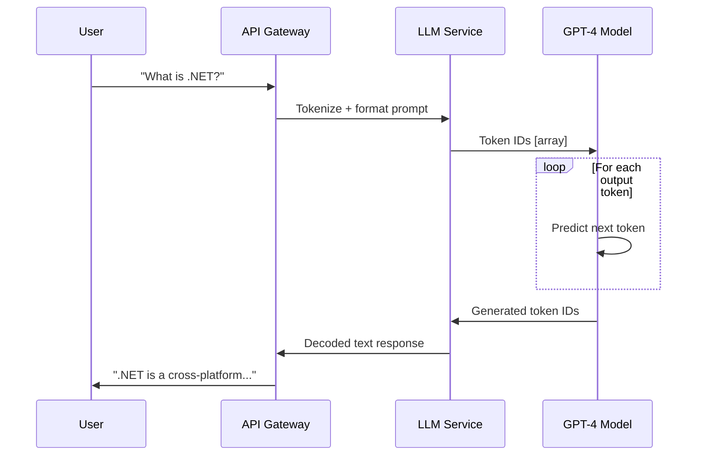
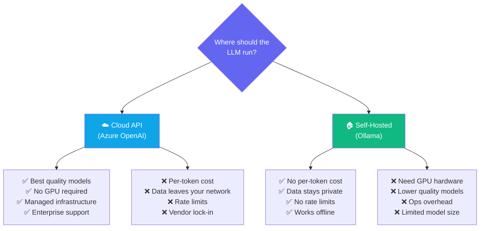
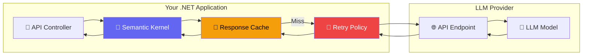

# Chapter 2 — How Large Language Models Work

## 🏢 Business Problem

Your CTO asks: *"Should we use GPT-4, Claude, Llama, or something else? What's the difference?"*

As a Solution Architect, you need to understand how LLMs actually work — not at the research level, but enough to make informed decisions about model selection, cost, latency, and architecture.

---

## 🧠 Theory

### What is a Large Language Model?

An LLM is a neural network trained on massive amounts of text data. Its core capability is **next-token prediction** — given a sequence of text, it predicts the most likely next word (token).

That's it. Every conversation, every code completion, every document summary is fundamentally the model predicting *"what word comes next?"* over and over again.



### Key Concepts

| Concept | What It Means | Why Architects Care |
|---------|---------------|---------------------|
| **Parameters** | The "weights" in the neural network (e.g., 70B = 70 billion) | Larger = more capable but slower and more expensive |
| **Training Data** | The text corpus the model learned from | Determines knowledge cutoff date and biases |
| **Inference** | Running the model to generate output | This is what costs money — every API call is inference |
| **Context Window** | How much text the model can "see" at once | Limits how much data you can send per request |
| **Temperature** | Controls randomness of output (0 = deterministic, 1 = creative) | Lower for factual tasks, higher for creative tasks |

### Model Comparison for Architects

| Model | Provider | Parameters | Context | Best For |
|-------|----------|-----------|---------|----------|
| GPT-4o | OpenAI / Azure | Undisclosed | 128K | General purpose, highest quality |
| GPT-4o-mini | OpenAI / Azure | Undisclosed | 128K | Cost-effective, fast |
| Claude 3.5 Sonnet | Anthropic | Undisclosed | 200K | Long documents, analysis |
| Llama 3.1 70B | Meta (Open) | 70B | 128K | Self-hosted, privacy-sensitive |
| Llama 3.2 3B | Meta (Open) | 3B | 128K | Local dev, edge deployment |
| Phi-3 | Microsoft | 3.8B | 128K | Small, efficient, .NET friendly |
| Gemini 1.5 Pro | Google | Undisclosed | 1M+ | Massive context windows |

### The Architecture Decision: Cloud vs Local



**Architect's Rule:** Most enterprise systems use a **hybrid approach** — cloud APIs for production quality and local models for development, testing, and privacy-sensitive data.

---

## 🏗 Architecture Diagram

Here's how an LLM call flows through a typical .NET system:



**Key architectural patterns:**
1. **Caching** — Same prompts shouldn't hit the LLM twice
2. **Retry with backoff** — LLM APIs have rate limits and transient failures
3. **Abstraction** — Semantic Kernel abstracts the provider, so you can swap models

---

## 💻 C# Example

Call an LLM from .NET using Semantic Kernel:

```csharp title="Program.cs — Your First LLM Call"
using Microsoft.SemanticKernel;

// Option 1: Azure OpenAI (production)
var builder = Kernel.CreateBuilder();
builder.AddAzureOpenAIChatCompletion(
    deploymentName: "gpt-4o",
    endpoint: "https://your-resource.openai.azure.com/",
    apiKey: "your-api-key"
);

var kernel = builder.Build();

// Ask the LLM a question
var response = await kernel.InvokePromptAsync(
    "Explain what a Solution Architect does in 3 sentences."
);

Console.WriteLine(response);
```

```csharp title="Program.cs — Using Ollama (local, free)"
using Microsoft.SemanticKernel;

// Option 2: Ollama (local development)
var builder = Kernel.CreateBuilder();
builder.AddOpenAIChatCompletion(
    modelId: "llama3.2",
    endpoint: new Uri("http://localhost:11434"),
    apiKey: "not-needed"  // Ollama doesn't need a key
);

var kernel = builder.Build();

var response = await kernel.InvokePromptAsync(
    "What are the key responsibilities of an AI Solution Architect?"
);

Console.WriteLine(response);
```

### What to Notice

- **Same Semantic Kernel API** for both Azure OpenAI and Ollama
- **Swappable providers** — change one line, use a different model
- **No AI expertise needed** — it's just an API call with a string prompt
- **The architecture decision** is about where the model runs, not how to call it

---

## 🧪 Lab: Make Your First LLM Call

### Objective
Call an LLM from a .NET console application using both local (Ollama) and cloud (Azure OpenAI) models.

### Prerequisites
- .NET 8+ installed
- Ollama installed with `llama3.2:1b` pulled
- (Optional) Azure OpenAI API key

### Steps

**1. Create the project**
```bash
dotnet new console -n Lab02-LLMCall
cd Lab02-LLMCall
dotnet add package Microsoft.SemanticKernel
```

**2. Write the code**
```csharp title="Program.cs"
using Microsoft.SemanticKernel;

Console.WriteLine("=== Lab 02: First LLM Call ===\n");

// Using Ollama (local)
var kernel = Kernel.CreateBuilder()
    .AddOpenAIChatCompletion(
        modelId: "llama3.2:1b",
        endpoint: new Uri("http://localhost:11434"),
        apiKey: "ollama"
    )
    .Build();

// Test 1: Simple question
Console.WriteLine("--- Test 1: Simple Question ---");
var answer = await kernel.InvokePromptAsync(
    "What is RAG in AI? Answer in 2 sentences."
);
Console.WriteLine(answer);

// Test 2: With temperature control
Console.WriteLine("\n--- Test 2: Creative vs Factual ---");
var settings = new PromptExecutionSettings
{
    ExtensionData = new Dictionary<string, object>
    {
        ["temperature"] = 0.1  // Very factual
    }
};

var factual = await kernel.InvokePromptAsync(
    "List 3 Azure AI services.",
    new KernelArguments(settings)
);
Console.WriteLine(factual);
```

**3. Run it**
```bash
# Make sure Ollama is running first
ollama serve
# In another terminal:
dotnet run
```

### ✅ Success Criteria
- [ ] LLM responds to your prompt
- [ ] You can change the model and see different responses
- [ ] You understand the relationship between prompt → model → response

---

## 🎯 Interview Questions

### Q1: How do LLMs generate text?
**Answer:** LLMs use next-token prediction. Given an input sequence, the model calculates probability distributions over its vocabulary and selects the next most likely token. This process repeats until a stop condition is met. The temperature parameter controls how much randomness is introduced in token selection.

### Q2: What factors drive LLM selection in an enterprise architecture?
**Answer:** (1) Task quality requirements, (2) latency budget, (3) cost per request, (4) data privacy constraints, (5) context window needs, (6) availability/SLA requirements, and (7) compliance/regulatory requirements. Often the answer is multiple models for different use cases.

### Q3: When would you self-host a model vs use a cloud API?
**Answer:** Self-host when: data cannot leave your network, you need zero per-token cost for high volume, you need offline capability, or you need full control. Use cloud API when: you need the best quality models, don't want to manage GPU infrastructure, need enterprise SLA, or have moderate usage volume.

### Q4: What is the difference between model parameters and context window?
**Answer:** **Parameters** (billions of weights) determine model capability and quality — more parameters generally means better reasoning but higher cost and latency. **Context window** (measured in tokens) determines how much text the model can process in a single request — it's the model's "working memory."

### Q5: How would you architect an LLM integration for high availability?
**Answer:** (1) Use an abstraction layer like Semantic Kernel to decouple from providers, (2) implement retry policies with exponential backoff, (3) cache responses for identical prompts, (4) set up fallback models (e.g., GPT-4o → GPT-4o-mini → local Ollama), (5) use circuit breakers, (6) implement async processing with queues for non-interactive workloads.

---

## 📚 References

- [Azure OpenAI Service Documentation](https://learn.microsoft.com/en-us/azure/ai-services/openai/)
- [Semantic Kernel — Getting Started](https://learn.microsoft.com/en-us/semantic-kernel/get-started/)
- [Ollama Documentation](https://ollama.com/)
- [OpenAI Tokenizer](https://platform.openai.com/tokenizer)
- [Microsoft — Choosing the Right AI Model](https://learn.microsoft.com/en-us/azure/ai-services/openai/concepts/models)

---

**Next:** [Chapter 3 — Tokens & Context Windows →](/docs/fundamentals/tokens-and-context)
