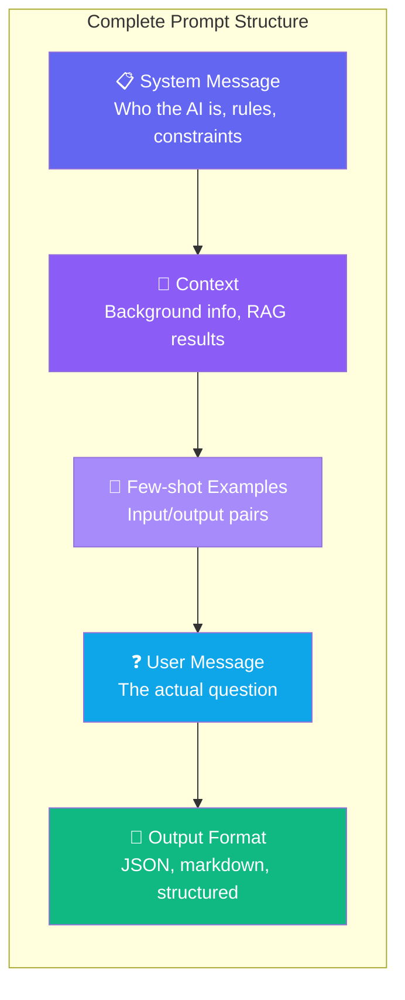
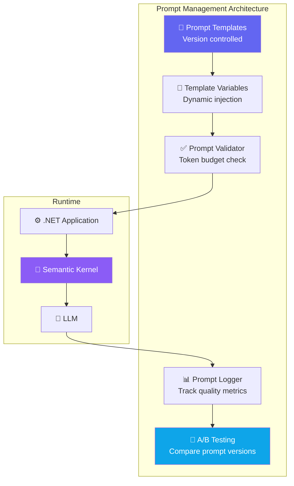

# Chapter 4 — Prompt Engineering for Architects

## 🏢 Business Problem

Your development team integrates an LLM into a customer support system. The AI gives inconsistent answers — sometimes brilliant, sometimes dangerously wrong. The product manager asks: *"Can we make it more reliable?"*

The answer is **prompt engineering** — the art and science of designing instructions that produce consistent, high-quality outputs from LLMs.

---

## 🧠 Theory

### What is Prompt Engineering?

Prompt engineering is the practice of crafting input text (prompts) to guide LLM behavior. For architects, it's a **system design concern** — your prompt is part of your application's logic, not just a string.

### The Anatomy of a Prompt



### Prompting Strategies

#### 1. Zero-Shot Prompting
No examples provided — relies on the model's training.

```
Classify this support ticket as [Bug], [Feature], or [Question]:

"The export button doesn't work on Safari"

Classification:
```

#### 2. Few-Shot Prompting
Provide examples to guide the model's behavior.

```
Classify support tickets:

Ticket: "Add dark mode support" → [Feature]
Ticket: "App crashes on login" → [Bug]
Ticket: "How do I reset my password?" → [Question]

Ticket: "The export button doesn't work on Safari" →
```

#### 3. Chain-of-Thought (CoT)
Ask the model to think step by step — improves reasoning.

```
Analyze this architecture decision step by step:

Should we use a single LLM service or multiple specialized models?

Think through:
1. What are the use cases?
2. What are the cost implications?
3. What are the quality trade-offs?
4. What is the operational complexity?
5. What is your recommendation?
```

#### 4. System Prompt Design

The system prompt is your **application configuration**. It defines the AI's persona, rules, and constraints.

```
You are a .NET Solution Architect assistant.

Rules:
- Only recommend Microsoft Azure and .NET technologies
- Always include cost considerations
- Always mention security implications
- If you don't know something, say "I don't know"
- Never generate code that stores secrets in plain text
- Format responses in markdown with headers
```

### Prompt Engineering Decision Matrix

| Strategy | When to Use | Quality | Cost |
|----------|------------|---------|------|
| **Zero-shot** | Simple, well-defined tasks | ⭐⭐⭐ | $ |
| **Few-shot** | Tasks needing consistent format | ⭐⭐⭐⭐ | $$ |
| **Chain-of-thought** | Complex reasoning | ⭐⭐⭐⭐⭐ | $$$ |
| **System prompt** | Application-wide behavior | ⭐⭐⭐⭐ | $ |
| **RAG + prompt** | Knowledge-grounded answers | ⭐⭐⭐⭐⭐ | $$ |

---

## 🏗 Architecture: Prompt Management System

In production, prompts are **not hardcoded strings**. They're managed artifacts.



---

## 💻 C# Example

```csharp title="PromptTemplateService.cs — Production Prompt Management"
using Microsoft.SemanticKernel;

/// <summary>
/// Manages prompt templates as versioned, testable artifacts.
/// This is how architects should design prompt systems.
/// </summary>
public class ArchitectAssistant
{
    private readonly Kernel _kernel;

    // Prompts are configuration, not magic strings
    private const string SystemPrompt = """
        You are a senior .NET Solution Architect.
        
        Rules:
        - Focus on Azure and .NET technologies
        - Always consider: cost, security, scalability, maintainability
        - Provide architecture decision records (ADRs) when asked
        - Include trade-offs for every recommendation
        - Use C# for code examples
        - If you're unsure, say so
        """;

    private const string DesignReviewTemplate = """
        Review this system design:
        
        {{$design}}
        
        Evaluate:
        1. Scalability (1-10)
        2. Security (1-10)
        3. Cost efficiency (1-10)
        4. Maintainability (1-10)
        
        Provide specific improvement recommendations.
        Format as a markdown table.
        """;

    public ArchitectAssistant(Kernel kernel)
    {
        _kernel = kernel;
    }

    public async Task<string> ReviewDesign(string designDescription)
    {
        var function = _kernel.CreateFunctionFromPrompt(
            DesignReviewTemplate,
            new PromptExecutionSettings
            {
                ExtensionData = new Dictionary<string, object>
                {
                    ["temperature"] = 0.2,     // Low = factual
                    ["max_tokens"] = 1500,      // Budget control
                }
            }
        );

        var result = await _kernel.InvokeAsync(function,
            new KernelArguments { ["design"] = designDescription }
        );

        return result.ToString();
    }
}

// Usage:
// var review = await assistant.ReviewDesign(
//     "Monolithic ASP.NET Core app with direct OpenAI calls, " +
//     "no caching, secrets in appsettings.json"
// );
```

### Key Architecture Decisions in This Code

1. **Prompts are constants** — versioned, reviewed, testable
2. **Temperature is low (0.2)** — for consistent, factual output
3. **Token budget is set** — `max_tokens` prevents runaway costs
4. **Template variables** — `{{$design}}` makes prompts reusable
5. **Semantic Kernel abstraction** — model-agnostic

---

## 🧪 Lab: Build a Prompt Template Library

### Objective
Create a library of reusable, version-controlled prompt templates for common architect tasks.

### Steps

**1. Create the project**
```bash
dotnet new classlib -n ArchitectPrompts
cd ArchitectPrompts
dotnet add package Microsoft.SemanticKernel
```

**2. Create template files**
```csharp title="Prompts/CodeReview.cs"
public static class CodeReviewPrompts
{
    public const string Version = "1.0.0";

    public const string SecurityReview = """
        Review this C# code for security vulnerabilities:
        
        ```csharp
        {{$code}}
        ```
        
        Check for:
        1. SQL injection
        2. Hardcoded secrets
        3. Missing input validation
        4. Insecure deserialization
        5. Missing authentication/authorization
        
        Format: Markdown table with Severity, Issue, Location, Fix.
        """;

    public const string PerformanceReview = """
        Review this C# code for performance issues:
        
        ```csharp
        {{$code}}
        ```
        
        Check for:
        1. N+1 queries
        2. Missing async/await
        3. Unnecessary allocations
        4. Missing caching opportunities
        5. Blocking calls
        
        Format: Markdown table with Impact, Issue, Recommendation.
        """;
}
```

**3. Use the templates**
```csharp title="Program.cs"
var kernel = Kernel.CreateBuilder()
    .AddOpenAIChatCompletion("llama3.2:1b",
        new Uri("http://localhost:11434"), "ollama")
    .Build();

var reviewFn = kernel.CreateFunctionFromPrompt(
    CodeReviewPrompts.SecurityReview);

var result = await kernel.InvokeAsync(reviewFn,
    new KernelArguments
    {
        ["code"] = "var conn = new SqlConnection(config[\"ConnectionString\"]);"
    });

Console.WriteLine(result);
```

### ✅ Success Criteria
- [ ] You have at least 3 reusable prompt templates
- [ ] Each template has a version number
- [ ] Templates use variables for dynamic content
- [ ] You understand why prompts should be treated as code

---

## 🎯 Interview Questions

### Q1: How would you design a prompt management system for an enterprise application?
**Answer:** (1) Store prompts as version-controlled artifacts (not inline strings), (2) use template variables for dynamic content, (3) implement A/B testing for prompt versions, (4) add token budget validation before sending, (5) log all prompts and responses for quality monitoring, (6) implement a prompt review process similar to code review.

### Q2: What is the difference between system prompts and user prompts in architecture?
**Answer:** System prompts define the AI's behavior, persona, and constraints — they're application configuration. User prompts are per-request input. System prompts are set by developers and rarely change; user prompts come from end users. A key security concern is ensuring user prompts cannot override system prompt rules (prompt injection).

### Q3: When would you use chain-of-thought prompting vs simple prompting?
**Answer:** Use chain-of-thought for complex reasoning tasks (analysis, comparison, multi-step decisions) where quality matters more than speed/cost. Use simple prompting for straightforward tasks (classification, extraction, formatting) where latency and cost matter. CoT uses more tokens but produces significantly better results for complex tasks.

---

## 📚 References

- [Semantic Kernel — Prompt Templates](https://learn.microsoft.com/en-us/semantic-kernel/prompts/)
- [OpenAI — Prompt Engineering Guide](https://platform.openai.com/docs/guides/prompt-engineering)
- [Azure OpenAI — Prompt Engineering Techniques](https://learn.microsoft.com/en-us/azure/ai-services/openai/concepts/prompt-engineering)
- [Microsoft — System Message Best Practices](https://learn.microsoft.com/en-us/azure/ai-services/openai/concepts/system-message)

---

**Next:** [Chapter 5 — Embeddings →](/docs/fundamentals/embeddings-intro)
