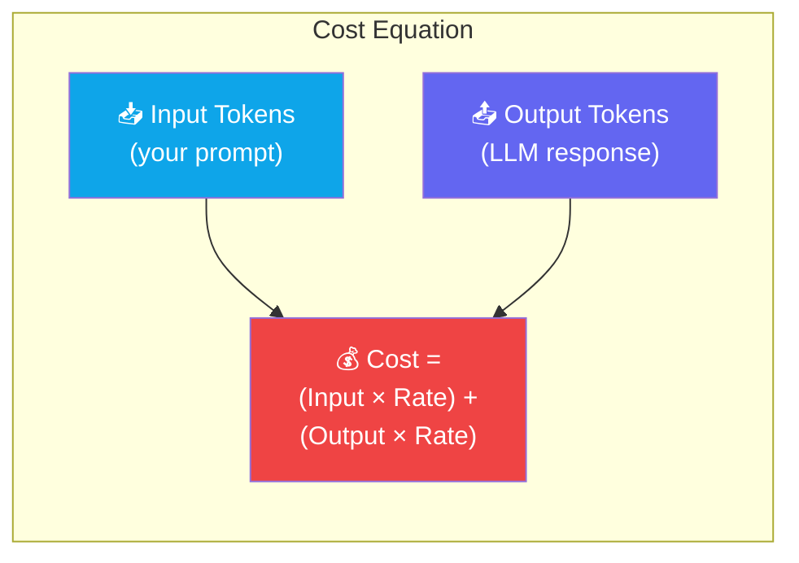
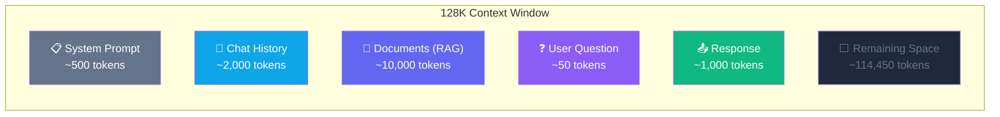
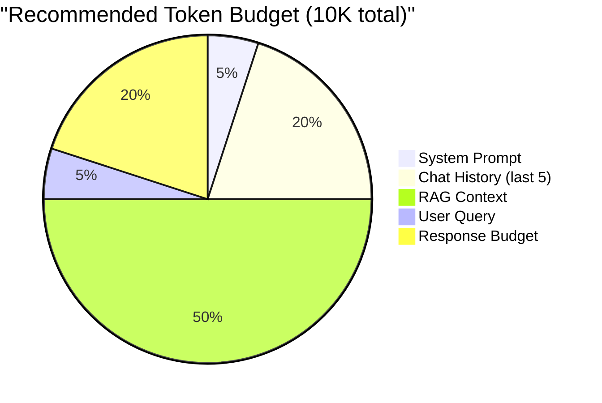
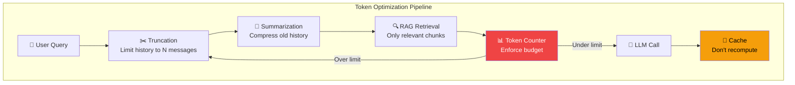

# Chapter 3 — Tokens & Context Windows

## 🏢 Business Problem

Your team deploys an AI feature. The first month's Azure bill is 5x what you budgeted. The PM asks: *"Why is AI so expensive? Can we bring the cost down?"*

The answer lies in **tokens**. Every API call to an LLM is billed by tokens — both input and output. Understanding tokenization is not just a technical concern; it's a **cost architecture** decision.

---

## 🧠 Theory

### What is a Token?

A **token** is the fundamental unit that LLMs process. It's not a word — it's a piece of text that might be:
- A whole word: `hello` → 1 token
- Part of a word: `tokenization` → `token` + `ization` → 2 tokens
- A single character: `.` → 1 token
- A special marker: `<|endoftext|>` → 1 token

**Rule of thumb:** 1 token ≈ 0.75 words (or 4 characters in English).

### Tokenization in Practice

```
Input:  "ASP.NET Core is a cross-platform framework"
Tokens: ["ASP", ".", "NET", " Core", " is", " a", " cross", "-", "platform", " framework"]
Count:  10 tokens
```

### Why Architects Must Understand Tokens



| Model | Input Cost | Output Cost | Context Window |
|-------|-----------|-------------|----------------|
| GPT-4o | $2.50 / 1M tokens | $10.00 / 1M tokens | 128K |
| GPT-4o-mini | $0.15 / 1M tokens | $0.60 / 1M tokens | 128K |
| Claude 3.5 Sonnet | $3.00 / 1M tokens | $15.00 / 1M tokens | 200K |
| Llama 3.1 (Ollama) | **Free** (self-hosted) | **Free** (self-hosted) | 128K |

### What is a Context Window?

The **context window** is the maximum number of tokens an LLM can process in a single request (input + output combined). Think of it as the model's "working memory."



**Architect's insight:** Having a 128K context window doesn't mean you should use it all. More tokens = higher cost = higher latency. Design your system to send **only what's relevant**.

### Token Budget Architecture



---

## 🏗 Architecture: Token-Aware System Design



### Cost Optimization Strategies for Architects

| Strategy | Savings | Complexity |
|----------|---------|-----------|
| **Prompt caching** | 30–50% | Low |
| **Model tiering** (GPT-4o-mini for simple, GPT-4o for complex) | 40–60% | Medium |
| **Token budgets** (hard limits per request) | 20–30% | Low |
| **Response caching** (same question = cached answer) | 50–80% | Medium |
| **Summarize history** (compress old messages) | 30–40% | Medium |
| **Local models** (Ollama for dev/test) | 90–100% | High |

---

## 💻 C# Example

```csharp title="TokenCounter.cs — Count Tokens Before Sending"
using Microsoft.DeepDev;  // TiktokenSharp
using System.Text.Json;

/// <summary>
/// Utility to count and manage token budgets.
/// Critical for cost control in enterprise AI systems.
/// </summary>
public class TokenBudgetManager
{
    private readonly ITokenizer _tokenizer;
    private readonly int _maxBudget;

    public TokenBudgetManager(string modelName = "gpt-4o", int maxBudget = 10_000)
    {
        _tokenizer = TokenizerBuilder.CreateByModelNameAsync(modelName).Result;
        _maxBudget = maxBudget;
    }

    public int CountTokens(string text)
    {
        var tokens = _tokenizer.Encode(text, Array.Empty<string>());
        return tokens.Count;
    }

    public TokenBudgetReport AnalyzeBudget(
        string systemPrompt,
        List<string> chatHistory,
        string ragContext,
        string userQuery)
    {
        var systemTokens = CountTokens(systemPrompt);
        var historyTokens = chatHistory.Sum(m => CountTokens(m));
        var ragTokens = CountTokens(ragContext);
        var queryTokens = CountTokens(userQuery);
        var totalInput = systemTokens + historyTokens + ragTokens + queryTokens;

        return new TokenBudgetReport
        {
            SystemPromptTokens = systemTokens,
            ChatHistoryTokens = historyTokens,
            RagContextTokens = ragTokens,
            UserQueryTokens = queryTokens,
            TotalInputTokens = totalInput,
            RemainingBudget = _maxBudget - totalInput,
            IsOverBudget = totalInput > _maxBudget
        };
    }
}

public class TokenBudgetReport
{
    public int SystemPromptTokens { get; set; }
    public int ChatHistoryTokens { get; set; }
    public int RagContextTokens { get; set; }
    public int UserQueryTokens { get; set; }
    public int TotalInputTokens { get; set; }
    public int RemainingBudget { get; set; }
    public bool IsOverBudget { get; set; }
}

// Usage:
var manager = new TokenBudgetManager(maxBudget: 8000);
var report = manager.AnalyzeBudget(
    systemPrompt: "You are a helpful .NET architect assistant.",
    chatHistory: new List<string>
    {
        "User: What is RAG?",
        "Assistant: RAG stands for Retrieval Augmented Generation..."
    },
    ragContext: "Azure AI Search provides vector search capabilities...",
    userQuery: "How do I implement RAG in ASP.NET Core?"
);

Console.WriteLine($"Total input: {report.TotalInputTokens} tokens");
Console.WriteLine($"Remaining budget: {report.RemainingBudget} tokens");
Console.WriteLine($"Over budget: {report.IsOverBudget}");
```

---

## 🧪 Lab: Token Cost Calculator

### Objective
Build a tool that estimates the cost of LLM calls before making them.

### Steps

**1. Create the project**
```bash
dotnet new console -n Lab03-TokenCalc
cd Lab03-TokenCalc
dotnet add package Microsoft.DeepDev.TokenizerLib
```

**2. Build a cost estimator**
```csharp title="Program.cs"
Console.WriteLine("=== Token Cost Calculator ===\n");

// Simulate a prompt
string systemPrompt = "You are an enterprise AI architect assistant.";
string userMessage = "Design a RAG system for a legal document search platform " +
    "that processes 10,000 documents per day. Include the architecture, " +
    "technology choices, and cost estimates.";

// Approximate token counts (4 chars ≈ 1 token)
int inputTokens = (systemPrompt.Length + userMessage.Length) / 4;
int estimatedOutputTokens = 500; // Assume ~500 token response

// Cost calculation (GPT-4o pricing)
decimal inputCost = inputTokens / 1_000_000m * 2.50m;
decimal outputCost = estimatedOutputTokens / 1_000_000m * 10.00m;
decimal totalCost = inputCost + outputCost;

Console.WriteLine($"Input tokens:  ~{inputTokens}");
Console.WriteLine($"Output tokens: ~{estimatedOutputTokens}");
Console.WriteLine($"Estimated cost: ${totalCost:F6}");
Console.WriteLine();

// Scale analysis
int callsPerDay = 10_000;
decimal dailyCost = totalCost * callsPerDay;
decimal monthlyCost = dailyCost * 30;
Console.WriteLine($"At {callsPerDay:N0} calls/day:");
Console.WriteLine($"  Daily cost:   ${dailyCost:F2}");
Console.WriteLine($"  Monthly cost: ${monthlyCost:F2}");
```

### ✅ Success Criteria
- [ ] You can estimate token counts for any prompt
- [ ] You understand the cost difference between models
- [ ] You can calculate monthly AI spending for a feature

---

## 🎯 Interview Questions

### Q1: How would you manage AI costs in a high-traffic enterprise application?
**Answer:** (1) Implement token budgets per request, (2) use model tiering (cheap model for simple queries, expensive for complex), (3) cache identical or similar prompts, (4) truncate/summarize conversation history, (5) use RAG to send only relevant context instead of entire documents, (6) monitor token usage per feature/user.

### Q2: A user sends a 50-page document and asks "summarize this." What happens?
**Answer:** If the document exceeds the context window, the request will fail or be truncated. The architectural solution is **chunking**: split the document into sections, summarize each chunk independently, then generate a final summary from the chunk summaries. This is called **map-reduce summarization**.

### Q3: What is the relationship between context window and RAG?
**Answer:** RAG exists partly because context windows have limits. Instead of stuffing an entire knowledge base into the prompt, RAG retrieves only the most relevant chunks and sends those. This keeps token costs low, latency reasonable, and response quality high because the model focuses on relevant information.

---

## 📚 References

- [OpenAI Tokenizer Tool](https://platform.openai.com/tokenizer)
- [Azure OpenAI Pricing](https://azure.microsoft.com/en-us/pricing/details/cognitive-services/openai-service/)
- [TiktokenSharp (C# tokenizer)](https://github.com/aiqinxuancai/TiktokenSharp)
- [Microsoft — Managing Token Limits](https://learn.microsoft.com/en-us/azure/ai-services/openai/how-to/manage-tokens)

---

**Next:** [Chapter 4 — Prompt Engineering →](/docs/fundamentals/prompt-engineering)
