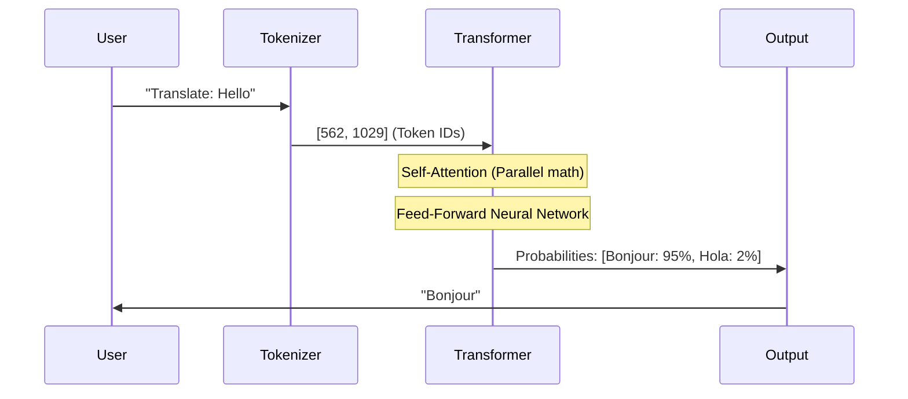

# Chapter 7 — Transformer Overview

## 🏢 Business Problem

Your CIO is looking at the Azure bill. They ask, *"Why does inferencing this new GPT-4 model cost 100x more than our old customer support chatbot from 2016?"*

To justify the budget, an AI Solution Architect must be able to explain the architectural leap from old sequence models to the modern **Transformer**, in plain English.

---

## 🧠 Theory

### Before 2017: The Dark Ages (RNNs & LSTMs)
Before transformers, AI read text sequentially (like a human reading a book, word by word). These models were called **Recurrent Neural Networks (RNNs)**. 
- **The problem:** If you feed them a 10-page document, by the time they get to page 10, they have "forgotten" what was on page 1. They also couldn't utilize parallel GPU processing because word 3 couldn't be processed until word 2 was finished.

### 2017: "Attention Is All You Need"
Google released a paper introducing the **Transformer**. The defining characteristic of a Transformer is that it reads *all words at the same time* in parallel. 

#### The Secret Sauce: Self-Attention
The Transformer uses a mathematical trick called **Self-Attention**. It calculates a "score" between every single word in a sentence and every other word to determine context.

*Example:* "The animal didn't cross the street because it was too tired."
How does the AI know what "it" refers to? The Self-Attention mechanism mathematically scores the relationship between "it" and "animal" higher than "it" and "street".

### Why is it so expensive?
Because Self-Attention compares *every token* to *every other token* in the prompt, the compute required grows quadratically ($O(n^2)$) as the prompt gets longer. This is why a 128k context window requires massive GPU clusters.

---

## 🏗 Architecture: The High-Level Flow



---

## 💻 C# Example: Running a Transformer Locally

While you usually call Azure OpenAI, you can run smaller transformers locally in .NET using `Microsoft.ML.OnnxRuntime`.

```csharp title="LocalTransformer.cs"
using Microsoft.ML.OnnxRuntime;
using Microsoft.ML.OnnxRuntime.Tensors;

public class LocalTransformerService
{
    private readonly InferenceSession _session;

    public LocalTransformerService(string modelPath)
    {
        // Load an exported Transformer model (e.g., ONNX format)
        _session = new InferenceSession(modelPath);
    }

    public float[] GetEmbeddings(long[] inputTokens)
    {
        // 1. Create a tensor from the tokens
        var inputTensor = new DenseTensor<long>(inputTokens, new[] { 1, inputTokens.Length });
        var inputs = new List<NamedOnnxValue>
        {
            NamedOnnxValue.CreateFromTensor("input_ids", inputTensor)
        };

        // 2. Run the Transformer mathematical graph!
        using var results = _session.Run(inputs);

        // 3. Extract the output (e.g., the embedding vector)
        var output = results.First().AsTensor<float>();
        return output.ToArray();
    }
}
```

---

## 🧪 Lab: Comparing Speed Conceptually

### Objective
Understand the performance difference between sequential processing and parallel processing.

### The Math
Assume it takes 1 millisecond to process 1 token. You have a 1,000 token prompt.

1. **RNN (Sequential):** Must process Token 1, then Token 2, then Token 3...
   - Total time: $1000 \times 1ms = 1000ms$ (1 second).
2. **Transformer (Parallel):** Uses 1,000 GPU cores to process all tokens simultaneously.
   - Total time: $\sim 1ms$ (ignoring self-attention overhead).

### ✅ Success Criteria
- [ ] You understand why Transformers require GPUs (thousands of cores) rather than CPUs (a few fast cores).
- [ ] You understand why Transformers destroyed older RNN models in both speed and capability.

---

## 🎯 Interview Questions

### Q1: What was the primary limitation of pre-Transformer AI models for NLP?
**Answer:** Recurrent Neural Networks (RNNs) processed data sequentially, which caused two major issues: they suffered from "catastrophic forgetting" on long texts, and they could not be parallelized across GPUs, making training on massive datasets incredibly slow.

### Q2: Explain "Self-Attention" simply.
**Answer:** Self-Attention is a mathematical mechanism that allows a model to look at a specific word in a sentence and weigh the importance of all the *other* words in that same sentence to give the target word its proper context (e.g., differentiating between a river "bank" and a financial "bank").

### Q3: Why does processing a 10,000 token document cost exponentially more compute than a 1,000 token document?
**Answer:** Because the Self-Attention mechanism compares every token against every other token. The computational complexity is $O(n^2)$. Therefore, increasing the context by 10x increases the compute requirement by ~100x.

---

**Next:** [Chapter 8 — AI System Design Overview →](/docs/fundamentals/ai-system-design-overview)
