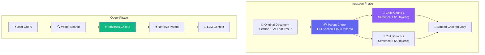

# Chapter 4 — Advanced Embedding Strategies

## 🏢 Business Problem

Your RAG application is hallucinating. Users ask about a specific feature, but the AI gives the wrong answer because the vector search returned paragraph 3 of a manual, but the *context* needed to understand paragraph 3 was in paragraph 2.

As an architect, you realize that simply splitting text by character count is breaking the semantic meaning of your documents. You need an **Advanced Chunking Strategy**.

---

## 🧠 Theory

The quality of a RAG system depends entirely on what you feed the LLM. If the retrieval is bad, the generation will be bad (Garbage In, Garbage Out). 

The process of taking a large document and breaking it down into smaller pieces for embedding is called **Chunking**.

### Chunking Strategies

#### 1. Naive (Fixed-Size) Chunking
- Splits text every $N$ tokens (e.g., 500 tokens).
- **Problem:** Cuts sentences in half. Destroys context.

#### 2. Overlapping Chunking
- Splits text every 500 tokens, but keeps an overlap of 50 tokens from the previous chunk.
- **Problem:** Better, but still arbitrary. Can split a logical thought across two chunks.

#### 3. Structural / Semantic Chunking
- Splits text based on the structure of the document (Headers, Paragraphs, Markdown sections).
- **Problem:** Harder to implement. Requires parsing PDFs or HTML properly.

#### 4. Parent-Child Chunking (Advanced)
- **Concept:** You embed small, specific chunks (the "children" - e.g., single sentences). When a child chunk matches the search query, you don't send the child to the LLM; instead, you retrieve its larger "parent" chunk (the whole section) and send *that* to the LLM.
- **Why?** Small chunks are great for accurate search matching. Large chunks are great for providing context to the LLM.

---

## 🏗 Architecture: Parent-Child Chunking



---

## 💻 C# Example: Semantic Kernel Text Chunking

Microsoft's Semantic Kernel provides built-in tools for structural chunking.

```csharp title="ChunkingService.cs — TextPartitioning"
using Microsoft.SemanticKernel.Text;

public class DocumentIngestionService
{
    public List<string> ChunkDocument(string fullDocumentText)
    {
        // Use Semantic Kernel's TextChunker to split by paragraphs/lines
        // rather than arbitrary character counts.
        
        var lines = TextChunker.SplitPlainTextLines(
            fullDocumentText, 
            maxTokensPerLine: 100
        );

        var paragraphs = TextChunker.SplitPlainTextParagraphs(
            lines, 
            maxTokensPerParagraph: 500,
            overlapTokens: 50 // Keep context between chunks
        );

        return paragraphs;
    }
}
```

### Implementing Parent-Child in C#

To implement Parent-Child relationships, you store the parent ID in the child's metadata:

```csharp
public class ChildChunkDocument
{
    public string Id { get; set; }          // e.g., "doc1_child_4"
    public string ParentId { get; set; }    // e.g., "doc1_parent_1"
    public float[] Vector { get; set; }     // The embedding
    public string Text { get; set; }        // The sentence itself
}

// When you search, you find the child:
// var childMatch = await searchClient.SearchAsync(...);
// 
// Then you query the DB for the parent:
// var parentText = await db.GetParentText(childMatch.ParentId);
// 
// Feed parentText to the LLM!
```

---

## 🧪 Lab: The Cost of Overlap

### Objective
Understand the storage impact of chunk overlap.

### Scenario
You have a 10,000 token document. 
You chunk it into 500 token chunks.

1. **No overlap:** $10,000 / 500 = 20 \text{ chunks}$
2. **250 token overlap:** Because you repeat 250 tokens every time, you effectively only advance 250 tokens per chunk. $10,000 / 250 = 40 \text{ chunks}$

### ✅ Success Criteria
- [ ] You realize that a 50% overlap **doubles** your vector database storage costs.
- [ ] You understand why architects must balance context-preservation with cost-efficiency.

---

## 🎯 Interview Questions

### Q1: What is the "Lost in the Middle" phenomenon?
**Answer:** Research shows that if you feed an LLM a massive chunk of text (e.g., 30,000 tokens), it pays close attention to the beginning and the end of the prompt, but tends to ignore facts hidden in the middle. This is why chunking is better than just dumping a 100-page PDF into a massive context window.

### Q2: Why would you use a Parent-Child chunking strategy?
**Answer:** It decouples the retrieval process from the generation process. Small chunks (sentences) are highly precise for vector search matching. Large chunks (paragraphs/sections) are needed by the LLM to provide enough context to generate a good answer.

### Q3: How do you handle chunking for tabular data (tables in PDFs)?
**Answer:** Standard text chunking destroys tables. You must extract tables separately, serialize them into Markdown or JSON format, and embed the table as a single, cohesive chunk.

---

**Congratulations!** You've completed Volume 2 — LLM Engineering. 🎉

You now understand:
- ✅ Transformer Architecture
- ✅ RAG vs Fine-tuning
- ✅ Vector Databases & Hybrid Search
- ✅ Advanced Chunking Strategies

**Next:** Volume 3 — .NET AI Integration (coming soon)
