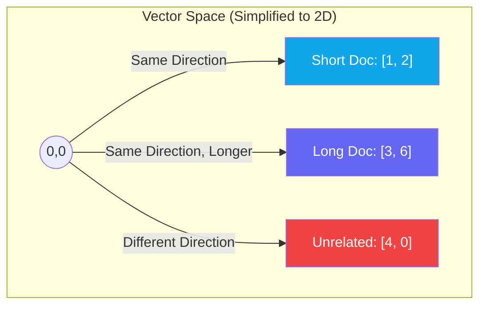

# Chapter — Cosine Similarity

## 🏢 Business Problem

Your developers have generated embeddings for all company documents. Now they need to search them. 

A junior developer suggests using a standard distance formula (Euclidean distance) to find the closest vectors. Suddenly, short documents are never matching with long documents, even when they discuss the exact same topic. Search is broken.

As an architect, you must dictate the correct mathematical distance metric for Vector Search.

---

## 🧠 Theory

When you have a user's search vector and millions of document vectors in a database, how do you mathematically determine which document is the "closest" match?

### The Problem with Euclidean Distance
Euclidean Distance measures the physical straight-line distance between two points in space. 
If Document A is a 2-page summary of Azure, and Document B is a 1,000-page manual on Azure, their vectors might point in the exact same *direction* (meaning), but Document B's vector will be much *longer* (magnitude). Euclidean distance will say they are very far apart.

### The Solution: Cosine Similarity
Cosine Similarity ignores the *length* of the vectors and only looks at the **angle** between them. 
- **0 degrees apart:** Cosine is 1.0 (Exact match in meaning).
- **90 degrees apart:** Cosine is 0.0 (Completely unrelated).
- **180 degrees apart:** Cosine is -1.0 (Exact opposite meaning).

By measuring the angle, a 2-page summary and a 1,000-page manual on the same topic will have a Cosine Similarity near 1.0, making your search highly accurate regardless of document length.

---

## 🏗 Architecture: Vector Distances



*Note: In the diagram, Doc A and Doc B have a Cosine Similarity of 1.0 (angle is 0), even though their Euclidean distance is large.*

---

## 💻 C# Example: Calculating Cosine Similarity

While a Vector Database usually does this for you, understanding the math in C# using modern .NET `System.Numerics.Tensors` is critical for AI engineers.

```csharp title="MathHelper.cs"
using System.Numerics.Tensors;

public class MathHelper
{
    public static float CalculateCosineSimilarity(float[] vectorA, float[] vectorB)
    {
        if (vectorA.Length != vectorB.Length)
            throw new ArgumentException("Vectors must have the same dimensionality.");

        // .NET 8 includes highly optimized Tensor primitives that use SIMD hardware instructions
        return TensorPrimitives.CosineSimilarity(vectorA, vectorB);
    }

    public static void Demo()
    {
        float[] query = { 0.1f, 0.5f, -0.2f };
        float[] doc1 =  { 0.1f, 0.5f, -0.2f }; // Exact match
        float[] doc2 =  { 0.2f, 1.0f, -0.4f }; // Same angle, different length
        float[] doc3 =  { -0.1f, -0.5f, 0.2f }; // Exact opposite

        Console.WriteLine(CalculateCosineSimilarity(query, doc1)); // Output: 1.0
        Console.WriteLine(CalculateCosineSimilarity(query, doc2)); // Output: 1.0
        Console.WriteLine(CalculateCosineSimilarity(query, doc3)); // Output: -1.0
    }
}
```

---

## 🧪 Lab: The Hardware Acceleration Advantage

### Objective
Understand why we use `TensorPrimitives`.

### Scenario
You are writing a local vector search tool in C# that must compare 1 user query against 50,000 document vectors in memory.
You write a standard `for` loop to calculate the dot product. It takes 500ms.

### ✅ Success Criteria
- [ ] You switch to `TensorPrimitives.CosineSimilarity()` in .NET 8.
- [ ] You understand that `TensorPrimitives` automatically utilizes **SIMD (Single Instruction, Multiple Data)** on the CPU.
- [ ] The hardware processes 4 to 8 array elements simultaneously in a single CPU clock cycle.
- [ ] Your local search drops from 500ms to 50ms without buying any new hardware.

---

## 🎯 Interview Questions

### Q1: Why is Cosine Similarity preferred over Euclidean Distance for text embeddings?
**Answer:** Cosine Similarity measures the angle between vectors, making it insensitive to the magnitude (length) of the vectors. This is crucial because document length and word frequency can alter the magnitude, but the underlying semantic meaning (direction) remains the same.

### Q2: What is the relationship between Dot Product and Cosine Similarity?
**Answer:** Cosine Similarity is simply the Dot Product of two vectors divided by the product of their magnitudes (lengths). If both vectors are "normalized" (scaled so their length is exactly 1), then the Dot Product is mathematically identical to Cosine Similarity, but much faster to compute.

### Q3: When you create a Vector Index in Azure AI Search, what distance metric should you choose?
**Answer:** You must choose the distance metric that the Embedding Model was trained on. For OpenAI embeddings (`text-embedding-ada-002` or `text-embedding-3`), the models are normalized and optimized for Cosine Similarity.

---

**Next:** [Chapter — Indexing (HNSW / IVF) →](/docs/llm-engineering/indexing-hnsw)
