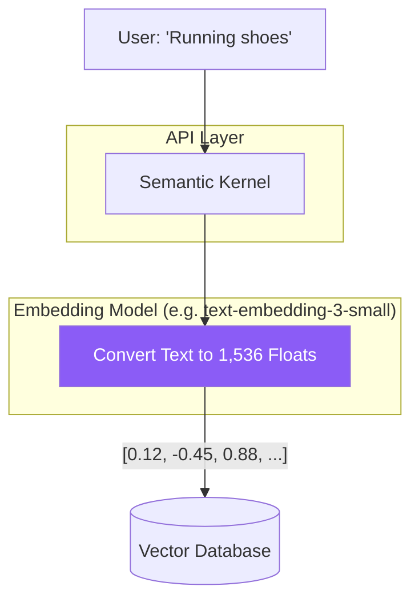

# Chapter — Embedding Models

## 🏢 Business Problem

Your e-commerce site uses standard SQL `LIKE '%search_term%'` for its search bar. A user searches for "running shoes". They get zero results because your product database lists them as "athletic footwear". 

You need a search system that understands the *meaning* of words, not just the exact spelling.

---

## 🧠 Theory

An **Embedding Model** is a specialized, lightweight AI model designed to do one thing: convert text into an array of floating-point numbers (a vector).

### The Math of Meaning
If two pieces of text have the same meaning, their embedding vectors will be mathematically close to each other in high-dimensional space.

- "Running shoes" -> `[0.12, -0.45, 0.88, ...]`
- "Athletic footwear" -> `[0.11, -0.42, 0.89, ...]`
- "Apple pie" -> `[-0.99, 0.22, -0.11, ...]`

Because "shoes" and "footwear" produce similar numbers, a database can easily find one when searching for the other.

### Types of Embeddings
1. **Dense Vectors:** Created by models like OpenAI's `text-embedding-3-small`. They capture deep semantic meaning. Usually 384 to 3,072 dimensions.
2. **Sparse Vectors:** Created by algorithms like BM25. They capture exact keyword matches. Most numbers in the array are zero.

To build world-class search (Hybrid Search), you must use both.

---

## 🏗 Architecture: The Embedding Pipeline



---

## 💻 C# Example: Generating Embeddings

In .NET, you use the `ITextEmbeddingGenerationService` abstraction. This allows you to generate vectors without caring if they come from Azure OpenAI, Hugging Face, or a local model.

```csharp title="EmbeddingService.cs"
using Microsoft.SemanticKernel;
using Microsoft.SemanticKernel.Embeddings;

public class SearchService
{
    private readonly ITextEmbeddingGenerationService _embeddingService;

    // Injected via DI (e.g., AddAzureOpenAITextEmbeddingGeneration)
    public SearchService(ITextEmbeddingGenerationService embeddingService)
    {
        _embeddingService = embeddingService;
    }

    public async Task<ReadOnlyMemory<float>> CreateSearchVectorAsync(string query)
    {
        // Generate the vector for the user's search query
        var embedding = await _embeddingService.GenerateEmbeddingAsync(query);
        
        Console.WriteLine($"Generated a {embedding.Length}-dimension vector.");
        return embedding;
    }
}
```

---

## 🧪 Lab: The Dimensionality Trade-off

### Objective
Understand the cost vs accuracy trade-off in embedding models.

### Scenario
You are building RAG for 10 million documents. 
- **Model A:** `text-embedding-3-large` (3,072 dimensions). Cost: $0.13 / 1M tokens. Storage required: 120 GB.
- **Model B:** `text-embedding-3-small` (1,536 dimensions). Cost: $0.02 / 1M tokens. Storage required: 60 GB.

### Task
You must recommend a model to the CIO.

### ✅ Success Criteria
- [ ] You recognize that 3,072 dimensions capture much deeper nuance (great for complex legal or medical texts).
- [ ] You recognize that doubling the dimensions doubles the RAM/Disk required in the Vector Database, heavily increasing infrastructure costs.
- [ ] **Recommendation:** Start with the smaller, cheaper model. Only upgrade to the larger model if search accuracy tests fail.

---

## 🎯 Interview Questions

### Q1: Can you use a vector generated by OpenAI to search a database of vectors generated by Hugging Face?
**Answer:** No. Every embedding model maps meaning to completely different coordinate spaces. An OpenAI vector is mathematically meaningless when compared to a Hugging Face vector. You must use the exact same model for indexing and searching.

### Q2: If you want to switch your embedding model in production, what must you do?
**Answer:** You must completely rebuild your Vector Database. You have to take all the original text documents, pass them through the new model, generate new vectors, and overwrite the old database. This is called "Re-indexing".

### Q3: Why are Embedding Models much faster and cheaper than LLMs (like GPT-4)?
**Answer:** LLMs are generative (Decoder-only); they have to run their massive neural networks sequentially for every single word they output. Embedding models are representation models (Encoder-only); they read the input text in one parallel pass, spit out an array of numbers, and immediately stop.

---

**Next:** [Chapter — Cosine Similarity →](/docs/llm-engineering/cosine-similarity)
