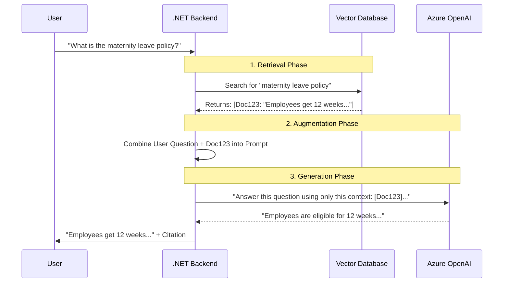

# Chapter 2 — Fine-tuning vs RAG

## 🏢 Business Problem

Your company wants to build an AI assistant that can answer questions about your proprietary HR policies. The CEO asks: *"Should we train our own AI model so it knows our data, or use something else?"*

As an architect, you must choose between **RAG (Retrieval-Augmented Generation)** and **Fine-Tuning**. Making the wrong choice costs hundreds of thousands of dollars and months of wasted engineering effort.

---

## 🧠 Theory

There are two primary ways to make a foundational model (like GPT-4) know about your private data:

### 1. Fine-Tuning (Baking the knowledge in)
Fine-tuning involves taking a pre-trained model and continuing the training process on your custom dataset.
- **How it works:** You adjust the underlying neural network weights.
- **Mental Model:** Studying for a closed-book exam. You memorize the information.
- **Best for:** Teaching a model a specific *format*, *tone*, or *domain-specific jargon* (e.g., medical diagnosis format).

### 2. RAG (Giving it a cheat sheet)
Retrieval-Augmented Generation (RAG) intercepts the user's question, searches a database for the answer, and hands the answer to the LLM alongside the question.
- **How it works:** `Prompt = User Question + Database Search Results`
- **Mental Model:** Taking an open-book exam. You look up the exact facts right before answering.
- **Best for:** Fact-retrieval, highly dynamic data (prices, inventory), and citing sources.

### The Architect's Decision Matrix

| Feature | RAG | Fine-Tuning |
|---------|-----|-------------|
| **Primary Use Case** | Knowledge retrieval (facts) | Behavior/Tone modification |
| **Data updates** | Instant (just update the DB) | Slow (requires re-training) |
| **Hallucinations** | Low (grounded in context) | High (relies on memory) |
| **Citations** | Yes (can link to source docs) | No (model doesn't know *where* it learned it) |
| **Security/ACLs** | Easy (filter DB results by user access) | Impossible (model knows everything) |
| **Cost to implement**| $$ | $$$$$ |

**Golden Rule for Solution Architects:** 
*Use RAG for knowledge. Use Fine-tuning for behavior. (And usually, start with RAG).*

---

## 🏗 Architecture: The RAG Pattern



---

## 💻 C# Example: Implementing RAG vs Fine-Tuning

In .NET, Fine-Tuning happens in the cloud portal (Azure ML) via API calls. RAG, however, is a pipeline you build in code.

```csharp title="RagService.cs — Standard RAG Pipeline"
using Microsoft.SemanticKernel;
using System.Text;

public class HRRagService
{
    private readonly Kernel _kernel;
    private readonly IDocumentRetriever _retriever; // e.g. Azure AI Search

    public HRRagService(Kernel kernel, IDocumentRetriever retriever)
    {
        _kernel = kernel;
        _retriever = retriever;
    }

    public async Task<string> AnswerHRQuestion(string userQuestion)
    {
        // 1. RETRIEVAL: Get relevant facts
        var documents = await _retriever.SearchAsync(userQuestion, topK: 3);
        
        var contextBuilder = new StringBuilder();
        foreach (var doc in documents)
        {
            contextBuilder.AppendLine($"Source: {doc.FileName}");
            contextBuilder.AppendLine($"Content: {doc.Text}");
        }

        // 2. AUGMENTATION: Inject facts into prompt
        var ragPrompt = """
            You are an HR assistant. Answer the user's question using ONLY the provided context.
            If the context does not contain the answer, say "I don't know".
            Always cite the source filename.
            
            [CONTEXT]
            {{$context}}
            
            [USER QUESTION]
            {{$question}}
            """;

        // 3. GENERATION
        var function = _kernel.CreateFunctionFromPrompt(ragPrompt);
        
        var result = await _kernel.InvokeAsync(function, new KernelArguments
        {
            ["context"] = contextBuilder.ToString(),
            ["question"] = userQuestion
        });

        return result.ToString();
    }
}
```

---

## 🧪 Lab: When to choose what?

### Objective
Map real-world business requirements to the correct architectural pattern.

### Scenario Analysis
For each scenario below, decide if you should use **RAG**, **Fine-Tuning**, **Both**, or **Prompt Engineering**.

1. **Scenario A:** Your company wants an AI to write C# code in your company's highly specific, proprietary coding style that no public model understands.
2. **Scenario B:** A retail site needs a chatbot that knows the live, up-to-the-minute inventory count of sneakers.
3. **Scenario C:** A law firm wants an AI that writes legal briefs in the exact voice of their founding partner, while citing specific cases from a private database.

### ✅ Success Criteria
- [ ] **Scenario A:** Fine-Tuning (teaching behavior/style).
- [ ] **Scenario B:** RAG (dynamic, changing facts).
- [ ] **Scenario C:** Both! (Fine-tune for the founding partner's voice, RAG to inject the specific legal cases).

---

## 🎯 Interview Questions

### Q1: Can we fine-tune a model so we don't have to use a vector database for search?
**Answer:** No, this is an anti-pattern. Fine-tuning for fact memorization is unreliable. Models hallucinate, you cannot easily update facts when they change (you'd have to retrain), and you cannot implement access controls (a model cannot unlearn a fact for a specific user). 

### Q2: How does RAG solve the hallucination problem?
**Answer:** RAG shifts the LLM's role from "knowledge engine" to "reasoning engine." By providing the exact facts in the prompt and instructing the model to *only* use those facts (grounding), the model summarizes the provided text instead of guessing from its training data.

### Q3: What is the main cost difference between RAG and Fine-tuning?
**Answer:** RAG primarily costs money for embeddings and vector database storage, plus standard inference tokens. Fine-tuning requires expensive upfront GPU compute for training, and cloud providers charge significantly more for hosting and running inferences on custom fine-tuned models compared to standard shared models.

---

**Next:** [Chapter 3 — Vector Database Deep Dive →](/docs/llm-engineering/vector-databases-deep-dive)
