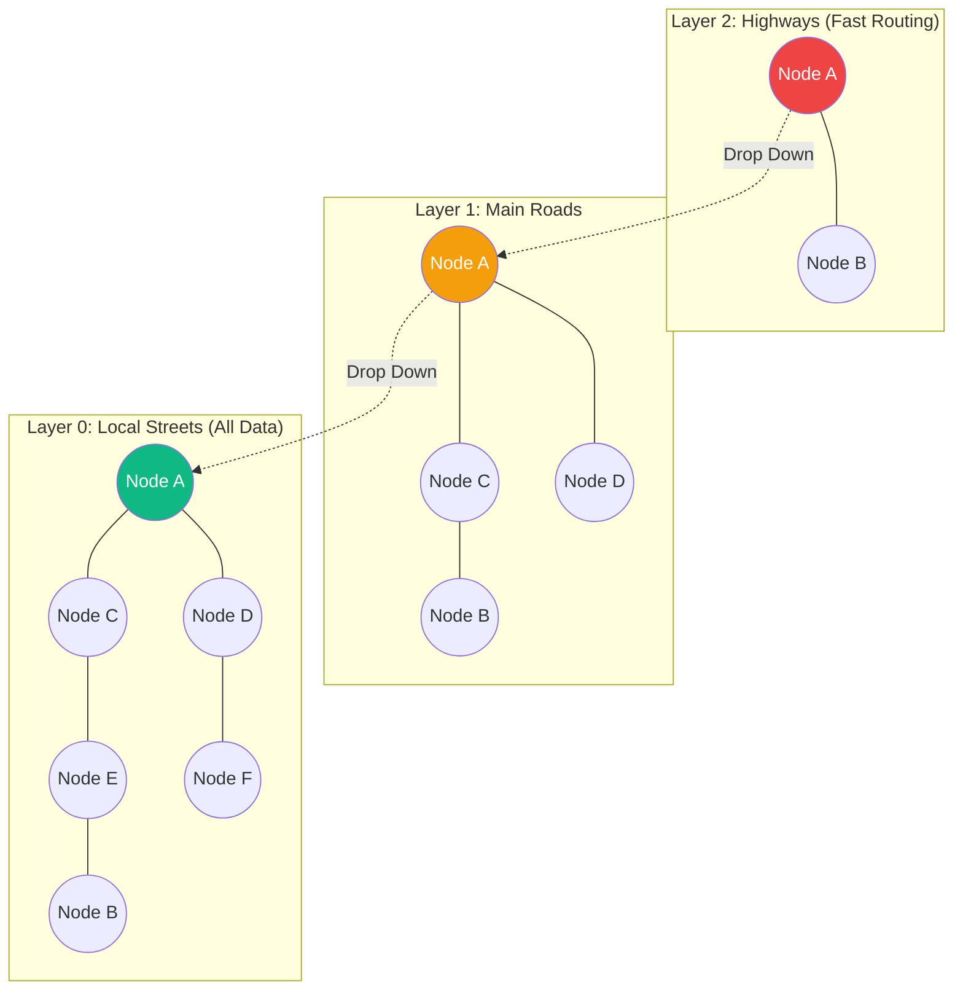

# Chapter — Indexing (HNSW / IVF)

## 🏢 Business Problem

Your RAG system worked perfectly in testing with 1,000 documents. You go to production with 10 million documents. 

Suddenly, a single user search takes 12 seconds to complete. The CPUs on your database server are at 100%. 

As an architect, you must explain that checking distance against every row in a database is an $O(N)$ operation that does not scale. You need a **Vector Index**.

---

## 🧠 Theory

If you have 10 million vectors, calculating Cosine Similarity against every single one (called Exact kNN, or K-Nearest Neighbors) is impossibly slow for real-time chat.

To speed this up, Vector Databases use Approximate Nearest Neighbor (ANN) algorithms. You trade a tiny bit of accuracy (1-2%) for a massive increase in speed (99% faster). 

The two most common algorithms are **IVF (Inverted File Index)** and **HNSW (Hierarchical Navigable Small World)**.

### 1. IVF (Inverted File Index)
IVF clusters your data. Instead of 10 million loose vectors, it groups them into, say, 1,000 clusters (e.g., a "Legal" cluster, an "HR" cluster). 
When a search comes in, it calculates distance to the 1,000 cluster center-points first. It picks the closest cluster, and then *only* searches the vectors inside that cluster.
- **Pros:** Fast to build, uses very little RAM.
- **Cons:** Accuracy drops if the data isn't clustered perfectly.

### 2. HNSW (Hierarchical Navigable Small World)
HNSW builds a multi-layered graph (like a highway system). 
- The top layer has very few nodes and long connections (highways).
- The bottom layer has all the nodes and short connections (local streets).
When a search comes in, it starts at the top layer, takes big jumps toward the destination, drops down a layer, takes smaller jumps, and so on.
- **Pros:** Incredibly fast search, very high accuracy.
- **Cons:** Building the graph takes a long time, and storing the graph requires massive amounts of RAM.

---

## 🏗 Architecture: HNSW Graph Layers



---

## 💻 C# Example: Index Configuration

When using `Microsoft.Extensions.VectorData` or EF Core with `pgvector`, you don't write the HNSW algorithm yourself. You *configure* the database to create the index.

```csharp title="VectorDbSetup.cs"
using Microsoft.Extensions.VectorData;

// When defining your Vector Store schema, you must define the Index type!
public class DocumentRecord
{
    [VectorStoreRecordKey]
    public string Id { get; set; }
    
    [VectorStoreRecordData]
    public string Text { get; set; }
    
    // Configure the Vector Column to use an HNSW Index
    [VectorStoreRecordVector(
        Dimensions: 1536, 
        DistanceFunction: DistanceFunction.CosineSimilarity, 
        IndexKind: IndexKind.Hnsw)] 
    public ReadOnlyMemory<float> Vector { get; set; }
}
```

If using EF Core with `pgvector` in PostgreSQL:
```csharp
protected override void OnModelCreating(ModelBuilder modelBuilder)
{
    modelBuilder.Entity<DocumentEntity>()
        .HasIndex(d => d.Embedding)
        .HasMethod("hnsw") // Tells PostgreSQL to build the graph
        .HasOperators("vector_cosine_ops");
}
```

---

## 🧪 Lab: RAM Sizing for HNSW

### Objective
Calculate the infrastructure cost required for an HNSW index.

### The Math
Unlike standard databases that store data on disk, an HNSW graph is traversed so quickly that it **must reside in memory (RAM)** to be effective.

1. You have 10 million documents.
2. Using OpenAI `text-embedding-3-small` (1,536 dimensions, 4 bytes per float) = 6 KB per vector.
3. Total Raw Vector Size: $10,000,000 \times 6 \text{ KB} = 60 \text{ GB}$.
4. The HNSW Graph Overhead (pointers and layers) usually adds 30-50% more size.
5. Total RAM Required: $\sim 90 \text{ GB}$.

### ✅ Success Criteria
- [ ] You realize that scaling Vector Search requires scaling Server RAM, not just Disk space.
- [ ] You understand why enterprise Vector DBs (like Azure AI Search) charge premium pricing for their higher tiers (they allocate massive RAM).

---

## 🎯 Interview Questions

### Q1: What is the difference between kNN and ANN?
**Answer:** kNN (K-Nearest Neighbors) is an *exact* search that compares the query against every single vector in the database ($O(N)$). ANN (Approximate Nearest Neighbor) uses algorithms like HNSW to find the *probably* closest vectors in a fraction of the time, trading a tiny bit of accuracy for massive scale.

### Q2: If HNSW is so fast, why would anyone use IVF?
**Answer:** HNSW is memory-intensive because the entire hierarchical graph structure must be stored in RAM. If a client has 500 million vectors and a strict budget, HNSW might be too expensive to host. IVF requires significantly less memory and builds much faster, making it a better budget option.

### Q3: A user updates a document's text. Why is updating an HNSW index computationally expensive?
**Answer:** Because HNSW is a complex graph. When a vector changes, the database can't just update a row; it has to recalculate the node's position, rebuild its connections to neighboring nodes, and potentially restructure parts of the upper hierarchy layers.

---

**Next:** [Chapter — Hallucinations & Mitigation →](/docs/llm-engineering/hallucinations-and-mitigation)
