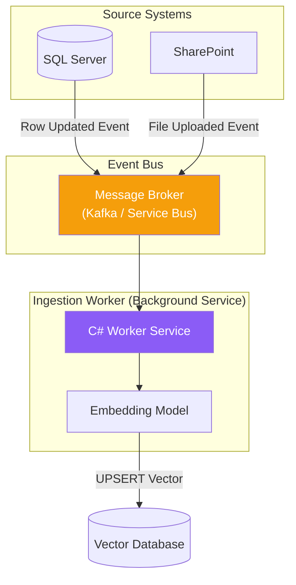

# Chapter — Production RAG Systems

## 🏢 Business Problem

Your developers built a fantastic RAG prototype using Semantic Kernel and Azure AI Search. It works perfectly on their laptops with 5 test PDFs. 

You deploy it to production. A week later, a manager updates the "Expense Policy" PDF on SharePoint. The AI is still quoting the old policy. Furthermore, users are asking vague questions like *"How do I do it?"* and the Vector Database is returning garbage results.

Building a RAG prototype takes 2 hours. Building a Production RAG system takes months. As an architect, you must solve the day-two operational problems.

---

## 🧠 Theory

A Production RAG system must solve three critical challenges that prototypes ignore:

### 1. Data Sync (The Stale Data Problem)
When a source document is updated, deleted, or its permissions change in the source system (SQL, SharePoint), the Vector Database must be updated immediately. 
- You cannot run a batch job every night to re-index 10 million documents. 
- You must implement an **Event-Driven Ingestion Pipeline**.

### 2. Query Rewriting (The Vague User Problem)
Vector databases do semantic math. If a user types *"What about the other one?"*, the database searches for vectors related to "otherness". It fails.
- The API must intercept the user's chat, look at the chat history, and use a fast, cheap LLM (like GPT-3.5) to rewrite the user's query into a standalone search string (e.g., *"What is the deductible for the standard healthcare plan?"*) *before* embedding it and searching the database.

### 3. Evaluation (RAGAS)
How do you know if your RAG system is actually good? You cannot manually read 10,000 chat logs. You use a framework like **RAGAS (RAG Assessment)** to have an LLM automatically grade your pipeline on:
- **Faithfulness:** Did the answer come from the context?
- **Answer Relevance:** Did the answer actually address the user's question?
- **Context Precision:** Did the Vector DB retrieve the right documents?

---

## 🏗 Architecture: Event-Driven RAG Sync



---

## 💻 C# Example: Query Rewriting Pipeline

Here is how you use Semantic Kernel to intercept a vague user query and rewrite it using chat history before hitting the Vector DB.

```csharp title="RagQueryPipeline.cs"
using Microsoft.SemanticKernel;
using Microsoft.SemanticKernel.ChatCompletion;

public class RagQueryPipeline
{
    private readonly Kernel _kernel;
    private readonly IChatCompletionService _chat;

    public RagQueryPipeline(Kernel kernel)
    {
        _kernel = kernel;
        _chat = kernel.GetRequiredService<IChatCompletionService>();
    }

    // Step 1: Rewrite the query
    public async Task<string> RewriteQueryAsync(string userMessage, string chatHistory)
    {
        var prompt = $$"""
            Given the following chat history and a new user message, rewrite the user message 
            into a standalone query that can be used to search a corporate database.
            Do not answer the question, just rewrite it.
            
            [HISTORY]
            {{chatHistory}}
            
            [NEW MESSAGE]
            {{userMessage}}
            """;

        // Use a fast/cheap model for this step!
        var standaloneQuery = await _kernel.InvokePromptAsync(prompt);
        return standaloneQuery.ToString();
    }

    // Step 2: The actual RAG search
    public async Task<string> ExecuteSearchAsync(string standaloneQuery)
    {
        // 1. Generate Embeddings for standaloneQuery
        // 2. Search Vector Database
        // 3. Return results
        return "Search Results Context...";
    }
}
```

---

## 🧪 Lab: The RAG Evaluation Matrix

### Objective
Understand how to mathematically prove your RAG system is ready for production.

### Scenario
You run a test set of 100 questions through your pipeline. 
The Evaluation LLM scores your system:
- **Faithfulness:** 0.98 (Excellent - not hallucinating)
- **Context Precision:** 0.35 (Terrible)

### Diagnosis
What is broken in your architecture?

### ✅ Success Criteria
- [ ] You identify that **Faithfulness** measures the Generator (the final LLM prompt). A score of 0.98 means your System Prompt and Temperature are perfectly tuned.
- [ ] You identify that **Context Precision** measures the Retriever (the Vector DB and Embeddings). A score of 0.35 means the database is returning junk documents.
- [ ] **Action:** You must fix the chunking strategy, switch embedding models, or implement Query Rewriting. You do *not* need to touch the LLM prompt.

---

## 🎯 Interview Questions

### Q1: In a Production RAG system, how do you handle document deletions?
**Answer:** The Vector Database must be treated as a downstream read-replica. When a document is deleted in the primary system (e.g., SharePoint), an event must be published to a message broker (e.g., Azure Service Bus). A background worker consumes this event and issues a `Delete(documentId)` command to the Vector Database.

### Q2: What is "Hybrid Search" and why is it mandatory for Production RAG?
**Answer:** Vector search is great for concepts, but terrible for exact keywords (like an employee ID `EMP-8832` or a specific SKU). Hybrid search executes a Vector Search (for meaning) AND a traditional Keyword Search (BM25) simultaneously, then merges the results using an algorithm called Reciprocal Rank Fusion (RRF) to give you the best of both worlds.

### Q3: Why is Query Rewriting necessary if we have chat history?
**Answer:** Passing the entire chat history to the embedding model generates a vector that represents a blend of 10 different topics. The Vector DB will fail to find anything relevant. Query Rewriting condenses the history into a single, highly specific search sentence, generating a pure vector that matches the target documents perfectly.

---

**Congratulations!** You have completed Volume 2 — LLM Engineering. 🎉

You are now ready to implement these concepts in **Volume 3 — .NET AI Integration**.
