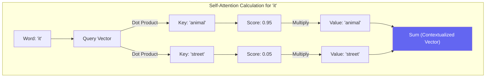

# Chapter — Self-Attention

## 🏢 Business Problem

Your data science team asks for a huge GPU budget increase to process larger documents. They say, "The computational cost of attention is quadratic." 

As a Solution Architect signing off on cloud budgets, you need to understand exactly what "Attention" is, why it scales poorly with document length, and how it differs from traditional search.

---

## 🧠 Theory

**Self-Attention** is the core mathematical operation inside a Transformer. It allows the model to look at a single word and determine how relevant every other word in the sequence is to that specific word.

### The Q, K, V Analogy
Self-attention relies on three vectors created for each token: **Query (Q)**, **Key (K)**, and **Value (V)**.

Think of it like searching a filing cabinet:
1. **Query (Q):** What you are looking for (e.g., "I need a noun that 'it' refers to").
2. **Key (K):** The labels on the files in the cabinet (e.g., "I am an animal", "I am a street").
3. **Value (V):** The actual contents of the file.

For every word in the sentence *"The animal didn't cross the street because it was tired"*:
- The word *"it"* generates a **Query**.
- The words *"animal"* and *"street"* provide their **Keys**.
- The math computes the dot product of the Query against all Keys to find the best match (the highest score).
- *"animal"* gets a high score (95%), *"street"* gets a low score (5%).
- The model then mixes the **Values** together based on these percentages to give *"it"* its final context.

### The $O(N^2)$ Problem
Because *every single token* must calculate its Query against the Keys of *every other token*, the number of calculations is $N \times N$, where $N$ is the number of tokens.
- 1,000 tokens = 1,000,000 calculations.
- 128,000 tokens = 16,384,000,000 calculations.

---

## 🏗 Architecture: The Attention Mechanism



---

## 💻 C# Example: Conceptual Attention Math

Here is a simplified C# representation of how an Attention Score is calculated using dot products.

```csharp title="AttentionScorer.cs"
using System;
using System.Linq;

public class AttentionScorer
{
    // A simplified dot product calculation between two vectors
    public static double CalculateScore(double[] query, double[] key)
    {
        if (query.Length != key.Length)
            throw new ArgumentException("Vectors must be same length.");

        double dotProduct = 0;
        for (int i = 0; i < query.Length; i++)
        {
            dotProduct += query[i] * key[i];
        }

        // In real transformers, this is scaled down by the square root of the dimension size
        return dotProduct / Math.Sqrt(query.Length);
    }

    public static void EvaluateContext()
    {
        // Conceptual vectors representing words
        double[] query_it = { 0.8, 0.2, 0.1 };
        
        double[] key_animal = { 0.9, 0.1, 0.0 }; // Very similar to 'it' conceptually here
        double[] key_street = { 0.1, 0.9, 0.5 }; // Very different
        
        double scoreAnimal = CalculateScore(query_it, key_animal);
        double scoreStreet = CalculateScore(query_it, key_street);
        
        Console.WriteLine($"Attention 'it' -> 'animal': {scoreAnimal:F2}");
        Console.WriteLine($"Attention 'it' -> 'street': {scoreStreet:F2}");
    }
}
```

---

## 🧪 Lab: The Cost of Context

### Objective
Calculate the exponential growth of attention mechanisms.

### Scenario
A client wants to switch from a 4k context window model to a 32k context window model. They assume it will cost roughly 8x more compute (since $32k / 4k = 8$).

### Task
Calculate the actual ratio of increase for the attention mechanism.

### ✅ Success Criteria
- [ ] You square the input size for 4k: $4,000^2 = 16,000,000$.
- [ ] You square the input size for 32k: $32,000^2 = 1,024,000,000$.
- [ ] You divide the two: $1,024 / 16 = 64$.
- [ ] You explain to the client that the attention mechanism requires **64x more compute**, not 8x!

---

## 🎯 Interview Questions

### Q1: What does Q, K, and V stand for in Self-Attention?
**Answer:** Query (what the current token is looking for), Key (what other tokens broadcast about themselves), and Value (the actual semantic content of the other tokens that will be mixed together).

### Q2: Why is the dot product used to calculate attention scores?
**Answer:** The dot product of two vectors is a mathematical measure of similarity. If two vectors point in the exact same direction, their dot product is large. If they are orthogonal (unrelated), it is zero. It is an extremely fast, hardware-optimized way to check how related two words are.

### Q3: What is "Multi-Head" Attention?
**Answer:** Instead of calculating attention just once per token, Transformers calculate it multiple times (multiple "heads") in parallel. One head might focus on grammatical relationships (verbs to nouns), while another head focuses on sentiment or historical facts.

---

**Next:** [Chapter — Tokenization Internals →](/docs/llm-engineering/tokenization-internals)
