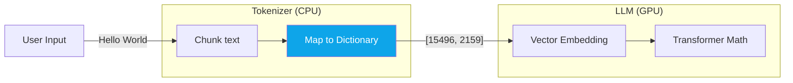

# Chapter — Tokenization Internals

## 🏢 Business Problem

Users are complaining that your advanced AI system cannot count how many 'r's are in the word "strawberry". They also complain that the AI refuses to write code in an obscure proprietary language.

As an architect, you must explain that this is not a limitation of the LLM's intelligence, but a hard limitation of its **Tokenizer**.

---

## 🧠 Theory

LLMs do not see letters or words. They see integers. A tokenizer is the dictionary that maps text to integers.

### Byte Pair Encoding (BPE)
Modern LLMs use BPE. It works by looking at millions of documents and finding the most common character combinations.
- The word `Apple` is common, so it gets a single token ID: `[409]`.
- The word `Strawberry` might be split into `[Straw, berry]`.
- An obscure name like `Jignesh` might be split into 3 or 4 tokens: `[J, ign, esh]`.

### The Strawberry Problem
If the tokenizer splits "strawberry" into `[straw, berry]`, the LLM physically *cannot* see the letters "r-r-y" at the end of the word. It only sees Token ID `590` and Token ID `820`. Asking it to count the letters is like asking a human to count the threads in a painted picture; the resolution isn't there.

### The Code Problem
If you ask an LLM to write C#, it excels. Why? Because the word `public` is a single token, `class` is a single token, and `string` is a single token. 
If you ask it to write an obscure language where keywords are broken into 5 tokens each, the LLM struggles to recognize the patterns.

---

## 🏗 Architecture: The Tokenization Pipeline



---

## 💻 C# Example: Counting Tokens Locally

You should *never* send a prompt to an LLM without knowing its token count. If you exceed the model's Context Window, the API will crash.

In .NET, use the official `Microsoft.ML.Tokenizers` library to count tokens *before* making the HTTP call.

```csharp title="TokenCounter.cs"
using Microsoft.ML.Tokenizers;

public class TokenCounter
{
    public static void CountTokensForGpt4(string prompt)
    {
        // GPT-4 uses the cl100k_base tokenizer (Tiktoken)
        var tokenizer = TiktokenTokenizer.CreateForModel("gpt-4");

        // Encode the string into integer tokens
        var tokens = tokenizer.EncodeToIds(prompt);

        Console.WriteLine($"Text: {prompt}");
        Console.WriteLine($"Token Count: {tokens.Count}");
        
        // Let's see what the LLM actually sees
        Console.WriteLine("Token IDs:");
        foreach (var id in tokens)
        {
            Console.WriteLine(id);
        }
    }
}
```

---

## 🧪 Lab: The Cost of Language

### Objective
Understand why AI is more expensive for non-English speakers.

### Scenario
An enterprise has two branches: London and Tokyo. Both branches send 1,000-word daily summaries to GPT-4.
The Tokyo branch complains that their Azure bill is 3x higher than London's.

### The Reason
The BPE algorithm was trained mostly on English data. Therefore, English words are highly optimized (1 word = 1 token). 
Japanese Kanji/Hiragana characters were seen less often, so they are broken down into raw bytes. One Japanese word might equal 3 or 4 tokens!
Since cloud providers bill per-token, Japanese is significantly more expensive to process.

### ✅ Success Criteria
- [ ] You run a tokenizer on an English paragraph and a Japanese paragraph of the same length.
- [ ] You observe the Japanese text produces 2-3x more tokens.
- [ ] You adjust cost estimates based on user locale.

---

## 🎯 Interview Questions

### Q1: Why do LLMs struggle with basic spelling or math?
**Answer:** The tokenizer groups characters together. The number "1,234" might be one token, while "1,235" might be split into "1,2" and "35". Because the model doesn't see the individual digits consistently, it struggles to learn the underlying rules of character-by-character math or spelling.

### Q2: Is tokenization handled on the CPU or GPU?
**Answer:** Tokenization is a simple dictionary lookup and string manipulation process. It is almost always handled on the CPU (often in the API Gateway or SDK) before the array of integers is sent over the network to the GPU-backed LLM.

### Q3: How do you prevent users from crashing the API by typing too much text?
**Answer:** Before sending the request to the cloud, you must run the input through a local tokenizer (like `TiktokenTokenizer` in .NET). If the token array length exceeds your allowed limit, you return an HTTP 400 Bad Request to the user immediately, saving time, bandwidth, and preventing an LLM API exception.

---

**Next:** [Chapter — Embedding Models →](/docs/llm-engineering/embedding-models)
