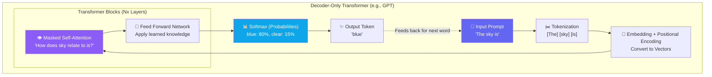

# Chapter 1 — The Transformer Architecture (Practical View)

## 🏢 Business Problem

Your enterprise needs to deploy a custom LLM on-premises for compliance reasons. Your infrastructure team asks: *"How many GPUs do we need? How much VRAM? Why does it take so much memory just to process a 10-page document?"*

To answer these questions, an AI Solution Architect must understand the engine under the hood: **The Transformer Architecture**.

---

## 🧠 Theory

### What is a Transformer?

Before 2017, AI processed text sequentially (like reading word by word). This was slow and "forgot" early context in long documents. 

In 2017, Google researchers published *"Attention Is All You Need"*, introducing the Transformer. The key innovation was **Self-Attention**: processing all words simultaneously and mathematically calculating how every word relates to every other word in a sentence.

### The Two Halves: Encoder and Decoder

1. **Encoder (e.g., BERT)**
   - Looks at the entire text at once to understand deep context.
   - **Best for:** Classification, sentiment analysis, embeddings.
   - **Analogy:** A reader analyzing a book.

2. **Decoder (e.g., GPT, LLaMA)**
   - Only looks at past words to predict the *next* word.
   - **Best for:** Text generation, chat, code completion.
   - **Analogy:** A writer continuing a story.

*Most modern generative LLMs (GPT-4, Claude, LLaMA 3) are **Decoder-only** transformers.*

### The Self-Attention Mechanism

When a Transformer reads the sentence: *"The bank of the river"*, it knows "bank" means land, not a financial institution, because the **Attention Mechanism** creates a mathematical link between "bank" and "river".

This requires massive parallel matrix multiplication, which is why GPUs (designed for parallel math in graphics) are required.

---

## 🏗 Architecture: How a Decoder Generates Text



### The Architect's Math: VRAM Calculation

When sizing infrastructure, you must calculate GPU memory (VRAM). 
For inference (running the model), a rough rule of thumb for FP16 (16-bit precision) is:

`1 Billion Parameters = ~2GB of VRAM`

- **LLaMA 3 (8B):** ~16GB VRAM minimum
- **Mixtral (8x7B):** ~90GB VRAM minimum
- **Context Window (KV Cache):** The longer your prompt, the more memory the Attention mechanism consumes dynamically.

---

## 💻 C# Example: Sizing Estimator

While we don't build transformers in C#, architects must write logic to route traffic based on token counts and model sizes.

```csharp title="ModelSizer.cs — Estimating Infrastructure Needs"
using System;

public class ModelInfrastructureSizer
{
    /// <summary>
    /// Estimates minimum GPU VRAM required to load a model (without context window overhead).
    /// </summary>
    public static double EstimateVRAM(int parameterCountBillions, int bitPrecision = 16)
    {
        // 1 byte = 8 bits. 
        // 16-bit (FP16) = 2 bytes per parameter
        // 1 Billion parameters = 10^9 parameters
        
        double bytesPerParam = bitPrecision / 8.0;
        double totalBytes = (parameterCountBillions * 1_000_000_000.0) * bytesPerParam;
        
        // Convert to Gigabytes
        double totalGB = totalBytes / (1024 * 1024 * 1024);
        
        // Add 20% overhead for KV Cache (Context) and CUDA overhead
        return totalGB * 1.20; 
    }
}

// Usage Example:
// double llama3_8b_vram = ModelInfrastructureSizer.EstimateVRAM(8, 16);
// Console.WriteLine($"LLaMA 3 8B needs {llama3_8b_vram:F1} GB of VRAM"); 
// Output: ~17.9 GB
```

---

## 🧪 Lab: Model Quantization Impact

### Objective
Understand how "Quantization" (reducing model precision) affects infrastructure architecture.

### Steps
1. Take the `ModelInfrastructureSizer` code above.
2. Calculate the VRAM required for an **8B parameter model** using:
   - 32-bit (FP32) - Full precision
   - 16-bit (FP16) - Standard inference
   - 4-bit (INT4) - Highly quantized
3. **Analyze:** If an Azure Nvidia A10 GPU has 24GB of VRAM, which precision levels fit on a single GPU?

### ✅ Success Criteria
- [ ] You understand that FP32 won't fit on a 24GB GPU.
- [ ] You understand that INT4 allows massive cost savings at a slight accuracy penalty.

---

## 🎯 Interview Questions

### Q1: Why do Large Language Models require GPUs?
**Answer:** The core of the Transformer architecture is the Self-Attention mechanism, which requires massive matrix multiplication to calculate the relationship between every token in the context window. GPUs possess thousands of arithmetic logic units (ALUs) designed specifically for parallel matrix math.

### Q2: What is the KV Cache, and why does long context use so much memory?
**Answer:** The Key-Value (KV) Cache stores the mathematical states of previous tokens so the model doesn't have to recalculate them for every new word it generates. Because Self-Attention calculates relationships quadratically ($O(n^2)$ or $O(n)$ depending on the architecture), memory usage scales linearly or quadratically with the length of the prompt.

### Q3: What is the difference between an Encoder model and a Decoder model?
**Answer:** Encoders (like BERT) have bidirectional context (they look at the whole text) and are used for understanding (classification, embeddings). Decoders (like GPT) are autoregressive (they only look backward) and are used for generating text one token at a time.

---

**Next:** [Chapter 2 — RAG vs Fine-Tuning →](/docs/llm-engineering/finetuning-vs-rag)
