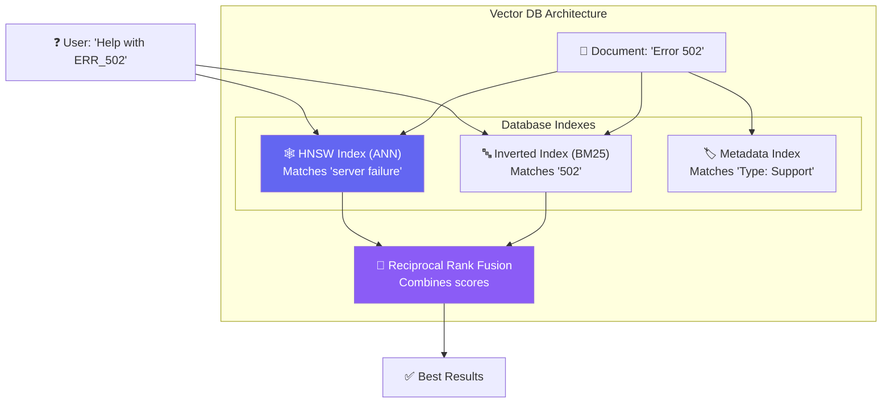

# Chapter 3 — Vector Database Deep Dive

## 🏢 Business Problem

Your semantic search works perfectly on 1,000 documents. You deploy to production with 10 million documents. Suddenly, every search takes 4 seconds, and users are complaining. 

Why? Because comparing one vector to 10 million other vectors using math (cosine similarity) is incredibly slow. As an architect, you need to understand how vector databases solve this scaling problem.

---

## 🧠 Theory

A Vector Database is specialized to store and query high-dimensional vectors efficiently. 

If you store 10 million vectors in a standard SQL database and calculate cosine similarity across all rows, you are doing a **k-Nearest Neighbors (kNN)** search. This requires a full table scan for every query ($O(N)$). 

Vector Databases use **Approximate Nearest Neighbors (ANN)** to find results in milliseconds. They trade a tiny bit of accuracy for a massive gain in speed.

### How ANN Works: The HNSW Graph

The most common indexing algorithm used by vector databases is **HNSW (Hierarchical Navigable Small World)**.

Imagine finding a specific house in a huge city without a map:
1. **Top Level (Highway):** You take the highway to get to the right general zip code.
2. **Mid Level (Main Roads):** You get off the highway and find the right neighborhood.
3. **Bottom Level (Streets):** You navigate street by street to find the exact house.

HNSW builds a multi-layered graph where long-distance links exist at the top layers, and short-distance links exist at the bottom.

### Hybrid Search (The Industry Standard)

Vector search is great for meaning ("How do I fix a broken screen?"), but terrible for exact keywords (e.g., searching for the error code `ERR_SYS_502`).

**Hybrid Search** combines:
1. **Vector Search** (Semantic meaning)
2. **Keyword Search** (BM25 algorithm, exact matching)

The results from both are merged using an algorithm like **RRF (Reciprocal Rank Fusion)** to give the best of both worlds.

---

## 🏗 Architecture: Vector Database Integration



---

## 💻 C# Example: Azure AI Search Hybrid Query

Azure AI Search is the recommended vector database for enterprise .NET shops.

```csharp title="SearchService.cs — Hybrid Search Implementation"
using Azure;
using Azure.Search.Documents;
using Azure.Search.Documents.Models;

public class HybridSearchService
{
    private readonly SearchClient _searchClient;
    private readonly EmbeddingService _embedder;

    public HybridSearchService(SearchClient searchClient, EmbeddingService embedder)
    {
        _searchClient = searchClient;
        _embedder = embedder;
    }

    public async Task<List<string>> SearchDocuments(string userQuery, string filterCategory)
    {
        // 1. Generate vector for the query
        var queryVector = await _embedder.GenerateEmbeddingAsync(userQuery);

        var searchOptions = new SearchOptions
        {
            // 2. Keyword Search (BM25)
            SearchText = userQuery,
            
            // 3. Metadata Filtering (Pre-filtering before vector math)
            Filter = $"Category eq '{filterCategory}'",
            
            Size = 5
        };

        // 4. Vector Search (HNSW)
        searchOptions.VectorSearch = new VectorSearchOptions
        {
            Queries = {
                new VectorizedQuery(queryVector.ToArray())
                {
                    KNearestNeighborsCount = 5,
                    Fields = { "ContentVector" }
                }
            }
        };

        // Execute Hybrid Search (Azure automatically applies RRF)
        var response = await _searchClient.SearchAsync<SearchDocument>(
            searchOptions.SearchText, 
            searchOptions
        );

        var results = new List<string>();
        await foreach (var result in response.Value.GetResultsAsync())
        {
            results.Add(result.Document["Content"].ToString());
        }

        return results;
    }
}
```

---

## 🧪 Lab: The Cost of Indexing

### Objective
Understand the memory footprint of an HNSW index.

### The Math
An HNSW index stores the vectors *plus* the graph connections.
For 1 million documents (using 1,536 dimensions):
1. **Vector storage:** 1,000,000 * 1536 * 4 bytes (FP32) = ~6 GB
2. **HNSW overhead:** Adds ~50% to ~100% overhead depending on the `M` parameter (number of connections per node).

### Questions
If you have 100 million documents, how much RAM will your Vector DB need to hold the index in memory for fast querying?

### ✅ Success Criteria
- [ ] You calculated ~600 GB for raw vectors, plus ~300 GB for HNSW overhead = **~900 GB of RAM**.
- [ ] You understand why enterprise vector databases are expensive to scale!

---

## 🎯 Interview Questions

### Q1: Why can't we just use SQL `ORDER BY` for vector similarity?
**Answer:** Because calculating cosine similarity for a single query against a table of 10 million vectors requires doing the math 10 million times (kNN). It takes seconds. Vector DBs use ANN (like HNSW) to navigate a graph, reducing the search space and returning results in milliseconds.

### Q2: What is Hybrid Search and why do we need it?
**Answer:** Hybrid search combines semantic vector search with traditional keyword search (BM25), merged via Reciprocal Rank Fusion (RRF). We need it because vector search is bad at finding exact matches (like IDs, error codes, or names), while keyword search is bad at understanding meaning.

### Q3: What is pre-filtering vs post-filtering in vector search?
**Answer:** Post-filtering means doing the vector search first, finding the top 100, and then filtering out ones the user doesn't have access to (which might leave 0 results). Pre-filtering means filtering the dataset *before* running the vector search. Modern vector DBs support pre-filtering to ensure accurate result counts and proper access control.

---

**Next:** [Chapter 4 — Advanced Embedding Strategies →](/docs/llm-engineering/advanced-embedding-strategies)
