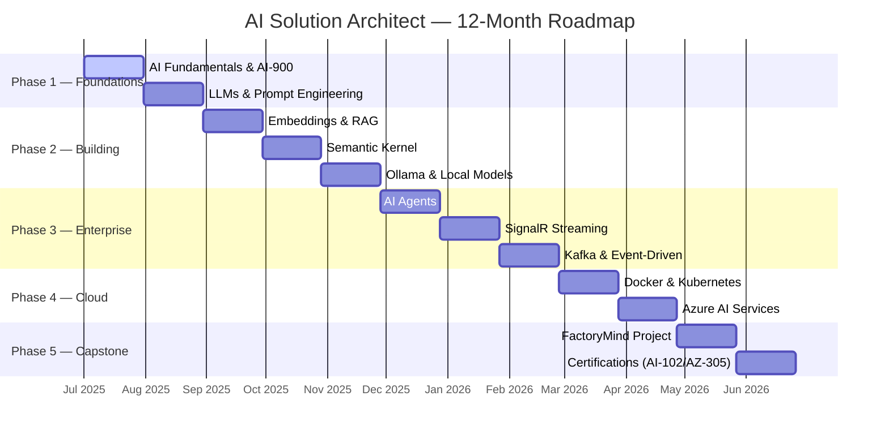

# 🗺️ 12-Month Learning Roadmap

This roadmap transforms an experienced .NET Technical Lead into an Enterprise AI Solution Architect over 12 months through structured learning, hands-on labs, and a capstone project.

---

## Timeline Overview

---

## Phase 1 — Foundations (Months 1–2)

**Goal:** Understand AI terminology, LLM fundamentals, and earn your first certification.

### Topics
- AI vs ML vs Deep Learning vs Generative AI
- How LLMs work (practical, not mathematical)
- Tokens, context windows, and cost management
- Prompt engineering patterns
- Responsible AI principles

### Deliverables
- ✅ AI-900 Certification
- ✅ Chapter 1 labs completed
- ✅ Development environment set up
- ✅ FactoryMind solution created

### Key Resources
- [AI-900 Study Guide](/docs/certifications/ai-900)
- [Chapter 1 — AI Landscape](/docs/fundamentals/ai-landscape)

---

## Phase 2 — Building AI Applications (Months 3–5)

**Goal:** Build real AI-powered applications using .NET.

### Topics
- Embeddings and vector spaces
- Vector databases (pgvector, SQL Server Vector Search, Azure AI Search)
- RAG architecture and retrieval strategies
- Semantic Kernel fundamentals
- Ollama and local model deployment

### Deliverables
- Local RAG chatbot
- Semantic Kernel application
- Offline AI demo with Ollama

---

## Phase 3 — Enterprise AI (Months 6–8)

**Goal:** Design enterprise-grade AI systems.

### Topics
- AI Agents and multi-agent patterns
- Model Context Protocol (MCP)
- Real-time AI streaming with SignalR
- Event-driven architecture with Kafka
- Docker containerization

### Deliverables
- Multi-agent prototype
- AI notification service with SignalR
- Enterprise architecture diagrams

---

## Phase 4 — Cloud & Architecture (Months 9–10)

**Goal:** Deploy AI to production on Azure.

### Topics
- Azure AI Services (Azure OpenAI, AI Search, AI Foundry)
- Kubernetes for AI workloads
- Monitoring and observability
- Cost optimization strategies
- Security and compliance

### Deliverables
- Cloud-deployed AI architecture
- Production monitoring setup
- Cost analysis documentation

---

## Phase 5 — Capstone (Months 11–12)

**Goal:** Build FactoryMind — a complete enterprise AI system.

### FactoryMind Modules
| Module | Technology |
|--------|-----------|
| API Gateway | ASP.NET Core |
| Authentication | Identity / JWT |
| RAG Pipeline | Semantic Kernel + Vector DB |
| AI Assistant | Azure OpenAI / Ollama |
| Agent System | Multi-agent orchestration |
| Knowledge Base | Document processing |
| Real-time | SignalR |
| Messaging | Kafka |
| Monitoring | OpenTelemetry |

### Deliverables
- Complete GitHub repository
- Architecture documentation
- System design diagrams
- Portfolio-ready project

---

## Certification Path

| Priority | Certification | When |
|----------|--------------|------|
| 1 | **AI-900** — Azure AI Fundamentals | Month 1–2 |
| 2 | **AI-102** — Azure AI Engineer | Month 10–11 |
| 3 | **AZ-305** — Azure Solutions Architect | Month 11–12 |
| 4 | DP-600 — Fabric Analytics Engineer | Optional |
| 5 | CKA — Kubernetes Administrator | Optional |

---

## Success Criteria

By the end of this roadmap, you should be able to:

- ✅ Design enterprise AI solutions from scratch
- ✅ Build RAG applications in .NET
- ✅ Build and orchestrate AI agents
- ✅ Use Semantic Kernel in production systems
- ✅ Deploy local and cloud AI solutions
- ✅ Lead AI architecture discussions confidently
- ✅ Mentor development teams on AI integration
